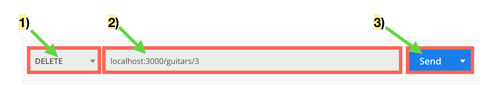

# Rails Generate Resource: Create and Delete

## Overview
- To round out our knowledge on the development flow using a rails generated resource we'll cover two more CRUD actions: Create and Delete.
- For this section we'll be using Postman to interact with our JSON API.

## Learning Objectives
- Creating CRUD functionality in an application
- Creating a JSON response for the Create and Delete methods
- Interacting with Postman

## Vocabulary
- Postman
- API
- resource
- CRUD
- JSON

## Useful Commands
- $ rails routes

## Additional Resources
- [Postman Resource](./postman.md)

## Set Up

#### Creating a new Rails app:
```
$ rails new guitar -d postgresql -T
$ cd guitar
$ rails db:create
$ rails server
```

In a browser navigate to:
`http://localhost:3000`


## Create

First we'll tackle building the method to create a guitar.

We'll update `guitars_controller.rb` like so:

```ruby
class GuitarsController < ApplicationController

  #...index/show methods...

  def create
    @guitar = Guitar.create(guitar_params)
    if @guitar.valid?
      render json: @guitar
    else
      render json: @guitar.errors
    end
  end

  private
  def guitar_params
    params.require(:guitar).permit(:strings, :manufacturer, :model, :color)
  end

end
```

Now we've set up strong params for our controller and we have added a method to create a guitar or render errors.

Let's try out our new endpoint through Postman.


When we click send, given that we've formatted our request correctly, we should see a response like this:


Notice that we get the newly created guitar in the body of our response.

## Destroy

The destroy action is the conventional Rails action for implementing the Delete operation. Let's build out that action.

We'll add a destroy method to our `guitars_controller.rb`:

```ruby
def destroy
  @guitar = Guitar.find(params[:id])
  if @guitar.destroy
    render json: @guitar
  else
    render json: @guitar.errors
  end
end
```

Once that's set up, we'll recall our routes or run `rails routes` in my terminal:


We see that our delete action is mapped to `/guitars/:id` so that's what we'll attempt to reach in Postman. Let's try to delete the guitar we just created.

We'll build our request like so:



Notice that we've selected the `DELETE` verb and set up the url with the `id` of the guitar we want delete.

When we hit send, we should get back the item we just deleted:


Now if we try to show the guitar we just deleted, we should receive an error:


[Back to Syllabus](../README.md)
