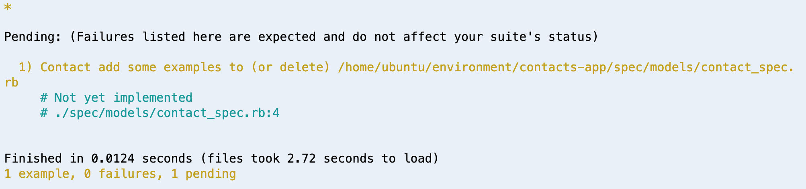

# Testing Models With Rspec

You now know how to harden your Rails models to protect your databases using ActiveRecord validations. With validations, you are building a solid foundation for the core of your application, your data. However, no implementation is complete without a strong suite of tests.

Remember, a good test suite will tell you a great deal about how a piece of code is intended to function. Good model specs help to define what pieces of information are crucial for the functionality of your app and how your models are intended to be used in your application.

To demonstrate setting up model tests, we'll use our familiar contact model example. Additionally, we'll implement the specs using a BDD approach to demonstrate how specs can help you define your objectives.

## The Setup

We'll start with a basic Rails app:

```bash
rails new contact-app -d postgresql -T
rails db:create
```

Then, we'll set up `rspec` as our spec framework. To do this we'll add the `rspec-rails` gem to our `:development, :test` group in our **Gemfile**:

```ruby
group :development, :test do
  gem 'byebug', platforms: [:mri, :mingw, :x64_mingw]
  gem 'rspec-rails', '~> 3.8' # <--- Added this gem
end
```

Then we'll run a couple of commands:

```bash
bundle install
rails generate rspec:install
```

That will bundle `rspec-rails` in with our app and generate the files we'll need to start writing our tests.

## The Initial Requirements

We are building an application for storing the contact information of our users. That said it, is crucial for our app to have a name and email on record for each user.

What we need to build:
- Contact model
- Cannot be created without a name
- Cannot be created without an email

The requirements may change, so we may need to add some additional tests. But this is enough to get started.

## Initial Specs

First we'll set up the model using a generator:

```bash
rails generate model Contact name:string email:string
```

Then we can run our migration:

```bash
rails db:migrate
```

This is a good point to set up the specs for the contact model. `rspec-rails` provides a command to set up a file for a model spec:

```bash
rails generate rspec:model contact
```

This commmand will generate our spec file at this path **spec/models/contact_spec.rb**.

To test out our spec setup we can run `rspec`. If it's set up correctly, we'll see pending tests for our contact model:



That pending message is set up in the generated spec file (**spec/models/contact_spec.rb**):

```ruby
require 'rails_helper'

RSpec.describe Contact, type: :model do
  pending "add some examples to (or delete) #{__FILE__}"
end
```

We'll update this file with our first requirement:

```ruby
RSpec.describe Contact, type: :model do
  it "must have a name" do
      contact = Contact.create
      expect(contact.errors[:name]).to_not be_empty
  end
end
```

Here our spec checks that there are errors for the name field if we attempt to create a contact without a name.

When we run our specs we should see it fail as expected, receiving an empty errors array for the name field.


We write just enough code for it to pass.

We'll update **contact.rb** with a presence validation:

```ruby
class Contact < ApplicationRecord
    validates :name, presence: true
end
```

When we run our specs again, we'll see it pass.


Let's go ahead apply a presence validation to emails as well.

First we'll add a test case for it:

```ruby
RSpec.describe Contact, type: :model do

  #...name test case...

  it "must have an email" do
      contact = Contact.create
      expect(contact.errors[:email]).to_not be_empty
  end
end
```

When we run `rspec`, that case should fail until we add an email presence validation to our model:

```ruby
class Contact < ApplicationRecord
    validates :name, :email, presence: true
end
```

Here we just added `:email` to our list of required attributes. When we run `rspec` again, we're passing.

## Additional Requirements

We may decide that we need to protect our data from duplicate contact entries. We can start to spec this out in a test.

We'll add this to **contact_spec.rb**:

```ruby
  it "does not allow duplicate contacts" do
      Contact.create(name: "bob", email: "bob@example.com")
      new_contact = Contact.create(name: "bob", email: "bob@example.com")
      expect(new_contact.errors[:email]).to_not be_empty
  end
```

Here we've created a contact and then attempted to create a contact with the same email. Essentially we want to eliminate the possibility of duplicates through a validation on emails.

We'll update our **contact.rb** to pass this test:

```ruby
class Contact < ApplicationRecord
    validates :name, :email, presence: true
    validates :email, uniqueness: true # <--- new validation
end
```


