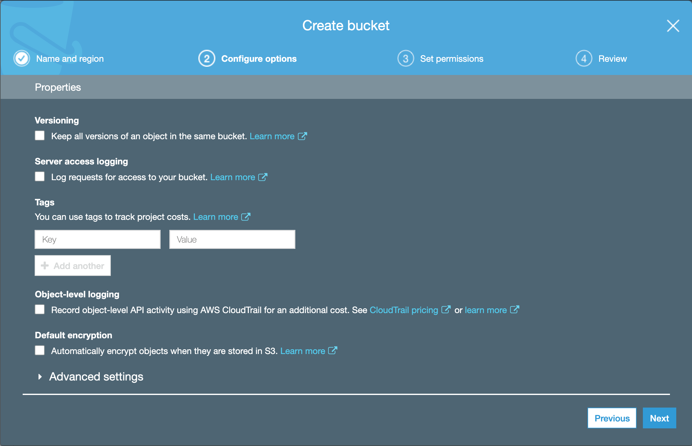
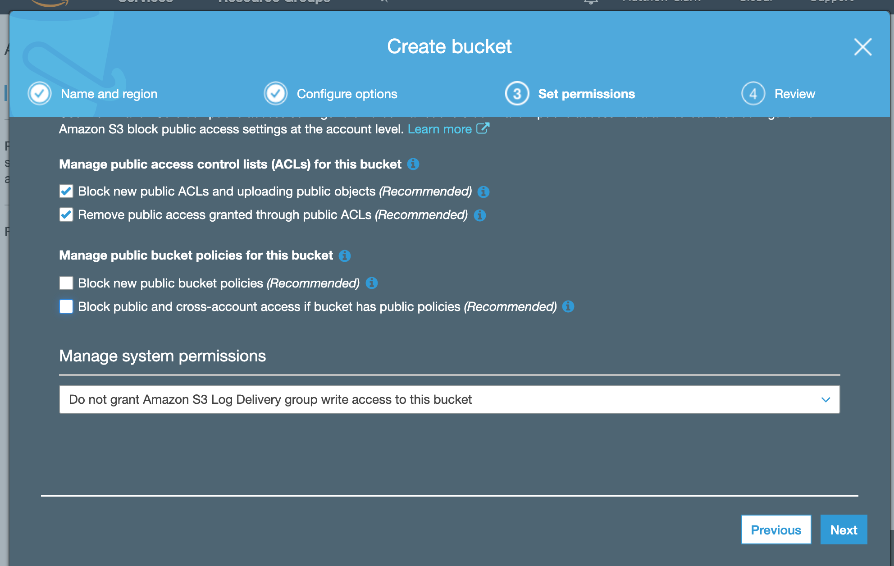
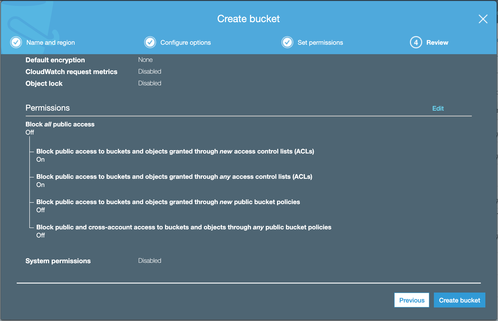
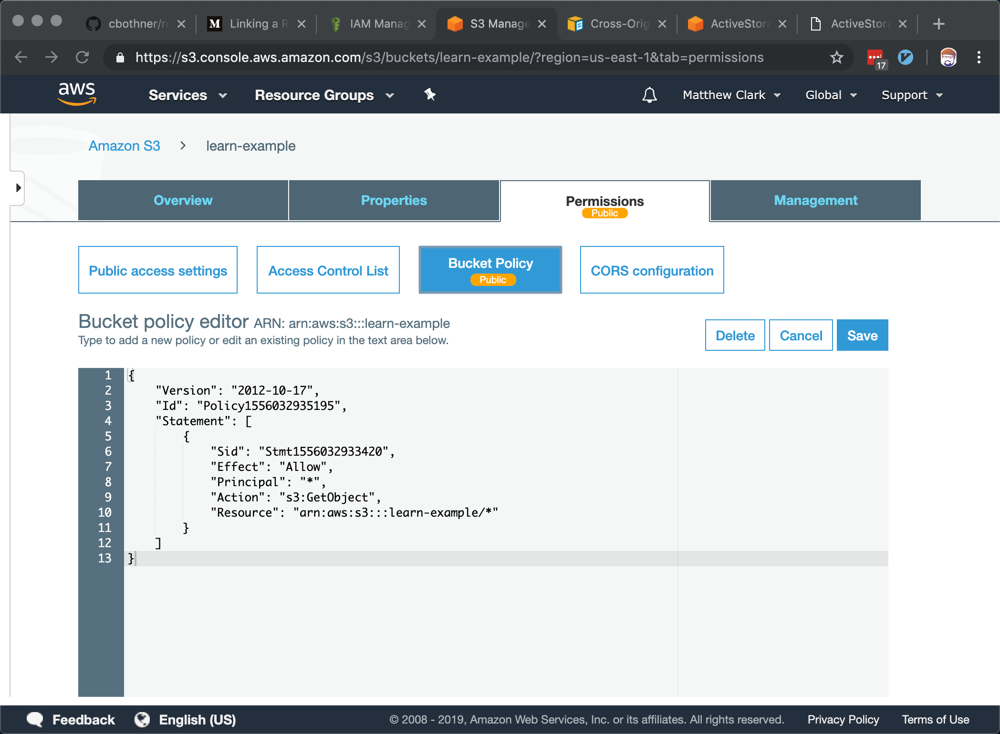
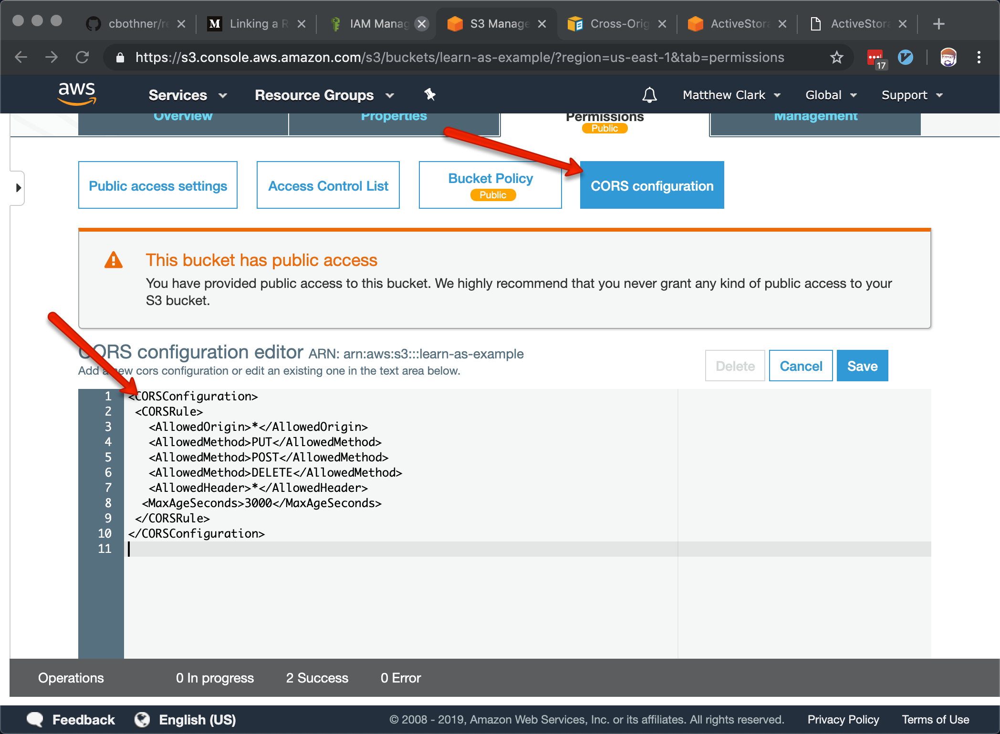

]



### Bucket Policy
```json
{
  "Id": "Policy1556032935195",
  "Version": "2012-10-17",
  "Statement": [
    {
      "Sid": "Stmt1556032933420",
      "Action": [
        "s3:GetObject"
      ],
      "Effect": "Allow",
      "Resource": "arn:aws:s3:::learn-example/*",
      "Principal": "*"
    }
  ]
}

```



### CORS
```xml
<CORSConfiguration>
 <CORSRule>
   <AllowedOrigin>*</AllowedOrigin>
   <AllowedMethod>PUT</AllowedMethod>
   <AllowedMethod>POST</AllowedMethod>
   <AllowedMethod>DELETE</AllowedMethod>
   <AllowedHeader>*</AllowedHeader>
  <MaxAgeSeconds>3000</MaxAgeSeconds>
 </CORSRule>
</CORSConfiguration>
```




