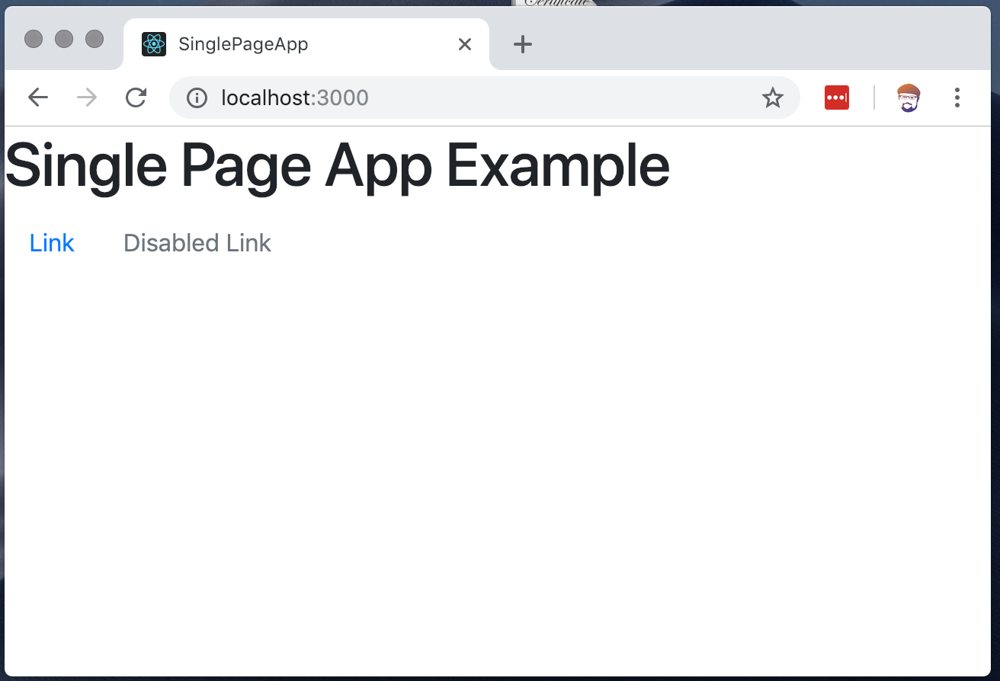

# Building a Single Page React App with React-Rails

We've seen how to create React components and use them on a webpage in a Rails app.  Our next task is to build a single page React app, where React is completely responsible for navigation, and the user experience of our application.  In this project, we're going to see how to build out a React application inside of Rails with all the features we've come to expect in our applications.

We'll re-visit:
1. component file organization
2. react-router
3. react-bootstrap

## Setting up the application

### 1) Build Application and Dependencies

```bash
rails new single_page_app
cd single_page_app
bundle add webpacker react-rails
bundle install
rails webpacker:install
rails webpacker:install:react
rails generate react:install
yarn install
```

### 2) Add the webpack to the layout

```bash
cat app/views/layouts/application.html.erb | sed 10!d
```
```result
:     <%= javascript_pack_tag 'application' %>
```


### 3) Add root route and view to Rails App

#### The Controller and View
```bash
rails g controller Pages
```

```bash
cat app/views/pages/root.html.erb
```
```result
: <h1>Single Page App Example</h1>
```

#### The Route
```bash
cat config/routes.rb
```
```result
: Rails.application.routes.draw do
:   root to: 'pages#root'
: end
```

### 4) Run the Rails server, and verify all is working
```bash
rails s
```


### 5) Render Our first component

Now that we have a place for it, let's add the main component for our single page application.  In a create-react-app built app, this component is called 'App.js'.  In our app, were going to call it 'MainApp.js'

#### Generate the Component
```bash
rails g react:component MainApp
```

And we can add some starting text we'll see when its rendered to assure that all is working correctly.

```bash
cat app/javascript/components/MainApp.js
```
```result
: import React from "react"
: import PropTypes from "prop-types"
: class MainApp extends React.Component {
:   render () {
:     return (
:       <h1>React MainApp Component</h1>
:     );
:   }
: }
:
: export default MainApp
```

#### Place Component on Page
```bash
cat app/views/pages/root.html.erb
```
```result
: <h1>Single Page App Example</h1>
: <%= react_component('MainApp') %>
```


## React and Bootstrap
In previous examples of using Bootstrap with React, we've used the excellent [React Bootstrap](https://react-bootstrap.github.io/) module.  For this example, we're going to use the equally excellent [Reactstrap](https://reactstrap.github.io/) package.  The do the same things, and eventually one may 'win' out over the other, but as of 2019, either is a great choice to use in your applications.  Its the same process for each when including them into a Rails backed project.

### 6) Add Bootstrap to Rails.
Reactstrap (and react-bootstrap) does not include Bootstrap's core CSS.  This means that we need to add those CSS files the the project ourselves.

#### There is a Gem for Bootstrap
One of the easiest ways to do this is to use the 'bootstrap' Rubygem.  We can add it to our project like so:

```bash
bundle add bootstrap
```

#### 7) Add bootstrap to our Stylesheet

We need to add the Bootstrap css rules to our main application stylesheet.  We're using the bootstrap gem, so we need to change `application.css` to be named `application.scss`.  This will cause the stylesheet to be loaded through the SASS engine, and alow us to import Bootstrap via a SASS ```@import``` statement.

```bash
mv app/assets/stylesheets/application.css app/assets/stylesheets/application.scss
```

```bash
cat app/assets/stylesheets/application.scss
```
```result
: /*
:  *= require_tree .
:  *= require_self
:  */
:
:  @import 'bootstrap';
```

** Note, there are many ways to add bootstrap to a Rails app, all of which will work equally well with our single page React application.

### 8) Add Reactstrap
```bash
yarn add reactstrap
```

### 9) Add Reactstrap components to the page
Once that is done, we can use Reactstrap components on our page.  Let's try it out in our MainApp component. This code is borrowed directly from Reactstrap's docs for the Nav component:

```bash
cat app/javascript/components/MainApp.js
```
```result
: import React from "react"
: import PropTypes from "prop-types"
: import { Nav, NavItem, NavLink } from 'reactstrap'
: class MainApp extends React.Component {
:   render () {
:     return (
:       <Nav>
:         <NavItem>
:           <NavLink href="#">Link</NavLink>
:         </NavItem>
:         <NavItem>
:           <NavLink disabled href="#">Disabled Link</NavLink>
:         </NavItem>
:       </Nav>
:     );
:   }
: }
:
: export default MainApp
```



## Component Organization

We want our application structure to be as simple as possible.  File structure should be shallow and intuitive.  At this point, we have a single component, 'MainApp'.  We're going to use it for the router, and to fill out the rest of the application, we'll have:

* ```MainApp.js``` file that will contain all of our routes
* ```pages``` directory for the main pages of the app
* ```components``` directory for all the helper components we'll need to create beautiful, engaging, user friendly interactions.

This structure is all placed, because of Rails convention in the '/app/javascript/components' directory

## 10) React-Router
In order to have multiple pages in a single page app, we need to add the router.  From the root directory of the project:

```bash
yarn add react-router-dom
```

### 11) Add pages

We need some pages in our React single page app  to route too.  For this example, we'll add an "About Us", "Learn More", and "Home" page.  Each of them will have an ```<h1>``` describing their intent.

```bash
cat app/javascript/components/pages/Home.js
```
```result
: import React, { Component } from 'react'
:
: class Home extends Component {
:   render() {
:     return(
:       <h1>Home Page</h1>
:     )
:   }
: }
:
: export default Home
```

The other two are mostly the same.

### 12) Routing Constraints

You'll recall that Rails has a router, and now that we've added react-router, so does React.  You might imagine that these two routers could come into conflict, and that would be correct.  We need to clearly separate the Rails routing responsibilities, and the React routing responsibilities.  We're building a single page app.  This, by definition, means that all HTML traffic goes to just one page.  All other types of requests though, will need to be routed by the rails app.  Most important of these, is the JSON and Javascript traffic that the Rails app must handle, we've been thinking of these requests as API requests from the frontend app to the backend one.

The Rails Router has a convenient feature that we can use to achieve this separation of traffic, all HTML requests got to our React app, and everything else be handled normally.  Concider this setup in our Router:

```bash
cat -n config/routes.rb
```
```result
:      1	Rails.application.routes.draw do
:      2	  get '*path', to: 'pages#root', constraints: ->(request){ request.format.html? }
:      3	  root to: 'pages#root'
:      4	end
```

* Line 2 - Notice the "constraints" section on line 2.  This states that all html traffic goes to "pages#root", our React app.
* Line 3 - handles the special case of the root page, which also routes to the React single page app.

Pretty cool!

### 13) Update the React router

```bash
cat -n app/javascript/components/MainApp.js
```
```result
:      1	import React from "react"
:      2	import PropTypes from "prop-types"
:      3	import { Nav, NavItem, NavLink} from 'reactstrap'
:      4	import { BrowserRouter as  Router, Route } from 'react-router-dom'
:      5
:      6	// Pages
:      7	import Home from './pages/Home'
:      8	import AboutUs from './pages/AboutUs'
:      9	import LearnMore from './pages/LearnMore'
:     10
:     11	class MainApp extends React.Component {
:     12	  render () {
:     13	    return (
:     14	      <Router>
:     15	        <div>
:     16	          <Nav>
:     17	            <NavItem>
:     18	              <NavLink href="/">Home</NavLink>
:     19	            </NavItem>
:     20	            <NavItem>
:     21	              <NavLink href="/about">About Us</NavLink>
:     22	            </NavItem>
:     23	            <NavItem>
:     24	              <NavLink href="/more">Learn More</NavLink>
:     25	            </NavItem>
:     26	          </Nav>
:     27	          <Route path="/" exact component={Home} />
:     28	          <Route path="/about" component={AboutUs} />
:     29	          <Route path="/more" component={LearnMore} />
:     30	        </div>
:     31	      </Router>
:     32	    );
:     33	  }
:     34	}
:     35
:     36	export default MainApp
```

## 14) Re-Load the page.
