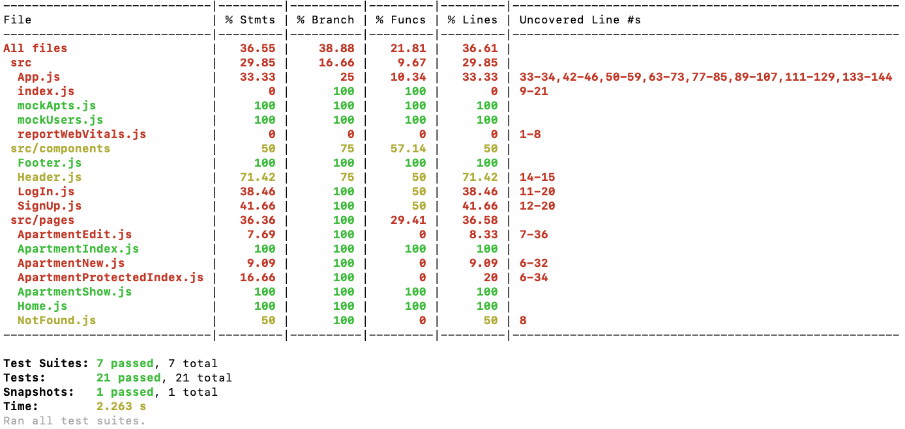
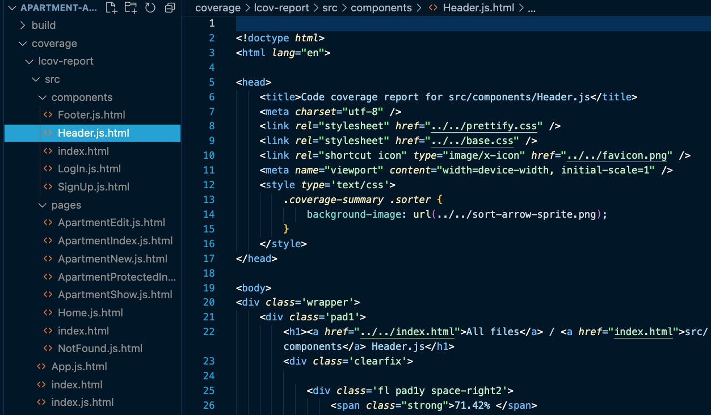
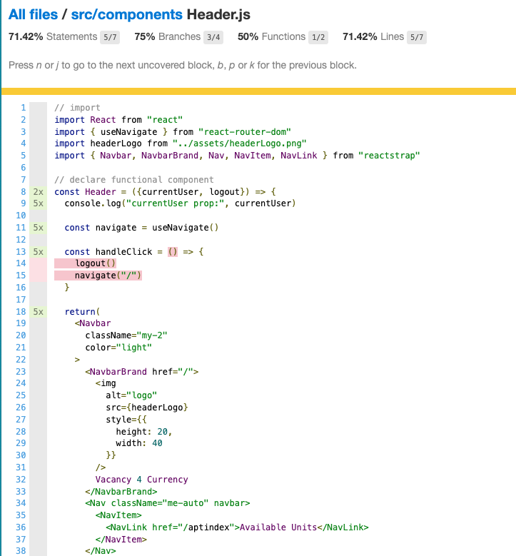
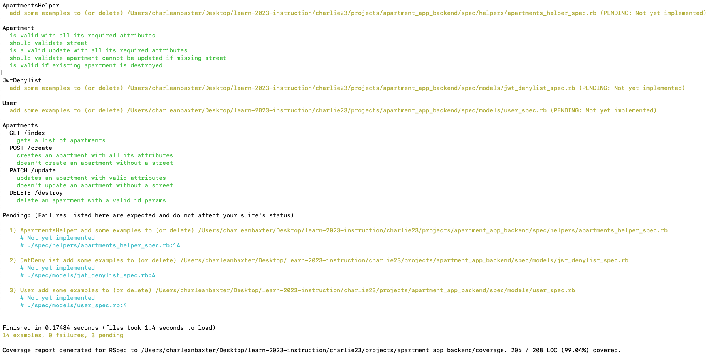
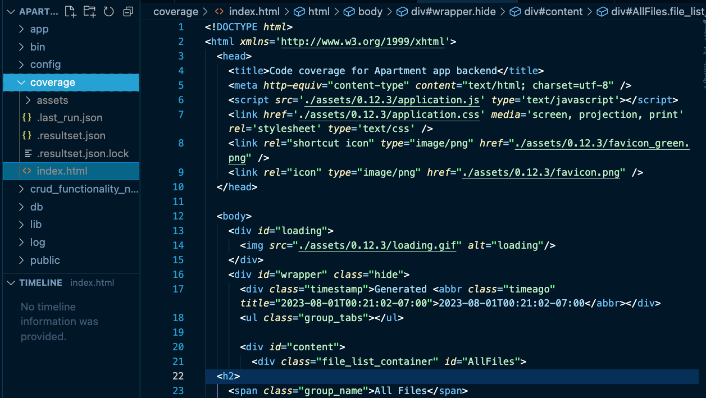
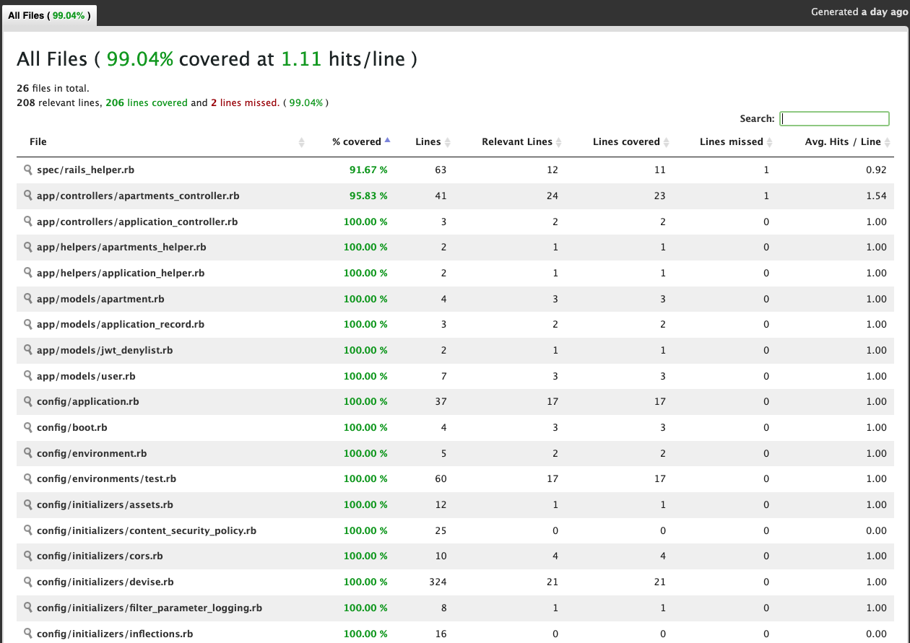
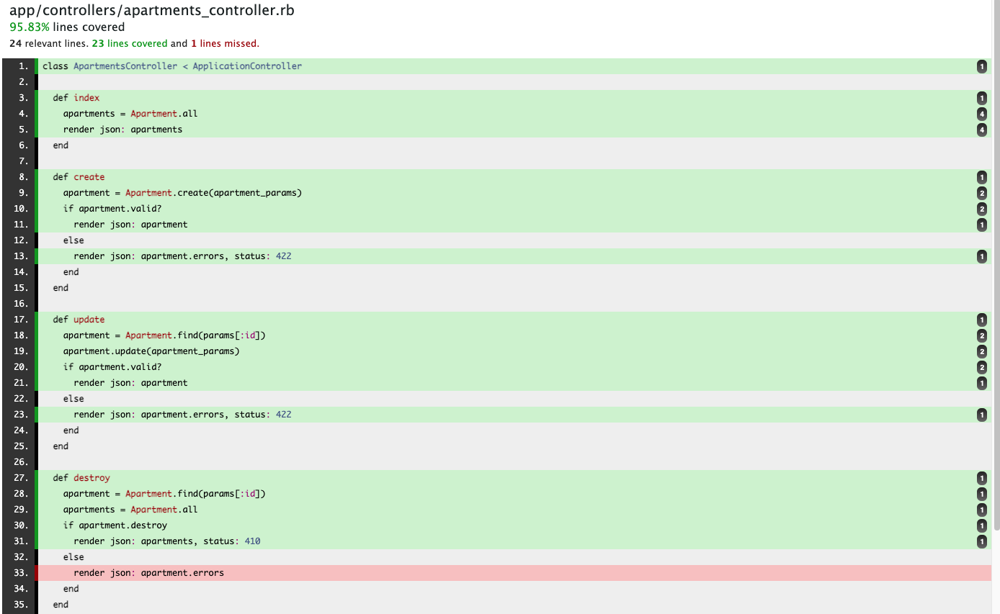

# Code Coverage  

## Overview  
- Code coverage in Test Driven Development (TDD) safeguards the requirements of the code within our web applications. Reports associated with test coverage help us determine not only how much of the code our tests are evaluating but also if we need to consider more edge cases to increase confidence in the expected outcome of our web application.
- This overview assumes the developer has created a full-stack decoupled application using React with the frontend structure and Rails with the backend structure. It is also assumed that Ruby gem `rspec` and its dependencies have been installed on the Rails application.

## Additional Resources  
- [Code Coverage](https://www.baeldung.com/cs/code-coverage)
- [SimpleCov](https://www.rubydoc.info/gems/simplecov/0.22.0)

## Learning Objectives
- Create an acceptable percentage of test coverage for React frontend application
- Create an acceptable percentage of code coverage for Rails backend application

## Vocabulary
- test coverage
- code coverage

## Useful commands
- $ `rspec`
- $ `yarn test --coverage --watchAll`  

The command `rspec` displays testing suite results associated with the Rails application.  
The command `yarn test --coverage --watchAll` displays test coverage report concerning the React application.

## Application Test Coverage 
**Code coverage** is an useful evaluation of how code within a web application is being tested before it is released to a consumer. Code coverage is a quantitative measurement of the number of lines of code covered by the testing suite. It helps web developers identify defects or bugs earlier in the production process. Less bugs helps us obtain more customer satisfaction with the end product. Code coverage also exposes areas of the web application that have not been tested. The more of the web application that is being tested, the more confidence that a developer can have that the web application will deliver the expected output to the consumer. 

Code coverage is a very popular testing tool and can often be confused with another evaluation called **test coverage**, which is a qualitative measurement of each test within the web application. Test coverage evaluates how many features of a web application is being tested before it is released to a consumer. For this decoupled application, we will use the code coverage evaluation from two tools: built-in analysis from the React application and `SimpleCov` for the Rails application. 

## React Test Coverage Metric
After creating a React project with `$ yarn create app`, you are automatically given access to the code coverage metric. Running the terminal command `yarn test --coverage --watchAll` outputs a static analysis of the files in the frontend application. The summary includes analysis of the following:
1. Statement coverage, which is each line of code executed during the testing.
2. Branch coverage, which is each branch within a conditional statement executed during testing.
3. Function coverage, which is each function or method executed during testing.
4. Line coverage, which is every line including statements and non-executable code like comments.
5. Uncovered Lines, which displays the line number(s) for any statement that is not covered.

The total code coverage will be displayed on the statement coverage for the `All files` entry.  



The terminal command will also create a new directory in our application called `coverage`. This coverage directory will be at the root of the React application. Within this directory, we find a `lcov-report` directory that will have a structure similar to the `src` directory of the React application. Each file will have an equivalent html file that will provide a visual presentation of what code is not covered by our testing files. 

The example provided shows the code coverage for the `Header.js` file. Within the text editor, the code coverage file will look similar to other html files. The code coverage html file for the `Header.js` file is located at ***coverage/lcov-report/src/components/Header.js.html***. 



Because this is a html file, we can open it in the browser to see a visual presentation of the coverage report. Each statement not covered will be highlighted in red. 



We do not want to save this code coverage report in our remote repo, so we need to ensure our .gitignore file is ignoring the coverage directory.

## Rails Test Coverage Metric
`SimpleCov` is a Ruby gem that can be installed as a code coverage analysis tool. The `SimpleCov` gem will deliver a quick report of the percentage of Lines of Code (LOC) covered by the rspec testing in the terminal output. This report is displayed after the results of the testing suite.



`SimpleCov` gathers its data from the built-in coverage library of the Rails application. It also displays a detailed code coverage report on an API, which is located on ***coverage/index.html*** file. 



The API can be accessed through the browser. The total code coverage will be displayed in the header. 



Selecting any of the ruby files will show the individual breakdown for the code coverage within that file. Any uncovered lines of code will be highlighted in red.  



We do not want to save this code coverage report in our remote repo, so we need to ensure our .gitignore file is ignoring the coverage directory.

### SimpleCov Installation Process 
- Add SimpleCov to the ***Gemfile***:
```Gemfile
  gem 'simplecov', require: false, group: :test
```
- Run $ `bundle install` to add appropriate dependencies

- Load and launch SimpleCov at the very top of the ***spec_helper.rb*** file located at **spec/spec_helper.rb**
```rb
  require 'simplecov'
  SimpleCov.start
```

- Run $ `rspec` to execute the full test suite and to see the percent coverage that the Rails application has.

- Run $ `open coverage/index.html` to see the ***coverage/index.html*** file in the browser. 

- Verify that `coverage` is in the `.gitignore` file to ensure that the code coverage results are not tracked by Git.

---

[Back to Syllabus](../README.md#unit-ten-capstone-project-mvp)