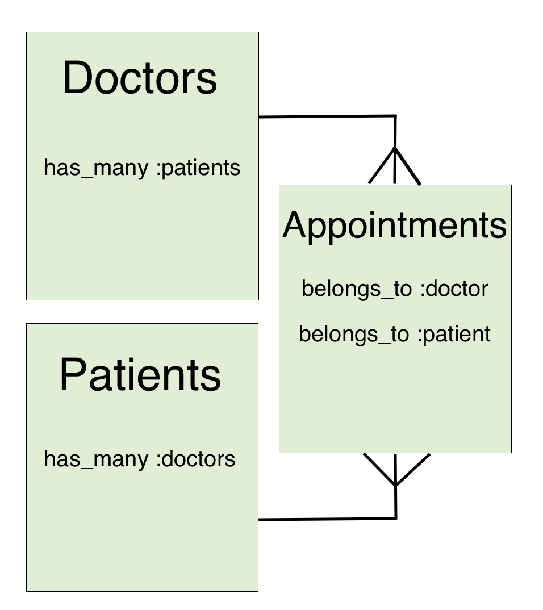

# Rails Has Many Through

#### Overview

It is often the case that relationships between models are more complex than just has_many belongs_to. If the relationship between two models is such that they both have many and belong to each other, we can create a join table to describe that relationship.

#### Previous Lecture (21 min)

[](https://youtu.be/-n9kZXXCiPk)

#### Learning Objectives

- can define a has_many_through relationship
- can define foreign keys
- can recall what model holds the foreign keys
-

#### Vocabulary

- has_many_through

#### Additional Resources

- [Active Record Associations](https://guides.rubyonrails.org/association_basics.html#the-has-many-through-association)

---

### Has Many Relationships

Think about the relationship between a model called Doctor and a model called Patient. The simplest relationship may be that a doctor has a patient and a patient belongs to a doctor. It is more likely that a doctor will have many patients. We are familiar with this style of relationship, but what if a patient also has many doctors? Then the relationship between our models is a patient has many doctors and a doctor has many patients. This is referred to as a **has_many_through** relationship where both models have both have many and belong to each other.

When your models have a more complex association we can use a third model to define the relationship. In our example, it would make sense to have the thing that ties doctors and patients together be appointments. So appointments becomes the third model that is responsible for creating the relationship.

The Appointment model will belong to both the Doctor model and the Patient model and both the Doctor and the Patient model will have many appointments. Since appointments belongs to both Doctor and Patient, appointments will hold BOTH foreign keys.

```bash
rails generate resource Doctor name:string practice:string

rails generate resource Patient name:string dob:date phone:string

rails generate resource Appointment doctor_id:integer patient_id:integer
```



### Has Many Through

The last part is to define a relationship between doctors and patients through appointments. Now a patient can have many doctors and a doctor can have many patients.

```ruby
class Doctor < ApplicationRecord
  has_many :appointments
  has_many :patients, through: :appointments
end

class Appointment < ApplicationRecord
  belongs_to :doctor
  belongs_to :patient
end

class Patient < ApplicationRecord
  has_many :appointments
  has_many :doctors, through: :appointments
end
```

---

[Back to Syllabus](../README.md#unit-ten-capstone-project-mvp)
