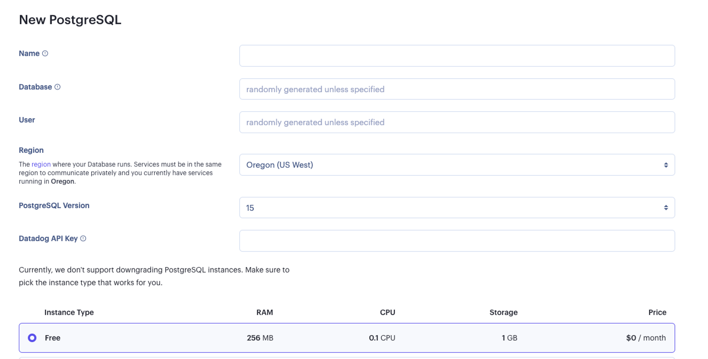
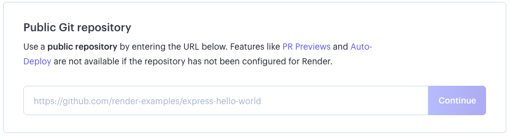
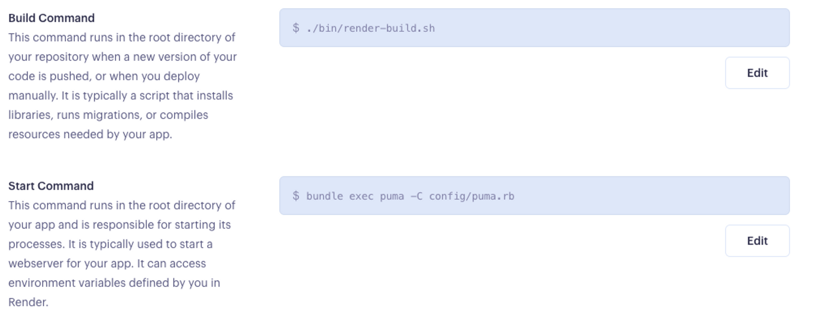
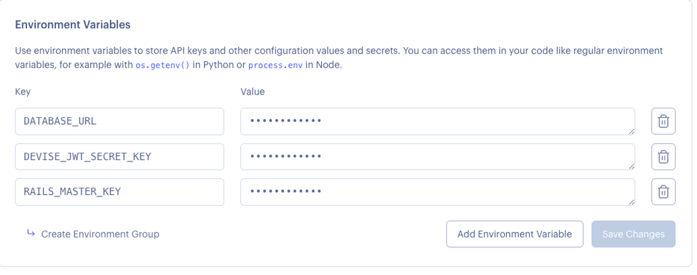
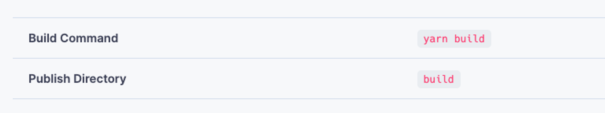
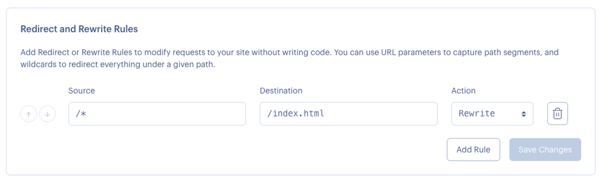

# Deploying on Render

Deployment is a very exciting step in the development process. Deployment is the process of employing a service to store your source code and data on their servers and providing a pathway in the form of the url. Render is platform used to host web applications. Render's services support many languages and it offers 3 month free deployments for small projects.

It is perfectly normal to deploy an application that is not "finished." Projects are always evolving and require regular deployment updates. The beauty of using a deployment service like Render is that you can connect the deployment to your GitHub repository. By default, Render will automatically build and deploy your services with every code push to your remote repository.

### Prep List

As a team, decide who will run the commands for deploying the application. Typically the tech lead would take on this responsibility.

Prior to deployment we need to ensure the main branch is up to date and the project runs without errors.

Next, if we have not already, we will create a Render acount using the team's email. Once created, need access to the email and password to log into the team's Render account.

And finally, the person in charge of deploying the application will need access to the `master.key` credential that lives in the `config` folder. The key is used to encrypt and decrypt your credentials. The `master.key` is not checked in to version control and so will not exist on Github. If the project was cloned from GitHub there will not be a `master.key` file in the `config` folder. If the person deploying the application has a `master.key` file, great! You are ready to go. If not, continue with the following steps in terminal.

```bash
$ EDITOR="vim" bin/rails credentials:edit
$ :wq
```

The first command will create the `master.key` file and a new `config/credentials.yml.enc` file with the Rails secrets. The command will drop you into a `vim` editor in your terminal. The second command will save the changes.

While the `master.key` will not be stored in version control, the `credentials.yml.enc` will be. So be sure that any updates are pushed to GitHub.

### Rails Application Configuration

First we will need to find the `database.yml` file in our `config` directory and modify the production section to gather the database configuration from the `DATABASE_URL` environment variable. 

**config/database.yml**

```yaml
 production:
  <<: *default
  url: <%= ENV['DATABASE_URL'] %>
```
Next, in our `puma.rb` file also found in our `config` directory, we are going to uncomment and update the following lines of code. 

```ruby
workers EVN.fetch("WEB_CONCURRENCY") {4}
```
changing the `{2}` to `{4}`

```ruby
preload_app!
```
**config/puma.rb**

```ruby
# Puma can serve each request in a thread from an internal thread pool.
# The `threads` method setting takes two numbers: a minimum and maximum.
# Any libraries that use thread pools should be configured to match
# the maximum value specified for Puma. Default is set to 5 threads for minimum
# and maximum; this matches the default thread size of Active Record.
#
max_threads_count = ENV.fetch("RAILS_MAX_THREADS") { 5 }
min_threads_count = ENV.fetch("RAILS_MIN_THREADS") { max_threads_count }
threads min_threads_count, max_threads_count

# Specifies the `worker_timeout` threshold that Puma will use to wait before
# terminating a worker in development environments.
#
worker_timeout 3600 if ENV.fetch("RAILS_ENV", "development") == "development"

# Specifies the `port` that Puma will listen on to receive requests; default is 3000.
#
port ENV.fetch("PORT") { 3000 }

# Specifies the `environment` that Puma will run in.
#
environment ENV.fetch("RAILS_ENV") { "development" }

# Specifies the `pidfile` that Puma will use.
pidfile ENV.fetch("PIDFILE") { "tmp/pids/server.pid" }

# Specifies the number of `workers` to boot in clustered mode.
# Workers are forked web server processes. If using threads and workers together
# the concurrency of the application would be max `threads` * `workers`.
# Workers do not work on JRuby or Windows (both of which do not support
# processes).
#
workers ENV.fetch("WEB_CONCURRENCY") { 4 }

# Use the `preload_app!` method when specifying a `workers` number.
# This directive tells Puma to first boot the application and load code
# before forking the application. This takes advantage of Copy On Write
# process behavior so workers use less memory.
#
preload_app!

# Allow puma to be restarted by `bin/rails restart` command.
plugin :tmp_restart
```
Our next step is to endable the public file server when the `RENDER` environemtn variable is present (which **always is** on Render)

**config/environments/production.rb**
```ruby
  # Disable serving static files from the `/public` folder by default since
  # Apache or NGINX already handles this.
  config.public_file_server.enabled = ENV["RAILS_SERVE_STATIC_FILES"].present? || ENV['RENDER'].present?
```

### Create a Build Script

We will need to run a series of commands to build our application. This can be done using a build script. First, we need create a file named `render-build.sh` that will live in our 'bin' directory at the root of your repository and paste the following commands: 

```bash
set -o errexit

bundle install
bundle exec rake assets:precompile
bundle exec rake assets:clean
bundle exec rake db:migrate
bundle exec rake db:seed
```
**Note**: Leaving the seed command here will cause our application to reseed on every push and redeploy. After we complete our initial deployment remove the `bundle exec rake db:seed`

Next, we will make sure the script is executable by running the following terminal command

```bash
$ chmod a+x bin/render-build.sh
```

### Create a yarn rake file 

Inside our `task` directory create a `yarn.rake` file and add the following line of code: 

**/lib/tasks/yarn.rake**

```ruby
Rake::Task["assets:precompile"].enhance ["yarn:install"]
```

### Add linux platform to Gemfile.lock

run the following command in the terminal: 

```bash
$ bundle lock --add-platform x86_64-linux

```

We will commit all changes and push them to our GitHub repository and now our application is ready to be deployed on Render!


## Deploy on Render

First, we will go to [render.com](https://render.com/). Using our team's email and password, we will log into the team's accout. 

### Postgres

Once we are logged in, we will create a new PostgreSQL Database



- Let's make sure that we have selected the Free Plan
- Once the database is created we will need to copy the Database URL to be used later 


### Web Service

Our next step is to create a new Web Service, pointing it to your application repository (make sure Render has access to it). 



The language we will select for our environment will be `Ruby` and then we will set the following propertires: 

- Build command: `./bin/render-build.sh`
- Start command: `bundle exec puma -C config/puma.rb`



Now, we need to add the following environment variables under the **Advanced** section: 



That's it! We can now finalize the backend service deployment. It will be live on our `.onrender.com` URL as soon as the build finishes. Copy and save this URL. We will need it for the front end. 

### Frontend

- Now that we have our URL from the backend service we just deployed, we need to change the URL in our fetch requests 

- From the Render Dashboard, we will click the 'New' button and select 'Static Site'

- Using our existing frontend repo, we will give Render permission to access it 

- Use the following values in the creation process: 



- Click on 'Create Static Site'

- Once our static site is deployed, we need to copy the site URL and save it for a later step. 

- Because we are using React Router, we will need to direct all routing request to `index.html` so they can be handled by your routing library. 

We can do this by defining a **Rewrite Rule** for our site. Go to the **Redirects/Rewrites** tab for your service and add a rule with the following values and then Save: 



Just like that, the frontend is complete!

### Final Step - allowing backend to handle frontend requests:

In the `cors.rb` file in our backend, we will need to change the origins to be the url to your frontend app **MINUS** the `https://` 

```ruby
Rails.application.config.middleware.insert_before 0, Rack::Cors do
  allow do
    origins 'your-app-frontend.onrender.com' <--- change this line!
    resource '*',
    headers: ["Authorization"],
    expose: ["Authorization"],
    methods: [:get, :post, :put, :patch, :delete, :options, :head],
    max_age: 600
  end
end
```

git add, commit, and push. Redeploy!

### Troubleshooting
During deployment, our build might encounter some errors. 

- `error Command "webpack" not found`

This means we forgot to add the `yarn.rake` task to our code. We can look at the **Create yarn rake file** step above to handle this error.

- `Your bundle only supports platforms ["x86_64-darwin-19"] but your local platform is x86_64-linux. Add the current platform to the lockfile with bundle lock --add-platform x86_64-linux and try again.`

run command: 

```bash
$ bundle lock --add-platform x86_64-linux
```

### Additional Docs:
- [Deploy React Front End](https://render.com/docs/deploy-create-react-app)
- [Deploy PostgreSQL Database Server](https://render.com/docs/databases)
- [Deploy Ruby on Rails Backend](https://render.com/docs/deploy-rails)

---

[Back to Syllabus](../README.md#unit-ten-capstone-project-mvp)
