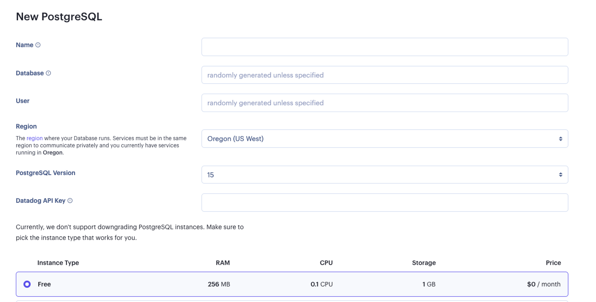
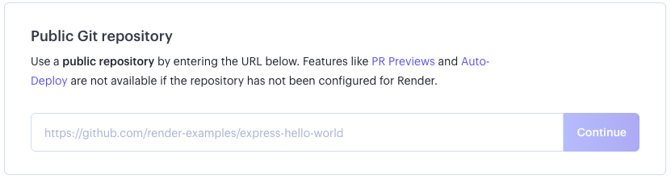
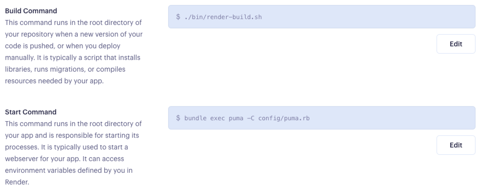
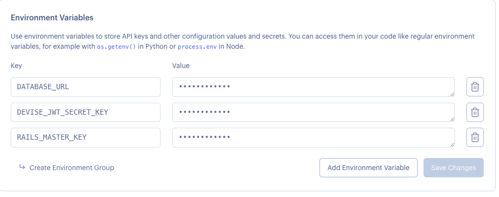
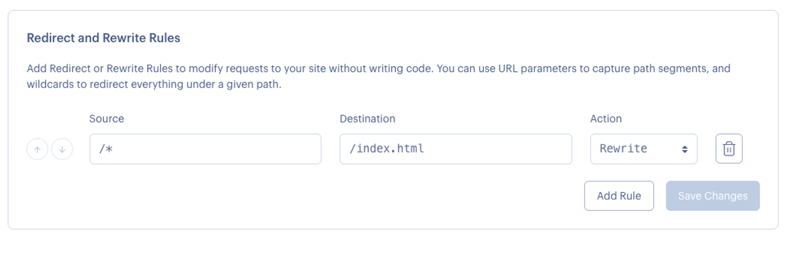

# Deploying on Render

#### Overview

Deploying a full-stack application is a challenging yet exciting stage of development. The process can be very configuration heavy and often takes a long time to complete. Deployment will often fail many times before succeeding so it is important to exercise a lot of patience in this process.

#### Vocabulary

- deployment
- Render
- Vim

#### Additional Resources

- [Deploying React Applications with Render](https://render.com/docs/deploy-create-react-app)
- [Deploy Ruby on Rails APIs with Render](https://render.com/docs/deploy-rails)
- [Deploy PostgreSQL Database Server with Render](https://render.com/docs/databases)
- [render.com](https://render.com/)

---

### Deployment

Deployment is a very exciting step in the development process. **Deployment** is the process of utilizing a service to store the source code and data of an application on their servers and providing a pathway in the form of the url. **Render** is a platform used to deploy and host web applications. Render's service supports many programming languages. Render offers three months of free deployment for small projects.

It is perfectly normal to deploy an application that is not "finished." Projects are always evolving and require regular deployment updates. The beauty of using a deployment service like Render is that you can connect the deployment to your GitHub repository. Render will automatically build and redeploy updated code with every code push to the GitHub repository.

### Master Key Credentials

As a team, decide who will run the commands for deploying the application. Typically the tech lead would take on this responsibility.

Prior to deployment we need to ensure the main branch is up to date and the project runs without errors.

Next, ensure the team email was used to create a Render account.

And finally, the person in charge of deploying the application will need access to the `master.key` credential that lives in the `config` folder. The key is used to encrypt and decrypt your credentials. The `master.key` is not checked in to version control and so will not exist on GitHub. If the project was cloned from GitHub there will not be a `master.key` file in the `config` folder. If the person deploying the application has a `master.key` file, great! You are ready to go. If not, continue with the following steps in terminal.

```bash
$ EDITOR="vim" bin/rails credentials:edit
$ :wq
```

The first command will create the `master.key` file and a new `config/credentials.yml.enc` file with the Rails secrets. The command will drop you into an editor in your terminal called Vim. **Vim** is a text editor that runs directly in the terminal. The Vim editor will not have access to normal terminal commands. The second command will save the changes and exit the Vim session.

While the `master.key` will not be stored in version control, the `credentials.yml.enc` will be. So be sure that any updates are pushed to GitHub.

### Rails Application Configuration

We will need to find the `database.yml` file in the `config` directory and modify the production section to gather the database configuration from the `DATABASE_URL` environment variable.

**config/database.yml**

```yaml
 production:
  <<: *default
  url: <%= ENV['DATABASE_URL'] %>
```

Next, in the `puma.rb` file also found in the `config` directory, we are going to uncomment and update the following lines of code.

```ruby
workers EVN.fetch("WEB_CONCURRENCY") {4}
```

The web concurrency is the number of worker processes that are handling traffic on the deployed site. Changing the `{2}` to `{4}` will increase the number of workers processes.

```ruby
preload_app!
```

**config/puma.rb**

```ruby
# Puma can serve each request in a thread from an internal thread pool.
# The `threads` method setting takes two numbers: a minimum and maximum.
# Any libraries that use thread pools should be configured to match
# the maximum value specified for Puma. Default is set to 5 threads for minimum
# and maximum; this matches the default thread size of Active Record.
#
max_threads_count = ENV.fetch("RAILS_MAX_THREADS") { 5 }
min_threads_count = ENV.fetch("RAILS_MIN_THREADS") { max_threads_count }
threads min_threads_count, max_threads_count

# Specifies the `worker_timeout` threshold that Puma will use to wait before
# terminating a worker in development environments.
#
worker_timeout 3600 if ENV.fetch("RAILS_ENV", "development") == "development"

# Specifies the `port` that Puma will listen on to receive requests; default is 3000.
#
port ENV.fetch("PORT") { 3000 }

# Specifies the `environment` that Puma will run in.
#
environment ENV.fetch("RAILS_ENV") { "development" }

# Specifies the `pidfile` that Puma will use.
pidfile ENV.fetch("PIDFILE") { "tmp/pids/server.pid" }

# Specifies the number of `workers` to boot in clustered mode.
# Workers are forked web server processes. If using threads and workers together
# the concurrency of the application would be max `threads` * `workers`.
# Workers do not work on JRuby or Windows (both of which do not support
# processes).
#
workers ENV.fetch("WEB_CONCURRENCY") { 4 }

# Use the `preload_app!` method when specifying a `workers` number.
# This directive tells Puma to first boot the application and load code
# before forking the application. This takes advantage of Copy On Write
# process behavior so workers use less memory.
#
preload_app!

# Allow puma to be restarted by `bin/rails restart` command.
plugin :tmp_restart
```

The next step is to enable the public file server when the `RENDER` environment variable is present. It is always present on Render.

**config/environments/production.rb**

```ruby
  # Disable serving static files from the `/public` folder by default since
  # Apache or NGINX already handles this.
  config.public_file_server.enabled = ENV["RAILS_SERVE_STATIC_FILES"].present? || ENV['RENDER'].present?
```

### Create a Build Script

We will need to run a series of commands to build our application. This can be done using a build script. First, we need create a file named `render-build.sh` that will live in our `bin` directory at the root of the repository. We can copy and paste the following commands:

```bash
set -o errexit

bundle install
bundle exec rake assets:precompile
bundle exec rake assets:clean
bundle exec rake db:migrate
bundle exec rake db:seed
```

**Note**: Leaving the seed command here will cause the database to reseed on every push and redeploy. After the initial deployment is complete remove the `bundle exec rake db:seed` from this set of commands.

Next, we will make sure the script is executable by running the following terminal command:

```bash
$ chmod a+x bin/render-build.sh
```

### Create a Yarn Rake File

Inside the `task` directory create a `yarn.rake` file and add the following line of code:

**/lib/tasks/yarn.rake**

```ruby
Rake::Task["assets:precompile"].enhance ["yarn:install"]
```

### Add Linux Platform

Run the following command in the terminal:

```bash
$ bundle lock --add-platform x86_64-linux

```

We will commit all changes made in this configuration process and push them to GitHub. Now the application is ready to be deployed on Render!

## Deploy on Render

First, we will go to [render.com](https://render.com/). Using the team's email and password, log into the account.

### Postgres

Once we are logged in, we will create a new PostgreSQL database on the Render server. Selected the `Free` instance type.



Once the database is created we will need to copy the Database URL to be used later.

### Web Service

The next step is to create a new Web Service and point it to the application repository. This ensures Render has access to it.



The language we will select for our environment will be `Ruby` and then we will set the following properties:

- Build command: `./bin/render-build.sh`
- Start command: `bundle exec puma -C config/puma.rb`



Now, we need to add the following environment variables under the **Advanced** section:



We can now finalize the backend service deployment. It will be live on the `.onrender.com` URL as soon as the build finishes. Copy and save this url as it will be necessary to configure the frontend.

### Frontend

Now that we have our url from the backend deployment, we need to change the url in the fetch requests.

Next, from the Render Dashboard, select the `New` and select `Static Site`. Using the existing frontend GitHub repository, we will give Render permission to access it.

Use the following values in the creation process:


Click on `Create Static Site`'.

Once the static site is deployed, we need to copy the site url and save it for a later step.

Because we are using the React Router, we will need to direct all routing request to `index.html` so they can be handled by the routing library.

We can do this by defining a `Rewrite Rule` for our site. Go to the `Redirects/Rewrites` tab for the service and add a rule with the following values.



Just like that, the frontend is complete!

### Handling Frontend Requests

The final step is to modify the `cors.rb` file in the Rails app. We will need to change the origins to be the React app **MINUS** the `https://` on the beginning of the url.

```ruby
Rails.application.config.middleware.insert_before 0, Rack::Cors do
  allow do
    origins 'your-app-frontend.onrender.com' # <--- change this line!
    resource '*',
    headers: ["Authorization"],
    expose: ["Authorization"],
    methods: [:get, :post, :put, :patch, :delete, :options, :head],
    max_age: 600
  end
end
```

Go through the git workflow to update the main branch and redeploy!

### Troubleshooting

It is very common during deployment for the build to encounter errors. Small syntax errors that work in development can cause a build to fail. Listed below are a few common errors we see along with the next steps for troubleshooting.

`error Command "webpack" not found`

This means we forgot to add the `yarn.rake` task to our code. Refer to the step above to handle this error.

`Your bundle only supports platforms ["x86_64-darwin-19"] but your local platform is x86_64-linux. Add the current platform to the lockfile with bundle lock --add-platform x86_64-linux and try again.`

Run the following command:

```bash
$ bundle lock --add-platform x86_64-linux
```

There may also be syntax errors in the code causing your deployment to fail. Read the error message carefully!

---

[Back to Syllabus](../README.md#unit-ten-capstone-project-mvp)
