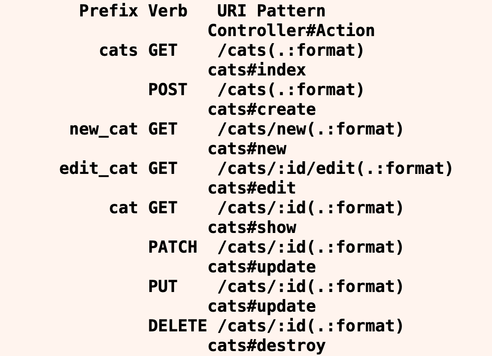

# Cat Tinder API Endpoints

#### Overview

Endpoints are the location from which APIs can access the resources they need to perform CRUD actions. Endpoints can be tested through request specs and model specs.

#### Previous Lecture (1 hour 7 min)

[](https://www.youtube.com/watch?v=7nHJ2G-FHl0)

#### Learning Objectives

- can define API endpoints
- can validate API endpoints
- can create endpoints for appropriate RESTful actions

#### Vocabulary

- API endpoints

#### Troubleshooting Tips

- Did you create your database?
- Did you migrate?
- Errors? Always look at the first error in the list.

---

### Cats Routes



We need to create endpoints for the actions in our React application. **API endpoints** are the touch point of communication within the API when an external request is made. In this application, the endpoints will allow external requests for the CRUD actions to be performed on the Cat model.

For the time being we can stub these routes by defining controller methods with no internal logic.

**app/controllers/cats_controller.rb**

```ruby
class CatsController < ApplicationController

  def index
  end

  def create
  end

  def update
  end

  def destroy
  end

end
```

### Index Route

We start with the index route. In this endpoint, we want to return all of the cats that the application knows about.

**Create a Spec**  
We're going to practice Test Driven Development, so let's start with a test. We'll add our test to the `cats_request_spec.rb` file:

**/spec/requests/cats_request_spec.rb**

```ruby
require 'rails_helper'

RSpec.describe "Cats", type: :request do
  describe "GET /index" do
    it "gets a list of cats" do
      Cat.create(
        name: 'Felix',
        age: 2,
        enjoys: 'Walks in the park',
        image: 'https://images.unsplash.com/photo-1529778873920-4da4926a72c2?ixlib=rb-1.2.1&ixid=MnwxMjA3fDB8MHxwaG90by1wYWdlfHx8fGVufDB8fHx8&auto=format&fit=crop&w=1036&q=80'
      )

      # Make a request
      get '/cats'

      cat = JSON.parse(response.body)
      expect(response).to have_http_status(200)
      expect(cat.length).to eq 1
    end
  end
end
```

When we run that spec, it fails of course, because we don't have any code in the controller to respond to the request correctly. Yay failure!

Now we can write the controller code to make it pass:

```ruby
def index
  cats = Cat.all
  render json: cats
end
```

### Create

Next we'll tackle the create route. Let's start with adding a new test:

```ruby
describe "POST /create" do
  it "creates a cat" do
    # The params we are going to send with the request
    cat_params = {
      cat: {
        name: 'Buster',
        age: 4,
        enjoys: 'Meow Mix, and plenty of sunshine.',
        image: 'https://images.unsplash.com/photo-1529778873920-4da4926a72c2?ixlib=rb-1.2.1&ixid=MnwxMjA3fDB8MHxwaG90by1wYWdlfHx8fGVufDB8fHx8&auto=format&fit=crop&w=1036&q=80'
      }
    }

    # Send the request to the server
    post '/cats', params: cat_params

    # Assure that we get a success back
    expect(response).to have_http_status(200)

    # Look up the cat we expect to be created in the db
    cat = Cat.first

    # Assure that the created cat has the correct attributes
    expect(cat.name).to eq 'Buster'
  end
end
```

And once again, this fails because we have no code in the controller to make it pass. Good! Adding the controller code for this spec is as follows:

```ruby
  def create
    # Create a new cat
    cat = Cat.create(cat_params)
    render json: cat
  end

  # Handle strong parameters, so we are secure
  private
  def cat_params
    params.require(:cat).permit(:name, :age, :enjoys, :image)
  end
```

And we're green! This isn't quite production ready code, but its enough to get our first test of the endpoint to pass, which is what we're after, so we're happy.

---

### 🐱 Challenge: Cat Tinder API Endpoints

As a developer, I have been commissioned to create an application where a user can see cute cats looking for friends. As a user, I can see a list of cats. I can click on a cat and see more information about that cat. I can also add cats to the list of cats looking for friends. If my work is acceptable to my client, I may also be asked to add the ability to remove a cat from the list as well as edit cat information.

- As a developer, I can add an index request spec to my application.
- As a developer, I can add an index endpoint to my application.
- As a developer, I can add a create request spec to my application.
- As a developer, I can add a create endpoint to my application.

### Stretch Goals

- As a developer, I can add an update request spec to my application.
- As a developer, I can add an update endpoint to my application.
- As a developer, I can add a destroy request spec to my application.
- As a developer, I can add a destroy endpoint to my application.

---

[Back to Syllabus](../../README.md#cat-tinder-backend)
