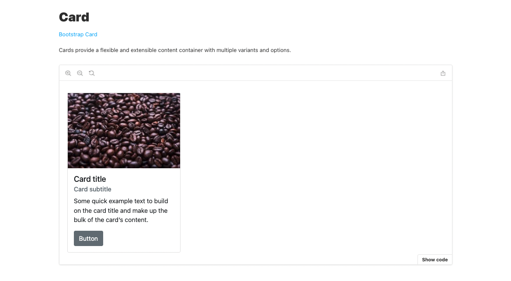

# Cat Tinder Read Functionality

#### Overview

There are four general actions a developer will consider when building an application. They are summed up in a delightful acronym: CRUD. This section will focus on the "read" functionality of Cat Tinder adding the ability to navigate between the home page, index page, and show page.

#### Previous Lecture (1 hour 22 min)

[](https://www.youtube.com/watch?v=_sD-GPMKGSg)

#### Learning Objectives

- can display an indexed page of mock JSON data
- can display a single entry of mock JSON data by id
- can route between appropriate pages

#### Additional Resources

- [Reactstrap Docs](https://reactstrap.github.io/)
- [Flexbox](https://css-tricks.com/snippets/css/a-guide-to-flexbox/)
- [CSS Margins](https://www.w3schools.com/css/css_margin.asp)
- [JavaScript .find()](https://developer.mozilla.org/en-US/docs/Web/JavaScript/Reference/Global_Objects/Array/find)
- [JavaScript Unary Plus](https://developer.mozilla.org/en-US/docs/Web/JavaScript/Reference/Operators/Unary_plus)

---

### Passing Data to Cat Index

Now that we have the basic file structure of our Cat Tinder application, we need to start passing around data. In our application, `App.js` is in charge of all of the routes. With that, it makes sense to have `App.js` decide which data needs to be passed to the component associated with any given route.

Right now we have a JSON array of mockCats being held in the state variable in `App.js`. We need to pass that data to the index component as props so our users can see all the options for new cat friends.

Currently this is our index route:

**src/App.js**

```javascript
<Route path="/catindex" element={<CatIndex />} />
```

We can pass in the cat variable from state into the `CatIndex` component. Then ensure we can access the data.

**src/App.js**

```javascript
<Route path="/catindex" element={<CatIndex cats={cats} />} />
```

A `console.log()` in the `CatIndex` component will verify the data is passed correctly. Once the data flow is confirmed the log should be removed.

**src/pages/CatIndex.js**

```javascript
import React from "react"

const CatIndex = ({ cats }) => {
  console.log(cats)
  return (
    <>
      <h3>Cat Index Page</h3>
    </>
  )
}

export default CatIndex
```

### Cat Index Page UI

Now that the cat data is being passed, we can create the look and functionality of the page.

Since we have an array of cat objects being passed into the component, the first step is to iterate through the array to access each cat object. We will start with a very basic display to ensure the code is working correctly.

**src/pages/CatIndex.js**

```javascript
import React from "react"

const CatIndex = ({ cats }) => {
  return (
    <main>
      {cats.map((cat, index) => {
        return (
          <>
            <p>{cat.name}</p>
            <p>{cat.age}</p>
          </>
        )
      })}
    </main>
  )
}

export default CatIndex
```

Now that we have access to each cat, we can introduce some styling. This is an opportunity to add Reactstrap to our application. In this example, we will use the `Card` component in Reactstrap.



Selecting the `Show code` button will reveal the React code that creates this particular view. The code for one card will be what is returned from each iteration of the array of cats.

We can plug in our cat data to replace the boilerplate code from Reactstrap and remove any content that is unnecessary.

**src/pages/CatIndex.js**

```javascript
{
  cats.map((cat, index) => {
    return (
      <Card
        style={{
          width: "14rem"
        }}
        key={index}
      >
        
        <CardBody>
          <CardTitle tag="h5">{cat.name}</CardTitle>
          <CardSubtitle className="mb-2 text-muted" tag="h6">
            Age: {cat.age}
          </CardSubtitle>
          <Button>See More Details</Button>
        </CardBody>
      </Card>
    )
  })
}
```

Reactstrap offers us prebuilt UI components that have stylings attached behind the scenes. Anytime we work with prebuilt code there are always pros and cons. The pros are that we can create a nice UI with very little effort. The cons are that it can be difficult to manipulate and customize. Each developer and each project and will have a different level of tolerance for using prebuilt code.

To access the components in Reactstrap we must add an import statement at the top of the page.

**src/pages/CatIndex.js**

```javascript
import { Card, CardBody, CardTitle, CardSubtitle, Button } from "reactstrap"
```

Now we can see our cat data displayed in the cards.

### Cat Index Page Styling

Reactstrap components can be challenging to style. A tip is to look at the HTML and CSS code in the inspect element in the browser. For example with the Reactstrap cards, we can see that behind the scenes, each card is actually a `div` element with an attribute of `class="card"`. We can use that class in our Cat Tinder `App.css` file to apply modifications to that element.

Another tip is that `flexbox` is a great tool to organize the layout of groups of things. The cards are rendering on the page but they don't have a particularly nice look as a set. To modify the layout of the cards with `flexbox`, we need to wrap all the cards in a container. To follow sematic HTML naming conventions, we can wrap the cards in a tag called `main`. This will have all the properties of a normal `div` but give context to accessibility tools as well as other developers as to its intent.

**src/pages/CatIndex.js**

```javascript
<main className="cat-index-cards">
  {cats.map((cat, index) => {
    return (
      <Card
        style={{
          width: "14rem"
        }}
        key={index}
      >
        
        <CardBody>
          <CardTitle tag="h5">{cat.name}</CardTitle>
          <CardSubtitle className="mb-2 text-muted" tag="h6">
            Age: {cat.age}
          </CardSubtitle>
          <Button>See More Details</Button>
        </CardBody>
      </Card>
    )
  })}
</main>
```

In the CSS file, we can apply `flexbox` to the class given to the `main` tag. To use the `flexbox` tools we need to declare `display: flex`. Then we can use the `wrap` attribute to allow the cards that overflow the browser width to wrap to the next line. Finally the `space-around` attribute will provide equal spacing on the right and left side of every card.

For a bit of space on the top and bottom of each card we can modify the `card` class defined by Reactstrap. The margin property has some handy shortcuts. Passing two values will apply the first value to the top and bottom and apply the second value to the right and left. Since flexbox is handling the space to the right and left of the cards, we can add a bit of space to the top and bottom so the cards don't sit directly on top of each other.

**src/App.css**

```css
.card {
  margin: 2rem 0;
}

.cat-index-cards {
  display: flex;
  flex-wrap: wrap;
  justify-content: space-around;
}
```

### Testing the Index Component

In the pages directory, we need to create a new file called `CatIndex.test.js` that will import React Testing Library and `CatIndex`. Then we can stub out the tests we want to create. We want to ensure our page will load and we want to ensure that our user can see the cat cards.

**src/pages/CatIndex.test.js**

```javascript
import { render } from "@testing-library/react"
import CatIndex from "../pages/CatIndex"

describe("<CatIndex />", () => {
  it("renders without crashing", () => {})
  it("renders cat cards", () => {})
})
```

Now that the tests are defined we can start filling in content. The first test will look a lot like the tests we previously created to ensure components render correctly to the browser. Once this test is in place we can see that the test is failing.

Note the error:

```bash
Error: Uncaught [TypeError: Cannot read properties of undefined (reading 'map')]
```

We have seen this error many times before. It is saying that when the test renders the `CatIndex` component `cats` is `undefined`. The `map` method doesn't work on a data type of `undefined` and therefore the page will not render.

But why is `cats` undefined? Our test revealed a very important bug in our code. The array of cats is coming from state in `App.js` and being passed to `CatIndex`. This is all happening very quickly but it does require a little bit of time. And furthermore, the cat data will eventually be handled by a `fetch` request which could take even longer. If the `CatIndex` component renders before the data has arrived the entire component breaks. Not ideal.

To fix this bug we want all the functionality handled by `.map` to run only if there is an array of cats. Otherwise, that code should be ignored and the rest of the page should render. By adding a `?` after `cats` we create conditional rendering. No cats? No map. No map, no error.

**src/pages/CatIndex.js**

```javascript
{cats?.map((cat, index) => {
```

Now to add the content of the second test. We need to ensure that (as long as there are cats being passed to the component) our user sees cat cards. We can set up the test to render the component and pass in the cats from the `mockCats.js` file. Be sure to import the mock cats to the test.

We want to check that every cat name that is being passed to the component can be found by our test. To make this test dynamic we can use a bit of JavaScript logic that will iterate over the array of mock cats and test for each cat name.

**src/pages/CatIndex.test.js**

```javascript
it("renders cat cards", () => {
  render(
    <BrowserRouter>
      <CatIndex cats={mockCats} />
    </BrowserRouter>
  )
  mockCats.forEach((cat) => {
    const catName = screen.getByText(cat.name)
    expect(catName).toBeInTheDocument()
  })
})
```

### Passing Data to Cat Show

The next task is to show the details for just one cat. We need to give the show page access to the cat data. Back in `App.js` we can pass the state variable over to `CatShow` and ensure the cat data is making it to the correct place.

**src/App.js**

```javascript
<Route path="/catshow" element={<CatShow cats={cats} />} />
```

**src/pages/CatShow.js**

```javascript
import React from "react"

const CatShow = ({ cats }) => {
  console.log(cats)

  return (
    <>
      <h3>Cat Show Page</h3>
    </>
  )
}

export default CatShow
```

Once we verify the cats have been properly passed to the show page we can remove the logs. It is a bad practice to leave `console.log` in a project.

Next we need to identify which cat should be displayed. Each cat object has a unique id that can be used to select the correct cat. By requiring a param in the url for the `CatShow` component we can dynamically get an id. With this update, the show page can only be accessed if a param is passed into the url.

**src/App.js**

```javascript
<Route path="/catshow/:id" element={<CatShow cats={cats} />} />
```

We need to access this param in order to display the correct cat. To access the param React Router offers us a hook called `useParams`. The hook must be imported and given access to the param that we named `id`.

**src/pages/CatShow.js**

```javascript
import React from "react"
import { useParams } from "react-router-dom"

const CatShow = ({ cats }) => {
  const { id } = useParams()
  console.log(id)

  return (
    <>
      <h3>Cat Show Page</h3>
    </>
  )
}

export default CatShow
```

Checking the logs we can see the param in the logs. This means we can use the variable to find the correct cat from the array of cats. The JavaScript `.find()` method is a higher-order function that will return the first instance that matches the given evaluation. In this case we are evaluating the param id and the id of each cat object.

Remember that the data type of a param is always a string. We need to convert the string to a number. We can do this in several ways. In this example, we will use a unary plus to convert the data type.

**src/pages/CatShow.js**

```javascript
const { id } = useParams()
let currentCat = cats.find((cat) => cat.id === +id)
console.log(currentCat)
```

The variable `currentCat` holds a single instance of a cat object. The name, age, enjoys, and image values can be accessed to display information about the cat.

### Testing the Show Component

In the pages directory, we need to create a new file called `CatShow.test.js` that will import React Testing Library and `CatShow`. Then we can stub out the test we want to create.

**src/pages/CatShow.test.js**

```javascript
import { render } from "@testing-library/react"
import CatShow from "../pages/CatShow"

describe("<CatShow />", () => {
  it("renders without crashing", () => {})
})
```

The test will follow the same format as all previous tests for ensuring components render correctly to the browser. Just like with index we can see that the test is failing.

Note the error:

```bash
Error: Uncaught [TypeError: Cannot read properties of undefined (reading 'find')]
```

Look familiar? It is necessary to think about which parts of the page are dependent on the data arriving. In the case of the show page it is the `.find()` method and also the content displaying the cat data. Both of these can be conditionally rendered.

**src/pages/CatShow.test.js**

```javascript
const { id } = useParams()
let currentCat = cats?.find((cat) => cat.id === +id)

return (
  <main className="cat-show-cards">
    {currentCat && (
      <>
        
        // additional cat code here
      </>
    )}
  </main>
)
```

### Connecting Cat Index and Show

Now that our pages are working we need to create the flow that will allow our users to navigate between pages. We can do this by providing our cat cards with links that will navigate to the show page.

We already have a route for the show page. This route requires a param. Since we have access to the cat id of every cat object we can use string interpolation and pass the cat id to the route. In this example, the `NavLink` is replacing the `Button` component from the earlier code.

**src/pages/CatIndex.js**

```javascript
<NavLink to={`/catshow/${cat.id}`} className="nav-link">
  See More Details
</NavLink>
```

Since `NavLink` is used for React routing, it must be imported from `react-router-dom`.

```javascript
import { NavLink } from "react-router-dom"
```

---

### 🐱 Challenge: Cat Index and Show

As a developer, I have been commissioned to create an application where a user can see cute cats looking for friends. As a user, I can see a list of cats. I can click on a cat and see more information about that cat. I can also add cats to the list of cats looking for friends. If my work is acceptable to my client, I may also be asked to add the ability to remove a cat from the list as well as edit cat information.

- As a developer, I can pass the cat mock data in state to my index component.
- As a user, I can see a page that lists of all the cat names.
- As a developer, I have test coverage on my index component.
- As a developer, I can refactor the show route to require an id param to show one cat.
- As a user, I can see a page featuring all the information for one cat.
- As a user, I can click on a cat name and be taken to a page that shows me all the information about that cat.
- As a developer, I have test coverage on my show component.

---

[Back to Syllabus](../../README.md#cat-tinder-frontend)
