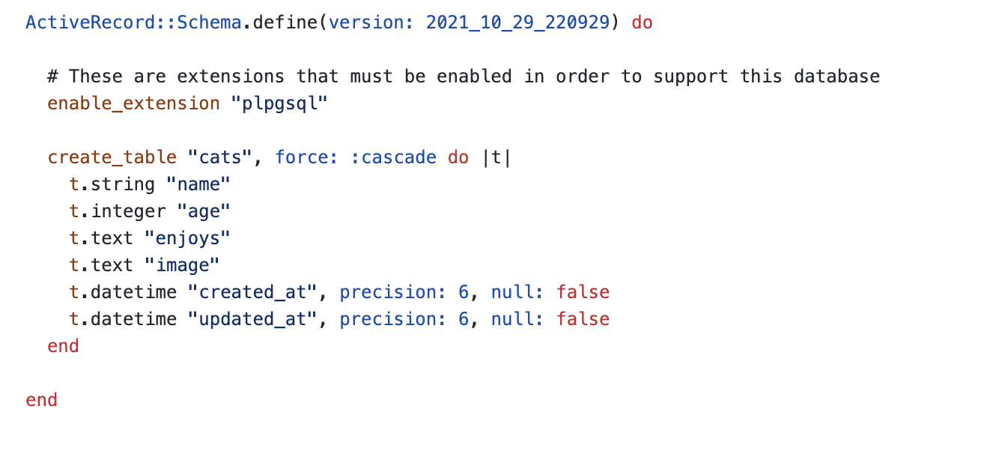

# Cat Tinder Introduction and Routing

## Overview
- Cat Tinder. It's like Tinder, but for cats.
- We are creating a full-stack, decoupled application. This means we are actually creating two separate applications. A React application for the frontend and a Rails API that handles our data.

## Learning Objectives
- Establishing a base file structure for Cat Tinder frontend
- Implementing Reactstrap
- Implementing React-Router
- Routing to multiple pages in React
- Creating a mock data file

## Vocabulary
- Reactstrap
- React router
- SPAs
- Assets directory

## Additional Resources
- [ Reactstrap ](https://reactstrap.github.io/)
- [ React Router ](https://reacttraining.com/react-router/web/guides/quick-start)

## Set Up

#### Creating a new React app:
```
$ yarn create react-app cat-tinder-frontend
$ cd cat-tinder-frontend
$ yarn add react-router-dom
$ yarn add bootstrap
$ yarn add reactstrap
$ yarn start
```
- add `import 'bootstrap/dist/css/bootstrap.min.css'` to index.js
- create a directory in *src* called *pages*
- create a directory in *src* called *components*
- create a directory in *src* called *assets*

## Planning
Right now we are focused on only the frontend of our application. But to create the View of our application it is important to be thinking ahead to what the API will look like. The backend of our Cat Tinder app will have a model called Cat. Our Cat model will have three attributes: a name, an age, and what the cat enjoys doing.

In the Rails application that we will build during this project the schema will look like this:



As a frontend developer we will need to create a React app that will accept the Rails API endpoints and offer our user a functional and visually appealing application.


## Getting Starting
So far, we have only created single page applications (or **SPA**s) in React. Now we want to be able to navigate to different pages as we explore CRUD functionality in a decoupled application.

To keep the files organized, it is a good practice to create three directories in your React application: assets, components, and pages.

**Assets**  
The assets directory is used to store image files used in your application.

**Components**  
The components directory is for helper components such as headers, footers, and buttons.

**Pages**  
The pages directory is for full views. The full view can consist of items from the assets and components directory as well a code unique to a page.

## Reactstrap
Reactstrap is a version of Bootstrap built specifically for React components. To access the functionality of Reactstrap you must add the dependencies for Reactstrap and Bootstrap via yarn as well as add an import to `src/index.js`.

Once Reactstrap has been added to the application, styled components can be imported and used like component tags. This opens up a lot of options for quick styling and functionality.

```
$ yarn add bootstrap
$ yarn add reactstrap
Add to src/index.js: import 'bootstrap/dist/css/bootstrap.min.css'
```

## Mock Cats
An important part of development is the ability to create code that exists for just for the purpose of building more code. This is called scaffolding. Creating placeholder data is a great way to ensure our frontend application is working before we connect it to the database.

To get our frontend up and running, we are going to create a file called `mockCats.js` that will live in the `src` directory and hold an array of cat objects.

**src/mockCats.js**
```javascript
let cats = [
  {
    id: 1,
    name: "Mittens",
    age: 5,
    enjoys: "sunshine and warm spots"
  },
  {
    id: 2,
    name: "Raisins",
    age: 4,
    enjoys: "being queen of the dogs"
  },
  {
    id: 3,
    name: "Toast",
    age: 1,
    enjoys: "getting all the attention"
  }
]
export default cats
```

Now we can use the mock data in `App.js` while we get the application up and running. The mock data can be set into state and passed around our application.

**src/App.js**
```
import mockCats from './mockCats.js'

class App extends Component{
  constructor(props){
    super(props)
    this.state = {
      cats: mockCats
    }
  }
```


## React Router
The first goal of our app is to get our base file structure ready to go. This includes the ability to navigate between pages.

Unlike Rails, React doesn't come with a built in router. So we can use a very popular third party application called `react-router-dom` to add the ability to navigate between pages. First we need to add the necessary packages to our application using a yarn command. This adds the react-router to the *package.json* file.
```
$ yarn add react-router-dom
```

This allows us to import routing components to our application. *App.js* will be in charge of handling the routes and displaying the components.

**src/App.js**
```javascript
import {
  BrowserRouter as Router,
  Route,
  Switch
} from 'react-router-dom'
```

Now we have access to three components that will help us build our routing functionality.

**Router**  
The Router component wraps all the functionality of the routes. There should only be one Router per application.

**Switch**  
Switch helps manage which page is being displayed by preventing multiple routes from matching at once.

**Route**  
The Route component gets passed two props:
1. The URL path
2. The component to be displayed for that path

```javascript
<Router>
  <Switch>
    <Route exact path="/" component={Home} />
    <Route path="/catindex" component={CatIndex} />
    <Route path="/catshow" component={CatShow} />
    <Route path="/catnew" component={CatNew} />
    <Route path="/catedit" component={CatEdit} />
    <Route component={NotFound}/>
  </Switch>
</Router>
```
There are a couple things to note here:

The Home route has an extra `exact` being passed to the path. The `exact` param prohibits partial matching. It ensures that Router will only return the route if the path is an EXACT match to the current URL.

The last Route in the list doesn't have a path. We can think of this as the `else` statement in our routes. If something happens in our application where a route is passed in that doesn't match any of the paths specified above, we can direct our user to a custom error page.

---

## Challenge: Cat Tinder Setup
As a developer, I have been commissioned to create an application where a user can see cute cats looking for friends. As a user, I can see a list of cats. I can click on a cat and see more information about that cat. I can also add cats to the list of cats looking for friends. If my work is acceptable to my client, I may also be asked to add the ability to remove a cat from the list as well as edit cat information.

- As a developer, I can create a directory in *src* called *pages*
- As a developer, I can create a directory in *src* called *components*
- As a developer, I can create a directory in *src* called *assets*
- As a developer, I can create a file called *Header.js* in the *components* directory
- As a developer, I can create a file called *Footer.js* in the *components* directory
- As a developer, I can create a file called *Home.js* in the *pages* directory
- As a developer, I can create a file called *CatIndex.js* in the *pages* directory
- As a developer, I can create a file called *CatShow.js* in the *pages* directory
- As a developer, I can create a file called *CatNew.js* in the *pages* directory
- As a developer, I can create a file called *CatEdit.js* in the *pages* directory
- As a developer, I can create a file called *NotFound.js* in the *pages* directory
- As a developer, I can add a file to *src* called *mockCats.js* and add an array of cat objects
- As a developer, I can add Reactstrap to my application
- As a developer, I can use Reactstrap to create the header UI
- As a developer, I can use Reactstrap to create the footer UI
- As a developer, I can import the header and footer to all the page components
- As a developer, I can add some styling to the Home component
- As a developer, I can add `react-router-dom` to my application
- As a developer, I can add routes to be able to navigate manually to all pages

---
[Back to Syllabus](../../README.md#cat-tinder-frontend)
