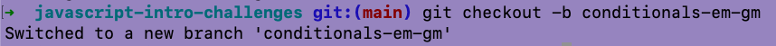
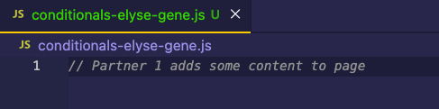
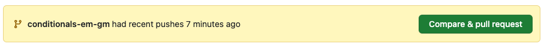
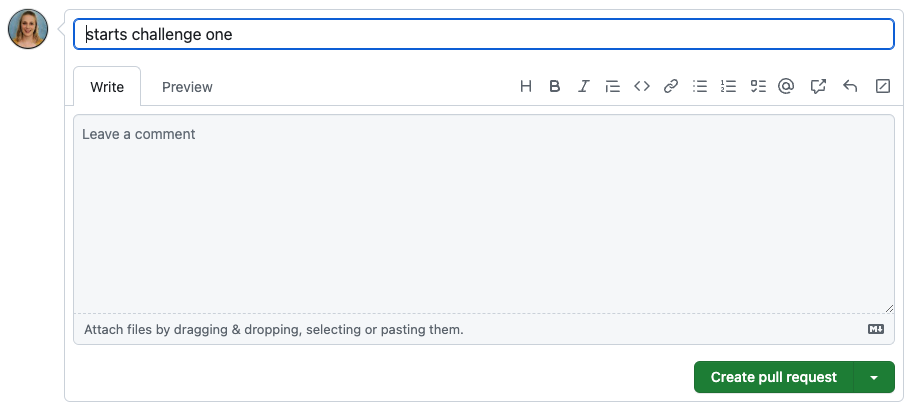
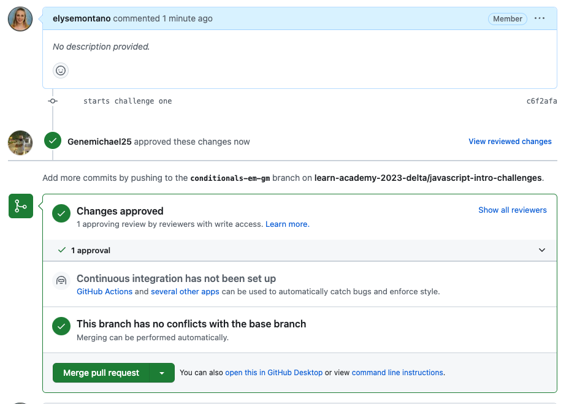

# Collaborative Coding with GitHub

#### Overview

GitHub is an online platform used by developers to collaborate on coding projects. To collaborate effectively and safely on GitHub there are important fundamentals that every developer needs to understand.

#### Previous Lecture (56 min)

[](https://www.youtube.com/watch?v=JrhB42_r6z0)

#### Vocabulary

- fetch
- pull request

### Useful Commands

Informational terminal commands will not make changes or perform any actions. These are GREAT tools to be familiar with.

- To see the branch you are currently using: $ `git branch`
- To see what files have been modified: $ `git status`
- To see the directory you are currently using: $ `pwd`
- To see what files are located in the current directory/repository: $ `ls`

#### Additional Resources

- [Git Workflow Cheatsheet](assets/git-workflow.png)

---

### Pair Programming with GitHub

The git workflow is the basis for contributing code to a development team. Understanding the workflow for a single developer working on the code base is the first step. However, since pair programming is the process of two developers working on a single project, we need a workflow that allows two developers to contribute code collaboratively.

### Cloning a Repository

Every member of the development team must have the repository on their local machine. To do this we need to clone the repository. Cloning the repository only needs to happen one time.


In the terminal, we will navigate to the appropriate directory. Typically the Desktop is a good location.

```bash
$ git clone https://github.com/your-repository.git
```

### Main Branch

When the repository is cloned, the only branch is the default main branch. The main branch is the "source of truth" and only vetted, properly formatted code is allowed on the main branch.

Anytime we start a new topic it is important to ensure we are on the main branch. The informational command $ `git status` will give us a readout of the current branch and other git info.


If the `git status` command returns a branch that is not main we will need to switch to the main branch and ensure our code is up to date.

```bash
git checkout main
git pull origin main
```

### First Driver: Creating a Branch

Only ONE person on the team should complete the following actions for creating a branch.

All new code gets added to a repository on a new feature branch. To checkout a new branch we use the terminal command `git checkout -b` followed by the new branch name. The `-b` indicates the creation of a new branch. A new branch only has to be created one time per topic.

In the classroom at LEARN, we will use the following naming convention for every branch we create: `topic-initials1-initials2`. Refer to the syllabus process notes for the exact branch name for each section.

For example, to create a branch with the name `conditionals-em-gm` the terminal command would be:

```bash
git checkout -b conditionals-em-gm
```



### First Driver: Creating a New File

Only ONE person on the team should complete the following actions to create a new file.

Now that we have successfully made a new feature branch, we will create a new file to work in. Use the terminal command $ `touch` to make a new file using the naming convention `topic-student1-student2.js` (ex. conditionals-elyse-gene.js). Refer to the syllabus process notes for the exact branch name for each section. A new file only has to be created one time per topic.


### First Driver: Coding

Then we can open the directory in a text editor and the first driver can begin to code.



### First Driver: Git Workflow

After 20-30 minutes it is time to switch drivers. Right now the code only exists on the first driver's local computer. We will need to go through our git workflow.

The git workflow should always start with the informational command $ `git status`. There are two things we are looking for with this command:

1. ensure we are on the correct branch and
2. confirm changes only exist on the file that corresponds to the feature branch.


The following commands will make the code available on GitHub. We will switch out the generic names in the prompt below with the current file name and branch names.

```bash
git add file-name.js
git commit -m "detailed message with as much detail as possible"
git push origin branch-name
```


Voila! Now the code we wrote locally is available on GitHub and the second driver can take over.

### Second Driver: Accessing an Existing Branch

As we move to the second driver we will want to ensure a couple of steps are complete:

1. the repository has been cloned,
2. we have navigated into the repository, and
3. we are currently on the main branch.

If any of these steps have not been complete, revisit the instructions at the top of this section.

It is important to note that the second driver SHOULD NOT be creating a new branch or a new file.

The feature branch currently exists on GitHub and on the first driver's local machine. It does not exist on the second driver's local machine. We need to **fetch** the existing branch, which means make an existing branch available to a local machine. The existing branch only has to be fetched one time per topic.

```bash
git fetch origin branch-name
git checkout branch-name
```

### Second Driver: Coding

We can open the directory in a text editor. The second driver will have the updated file that the first driver contributed! The second driver is ready to code!


### Second Driver: Git Workflow

After 20-30 minutes it is time to switch drivers. In order to switch drivers we will need to go through our git workflow.

The git workflow should always start with the informational command $ `git status`. There are two things we are looking for with this command:

1. ensure we are on the correct branch and
2. confirm changes only exist on the file that corresponds to the feature branch.

We will switch out the generic names in the prompt below with the current file name and branch names.

```bash
git add file-name.js
git commit -m "detailed message with as much detail as possible"
git push origin branch-name
```

### Additional Driver Swaps

Once each member of the team has contributed code to the GitHub repository, the swapping process gets a bit simpler. Each driver will begin their coding session by pulling the new code from GitHub.

```bash
git pull origin branch-name
```

Each member of the team will end their coding session with the git workflow.

```bash
git status
git add file-name.js
git commit -m "detailed message with as much detail as possible"
git push origin branch-name
```

### Creating a Pull Request

Once the coding session is over, we need to create a pull request. Only ONE person on the team should complete the following actions to create a pull request.

A **pull request** is the process of submitting code contributions to a development project. A pull request will allow the instructors to review all the code.

Once we push the code from a feature branch to GitHub, we will see this message:



Click the button to `Compare & pull request`

This will redirect us to a page where we can create a pull request. Ensure the message is descriptive then click the button to `Create pull request`.



### Merging into Main

Only ONE person on the team should complete the following actions to merge the code into main.

Once an instructor reviews and approves the code, we will merge the code into the main branch. Click the button to `Merge pull request`. This will create a new source of truth that includes the code we just created.



### Deleting Branch

The main branch has been updated to include the code we just wrote! The feature branch did its job and can be deleted.

There are two steps to deleting a branch. First, only ONE person on the team should click on the GitHub button that will delete the branch.


Next up the branch must be deleted locally. This step should be preformed by all members of the team!

```bash
git checkout main
git pull origin main
git branch -d branch-name
```


And the pair programming workflow is done!

---

[Back to Syllabus](../README.md#github)
