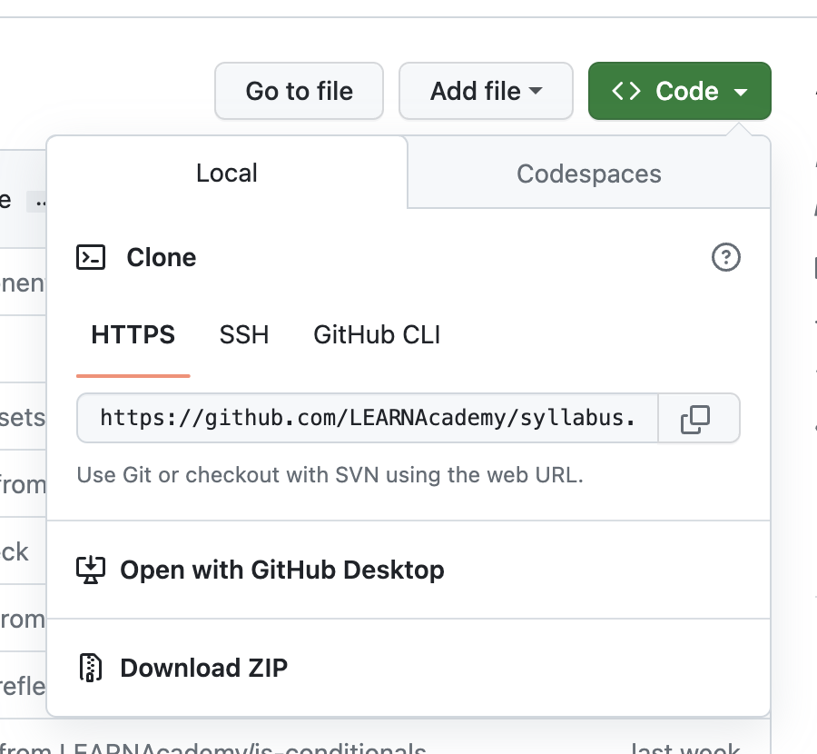
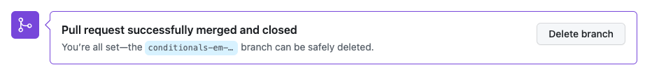

# Git and GitHub Introduction

#### Overview

Git is a very powerful tool used to keep code organized through version control. GitHub is an online platform that uses the git technology to allow developers to store, share, and collaborate on coding projects. Git and GitHub are a critical part of the daily workflow for all developers and development teams.

#### Vocabulary

- git
- GitHub
- repositories
- version control
- branch
- main branch
- local
- remote
- checkout
- staging
- commit
- merging
- stale branch

### Useful Commands

Informational terminal commands will not make changes or perform any actions. These are GREAT tools to be familiar with to ensure commands are run properly.

- To see the branch you are currently using: $ `git branch`
- To see what files have been modified: $ `git status`
- To see the directory you are currently using: $ `pwd`
- To see what files are located in the current directory/repository: $ `ls`

---

### Git Introduction

**Git** is a free, open-source version control system widely used in the programming world. Git is a technology that is independent of any programming language or computer operating system.

Git was created in 2005 by Linus Torvalds, the creator of Linux, to track changes in source code. Git is accessed primarily through the command line.

The history of the name "git" according to Mr. Torvolds is quite funny. "Git" is British slang for pig-headed or argumentative. This will feel very appropriate at moments when interacting with git. Mr. Torvolds says that while "git" was a random three-letter combination that is pronounceable and was not currently used by any common UNIX command, the true meaning of git can change, depending on your mood:

1. Global Information Tracker: if you're in a good mood, and it actually works for you. Angels sing and light suddenly fills the room.
2. Godd\*\*n Idiotic Truckload of sh\*t: when it breaks.

### GitHub Introduction

**GitHub** is an online platform that uses git version control technology. GitHub allows developers to share and store code. GitHub is the largest host of code in the world (as of 2023). GitHub also offers developers tools for testing and deployment of applications. Developers create personal GitHub accounts that can be connected to teams allowing for collaboration on projects.

Git version control exists on an individual computer. GitHub is accessed online. Connecting an individual computer to GitHub requires some configurations. These configurations are outlined in another section of the syllabus.

GitHub holds the source code for applications. The source code lives in named directories called **repositories** or repo for short. A repository can hold many other directories and files of code that make up a project.

### Git Version Control and Branches

When contributing code on a team there are some common issues that need to be considered:

1. Projects are constantly evolving and it can be helpful to have access to previous versions of a project.
2. The code in an application is continuously being updated. While this work is taking place on the team, the application still needs to be functional.
3. It is common that multiple developers on a team will contribute to the updates.

The use of git and GitHub help solve these problems. Git's fundamental use is for version control. **Version control** is creating labeled markers that are attached to each iteration of a project. This allows developers to revisit every contribution to the project.

In order to create a version control marker we need to establish a named timeline of code called a **branch**. The default branch is called the main branch. Every repository has exactly one **main branch** that is the "source of truth" for the codebase and contains the history of every code contribution to the project. The main branch is often the branch that is deployed in production. Only well-tested, correctly formatted code is permitted on the main branch.

Since the main branch is the source of truth, it should only have updates that are complete and well-vetted. But coding takes a lot of time and a lot of testing to ensure everything works properly! While work is in progress, it is necessary to have a place where the development team can access the code but not be at risk of affecting the source of truth. Git solves this issue by allowing the creation of additional branches. By creating a new branch, we duplicate the content from the main branch. This is often referred to as a feature branch. Coding and testing can take place on this new branch without affecting the main branch. When the work is complete the content can be added back to the main branch.

Once a new feature branch has been created, everyone on the team can have access to it. This means teams can collaborate on code updates from their own computers and have access to the work in progress.

Version control and branches to the rescue!

### Contributing to GitHub

The workflow for a developer is small, systematic contributions of code to a project. This means a single developer has to have access to the shared repository on their individual computer and be able to contribute code back to the repository. The computer a developer is working on is known as the **local** computer. The online storage of code on GitHub is called the **remote**.

### Cloning a Repository

A repository is a folder on GitHub for holding source code. In order to access the repository on our local we need to clone the repository. **Cloning** a repository is copying the directory from GitHub and making it available on our local. This is done by viewing a repository on GitHub, selecting the green `Code` button, and copying the HTTP url.



In the terminal, we will navigate to the appropriate directory. Typically the Desktop is a good location. Once we ensure the correct location, we can type $ `git clone` into the terminal command line. After the `git clone` we can paste the copied url.

```bash
$ git clone https://github.com/your-repository.git
```

Hitting enter in the terminal will add this repository to our present working directory (pwd). We can then `cd` into the directory and see the contents of the repository with the command `ls`. We can open the repository in a text editor and modify the contents.

### Creating a New Branch

Next, we will look at the process of creating a new branch. We are able to make changes on our local computer while the original version of the project, the main branch, remains safely on GitHub. We want to ensure the new branch has a descriptive name to communicate the intention of the changes that are being made. When we create a new branch or navigate between existing branches it is called **checkout**.

To checkout a new branch we use the terminal command `git checkout -b` followed by the new branch name. The `-b` indicates the creation of a new branch.

In the classroom at LEARN, we will use the following naming convention for every branch we create: `topic-initials1-initials2`. For example, `arrays-aw-sp`. To create a branch with this particular name, the terminal command would be:

```bash
git checkout -b arrays-aw-sp
```

### Checking Out an Existing Branch

If there are two branches on a project we can navigate between them using the `checkout` command. Since there is no need to create a new branch we will NOT include the `-b` in the command.

```bash
$ git checkout main
$ git checkout arrays-aw-sp
```

The purpose of the main branch is to hold the "source of truth" which is the current working code. The new feature branch is where work-in-progress code will exist. As the code is added to the new branch, navigating back to the main branch could cause the appearance that the code "disappeared." Don't worry, your code is not gone. This is exactly what the branches are designed to do! Ask your instructors for help if this happens to you.

### Git Flow

Creating new code always happens on a branch that is created specifically for that purpose. When the code has been tested and vetted for quality, it is time to add that new code to the "source of truth" on the main branch. This requires a multi-step process:

1. staging the code,
2. adding a version notation,
3. and making the code available on GitHub for review.

Before any of these steps occur it is important to gather some information. The informational command $ `git status` is the best command EVER! Using this command and reading the output properly will prevent problems and save us lots of time!

### Step One: Staging

The first step is selecting the files that should be included in this particular update. Selecting all the files that should be included is a process called **staging**. The staging command is `git add` followed by the name of the file. If we want to stage a file called `arrays-austin-sarah.js` the staging command would be:

```bash
git add arrays-austin-sarah.js
```

### Step Two: Version Notation

Next, we need to add the version notation. This step, called the **commit**, creates two important pieces of information: a human readable version notation and a computer readable version notation. This is what allows developers to look at older versions of code and creates the history of the project. The computer readable version notation is a string of 40 characters. It looks something like this: `7bebbc9797dad27408d1425fcfcb3dfac55f0714`.

Humans don’t process information in long strings of characters. The commit stage allows us to also add a human readable message for context.

```bash
git commit -m "adds new feature with details listed here"
```

Commit messages should ALWAYS be descriptive. It is a best practice to use an active voice and include as much detail as possible.

### Step Three: GitHub

At this point we have only made changes on our local version of the project. The next step is to make those changes available to GitHub. This step is called pushing. Pushing happens on the branch where the work exists.

```bash
git push origin arrays-aw-sp
```

The push command always includes the name of the branch.

If we look at the repository on GitHub we can now see that there are two branches. We can look at the difference between the code on the new feature branch and what is on the main branch. GitHub will display the lines of code that were added and the lines that were deleted.

This process can be repeated as many times as needed. Once the new code is ready, the code will get reviewed. The review process is typically done by a tech lead on the team. In our case the instruction team will review and approve all the code.

### Merging Code

Once the code is reviewed, it can be merged into the main branch. **Merging** will replace the main branch with a new source of truth that includes the new code. Merging happens on the GitHub application.

### Deleting Branches

Feature branches are temporary entities. They get created for a single purpose and deleted when that purpose is done. Once the branch is no longer being used it is considered a **stale branch**. Stale branches need to be deleted. When we delete a branch it happens in two places. The first one is on GitHub. After merging the branch, we will be prompted to delete the branch.



The branch also has to be deleted on our local. We can't delete a branch that we are currently on. First we need to navigate back to the main branch.

```bash
git checkout main
```

At this point, if we look around at the code we would not see any of the work we just did. This is because we diverged from the main branch when we created the new feature branch. Going back to main is like traveling back in time to the last version of main.

The code on GitHub is up to date with the new feature. The "source of truth" has changed so we need to update main on our local. This is done with the pull command. Just like the push command, pull always happens on a branch.

```bash
git pull origin main
```

Now there is a new "source of truth" on GitHub and on our local. This completes the full workflow for a new feature. Now we can checkout a new branch and start the process all over again!

```bash
git branch
git branch -d arrays-aw-sp
```

### Git Flow Summary

The summary of the git workflow is:

- informational command to ensure files and branches are correct
- git add files (stage)
- git commit message (version control notation)
- git push to the current branch
- receive a code review and approval
- merge into main on GitHub
- delete the feature branch on GitHub
- git checkout main
- git pull origin main
- delete the feature branch

---

[Back to Syllabus](../README.md#github)
