# Collaborative Coding with GitHub

### What is a branch?
A branch serves as an abstraction for the edit/stage/commit process. New commits are recorded in the history for the current branch rather than main.

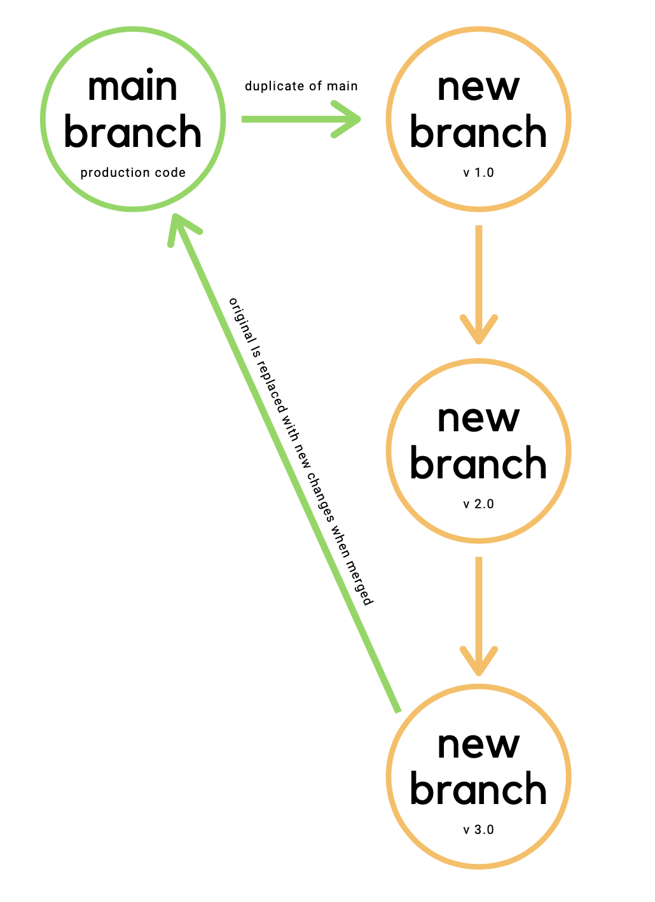
In the example above, we can visualize our main branch on the left. It is our "production" code that has been through testing and quality assurance. When we create a branch, we are duplicating the existing main branch. From this new branch, we can mess with features, add code, and generally run free without worrying about messing up the production code. We can commit different versions of our new branch as many times as we want until it is ready to be merged with main. Once you merge, the main branch has now been replaced with a version of itself that includes your updated code.

### Creating a New Branch

Let's look at the process of creating a new version of the project (a branch). Then we are free to make changes locally on our computer — while the original version of the project, the main branch, remains safely on GitHub. We give the new branch a descriptive name to remind us what we intend to do while working in it. You should use the following naming convention for your branch while you are in the classroom: `topic-initials1-initials2` (ex. arrays-aw-sp)

- To create this new branch, type `git checkout -b <topic-initials1-initials2>` e.g. (ex. arrays-aw-sp). You'll see a line in your terminal that says `Switched to a new branch`.
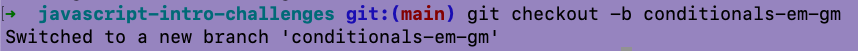

- Now that you are successfully inside of a new branch, you will create a new file to work in. Use `touch` to make a new file using the naming convention `topic-student1-student2.js` (ex. arrays-austin-sarah.js). Then you can open your code in your text editor.
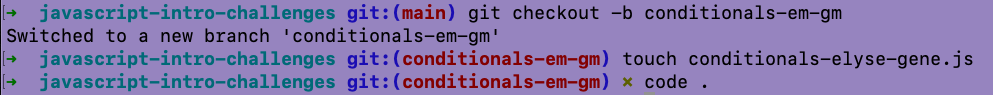

- The first driver is now free to write code!
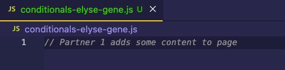

- After the first driver is done with their portion, follow the git flow to push your code up to GitHub:
- Run a quick `git status` to make sure your changes are being registered. And no extra files have been changed.
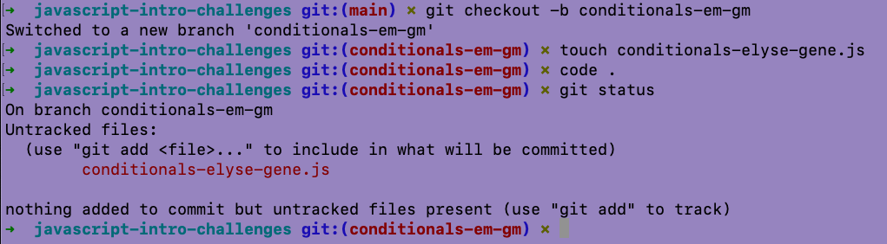

As you can see above, a change has been made to our new file and is ready to be pushed up!
- Next you will `git add .` and `git commit`. Your commit message should be descriptive of the portion you are completing. It would also follow the current-tense, almost as if you are telling the computer a command. In this example, our commit message is `"start challenge one"`.
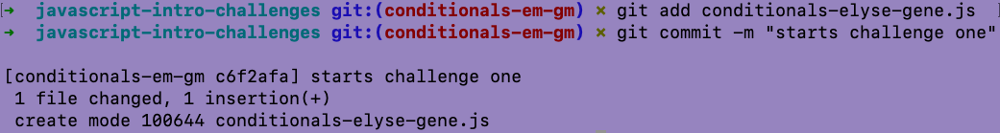

- Finally, you're going to `git push origin <branch-name>`.
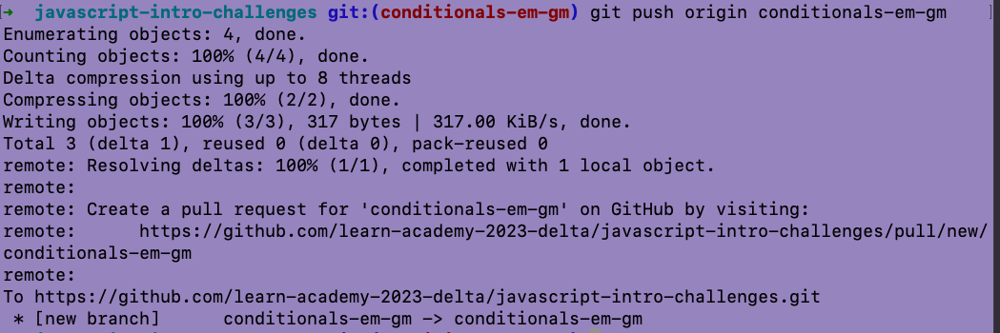

- Voila! Now the code you wrote locally is hosted on GitHub and your partner will be able to access it!

### Switching Drivers

Now you're ready to switch! The next driver will want to clone the original repository, `cd` into that folder, and run the following commands:

- `git fetch origin <branch-name>`
- `git checkout <branch-name>`
  - Note: This branch name is the one that was created by the first driver.
- `git pull origin <branch-name>`

At this point, the second driver should have the updated file/s that the first driver contributed! Driver Two is ready to code!
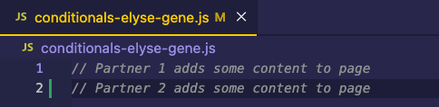

When it comes time to switch again, follow the git flow that was used above:
- `git add .`
- `git commit -m "detailed description here"`
- `git push origin <branch-name>`

## Merging to Main

A pull request is a method of submitting contributions to a development project. We will use pull requests to update `main` with the new files you'll be creating in your branches.

- Inside of the repository on GitHub, you'll see this message:
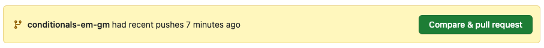
Click `Compare & pull request`
- You will then be redirected to a page where you can create a pull request. Don't worry about adding to the form for the code challenges we do in class.
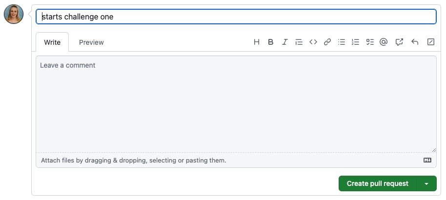
Click `Create pull request`

- Now click `Merge pull request`
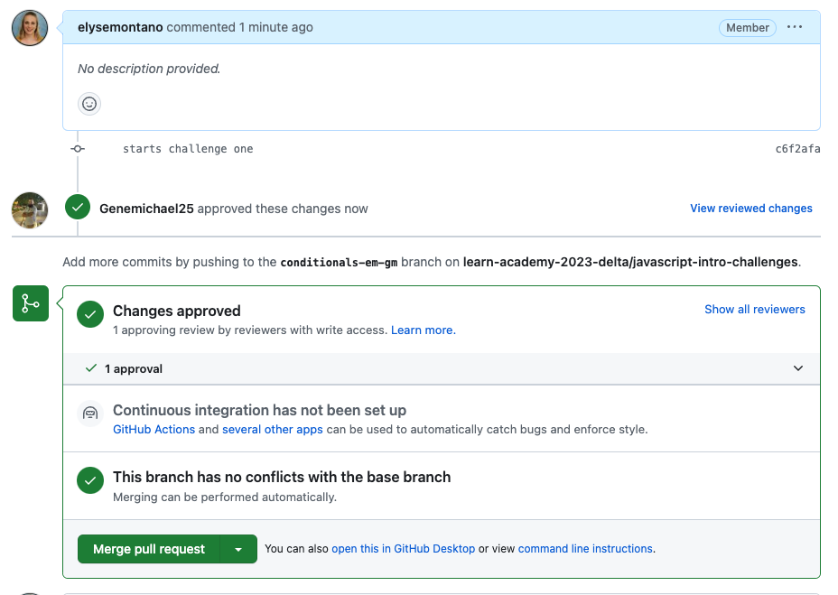

- Now main has been updated to include your code! Your branch did its job and can be deleted.
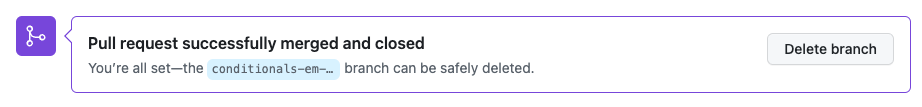

---
[Back to Syllabus](../README.md#github)
