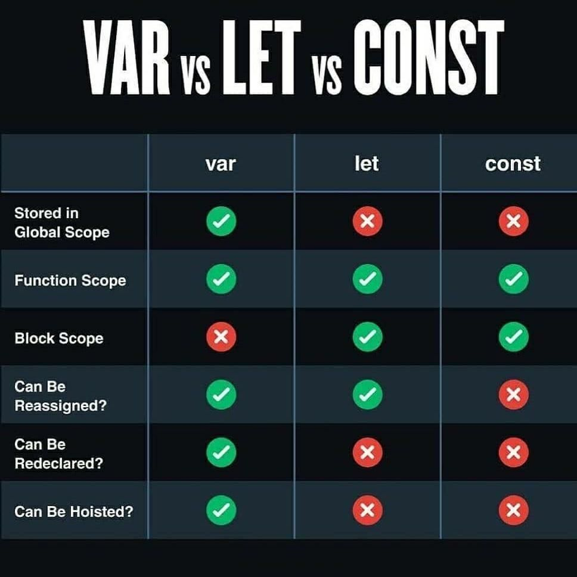

# JavaScript Functions

#### Overview
Functions are a fundamental building block in JavaScript and in programming in general. Functions are reusable pieces of code that only execute when invoked and always return an output. Functions can have information (arguments) passed into the scope of the function through placeholders called parameters. Functions are designed to be used many times in a program and should be as generic as possible while still being descriptive as to their purpose.

#### Previous Lecture (43 min)
[](https://www.youtube.com/watch?v=YyG1hetdqQI)

#### Learning Objectives
- can explain the purpose of a function
- can define the anatomy of an arrow function
- can create a function that is reusable and dynamic
- can distinguish between a function call and a function expression
- can utilize parameters within a function
- can demonstrate the use of pseudocode to guide logical steps

#### Vocabulary
- function
- encapsulation
- arrow syntax
- function expresson
- const
- function invocation / function call
- code block
- return
- parameter
- argument
- algorithm
- function signature
- pseudocoding

#### Additional Resources
- [W3Schools JavaScript Functions](https://www.w3schools.com/js/js_functions.asp)
- [Edabit Code Challenges](https://edabit.com/challenges/javascript)
- [How to Write Pseudocode](https://www.geeksforgeeks.org/how-to-write-a-pseudo-code/)
- [Many Ways to Create Functions](https://javascript.info/function-expressions)



#### Process
- `cd` into the `javascript-intro-challenges` repository
- Create a new branch: `functions-initials1-initials2` (ex. functions-aw-sp)
- `touch` a file with no spaces and `.js` extension: `functions-student1-student2.js` (ex. functions-austin-sarah.js)
- Open the folder in a text editor
- Code!

#### Troubleshooting Tips
- Does the function have a return?
- Is there a `console.log` on the function invocation?
- Does the number of arguments match the number of parameters?

---

### Functions: Little Code Machines
A **function** is a set of instructions detailing how to do a task. We can use the instructions to execute an action over and over again. Function logic should be contained so that the internal workings of the function should not interact with the rest of the program. This is the idea of **encapsulation**.

### Anatomy of a Function

```javascript
const greeting = () => {
  return "Hello there LEARN student!"
}
````

Functions consists of the following:
1. Variable declaration
    - Just like any other variable, we must inform JavaScript with a declaration
    - Because function expressions should only be assigned one time it is best practice to use the variable declaration that won't allow reassigning
    - `const`
2. Variable name
    - Variables must be camelCase and descriptive as to the intent of the function
    - `const greeting`
3. Single equal sign
    - Variables must be assigned with a single equal sign
    - `const greeting =`
4. Parentheses
    - Parentheses describes an action in JavaScript
    - Parentheses can take parameter to pass inputs to a function
    - `const greeting = ()`
5. Arrow
    - Function syntax
    - `const greeting = () =>`
6. Curly braces
    - Curly braces define a code block where the logic is encapsulated
    - `const greeting = () => {}`
7. Return
    - Describes the output of a function
    - Without a return, a function will log `undefined`
    - There can only be one executable return per code block
    ```
      const greeting = () => {
        return
      }
    ```

### Function Expression

```javascript
const greeting = () => {
  return "Hello there LEARN student!"
}
````

There are several ways to define a function in JavaScript. There is a keyword *function* that can be used to create what is called a named function declaration. In programming there are many tools for the job. It is up to us as developers to find the best tool for the problem we are facing. At LEARN, we will focus on creating function expressions using variable declarations and the **arrow syntax**. The arrow syntax provides a concise approach to describing a function action in JavaScript. The arrow syntax also has some advantages as we move into more complicated implementations of JavaScript.

A **function expressions** is a variable that holds the logic of a function. Our function expression will be declared using the variable declaration const. The variable declaration **const** will prohibit the function expression from accidentally being redeclared.

Great! We have a function. But this function is not doing anything yet. At this point, JavaScript recognizes that our function exists, but the power of a function is that it is a little machine that can be used over and over again. So how do we tell the program when and how often to run our little code machine?

### Function Invocation/Call

```javascript
const greeting = () => {
  return "Hello there LEARN student!"
}
console.log(greeting())
````

We have a function that is recognized by the program and now we need to tell our function when and how often to execute. Telling our function to run is called a **function invocation** or **function call**. Invocation and call are often used interchangeably. While we only have one function expression, we can have as many function invocations as needed for our program.

```javascript
const greeting = () => {
  return "Hello there LEARN student!"
}
console.log(greeting())
// output --> "Hello there LEARN student!"
console.log(greeting())
// output --> "Hello there LEARN student!"
console.log(greeting())
// output --> "Hello there LEARN student!"
````

To invoke or call our function we used the name that we gave our variable that holds the function expression. Following the variable name is a set of parentheses. Calling the function by its name will tell the program to execute the steps described in the function expression. In order to see the output of our function, we have wrapped our function call in a `console.log`.

### Function Logic
After the arrow `=>` in our function expression is where all the logic lives. It is a common practice to define a code block. A **code block** is a group of statements wrapped by curly braces. Inside the code block we can write any JavaScript code that is necessary to get to the desired output of the function. Within the logic there is going to be *one thing* that is the ultimate function output. That output is defined by the JavaScript keyword **return**. Every function code block needs exactly one return. If you omit the return your function will output `undefined`.

### Function Parameters and Arguments
It is important to remember when creating function logic that functions should always be encapsulated. This means the logic in your function cannot reference other information in your program. The problem with this is without any external information the function logic is limited. Functions often require external information in order to perform the appropriate task.   This problem is solved by function parameters and arguments.

In the previous example of the `greeter` function there was only one possible output. As many times as we invoked the function we only ever recieved a string containing the characters, "Hello there LEARN Student!" Let's enhance this function using a parameter and argument to introduce an input to the function.

```javascript
const greeting = (name) => {
  return `Hello there ${name}!`
}
console.log(greeting("Matt"))
// output --> "Hello there Matt!"
console.log(greeting("Rachael"))
// output --> "Hello there Rachael!"
```

Now our function output will be different each time it is invoked. In the example above, `name` is a parameter. A **parameter** is a placeholder variable that is defined inside the parentheses of the function expression. Once it is defined in the parentheses, it can be leveraged anywhere in the function logic.

The parameter is then assigned a value called an argument. An **argument** is the actual content passed to the function inside the parentheses of the function invocation. The argument value must be a data type recognized by JavaScript. The argument is represented in the function for every instance of the parameter. Now our function output changes based on the input while still maintaining encapsulation.

```javascript
console.log(greeting("Sam"))
// output --> "Hello there Sam!"
console.log(greeting("John"))
// output --> "Hello there John!"
```

### Multiple Parameters and Arguments
Functions are not limited to a single input. We can pass as many arguments into a function as we want. We just have to define an equal number of parameters.

```javascript
const multiplier = (num1, num2) => {
  return num1 * num2
}

console.log(multiplier(3, 5))
// output --> 15
console.log(multiplier(5, 8))
// output --> 40
```

It is common that the argument values will be represented by variables.

```javascript
var myNumber1 = 3
var myNumber2 = 5
var myNumber3 = 8

console.log(multiplier(myNumber1, myNumber2))
// output --> 15
console.log(multiplier(myNumber2, myNumber3))
// output --> 40
```
The variable should not be named the same thing as the function parameters.

### Pseudocode
When we are faced with creating a function that is going to take an input and perform logic to produce an output what we are doing is creating an **algorithm**. This is often a complex task that requires a lot of mental heavy-lifting. Anytime we are faced with a complex problem, it is a good idea to break it down.

A common workflow to break down a function algorithm is to start with an input and output. This will ensure we know what the function is going to do and what arguments it will require. The input and output of the function is called the **function signature**. Once we have established the signature, we can create a list of the logical steps to get from input to output. The list should be plain language using code terms but not coding itself. This process of establishing the function signature and creating an actionable plan in human readable words is called **pseudocoding**. Writing pseudocode is a really good habit as it gives us a plan and translates between code communication and human communication.

Let's work through an algorithm prompt using pseudocode.

Prompt: Write a function called `tallEnough` that takes an argument of a person's height in inches and returns whether or not the person meets the 40 inch height requirement to ride the rollercoaster.

```javascript
// Function Signature
// input: number
// output: string indicating allowed, denied, or error

// Examples
// input: 39 // output --> "Cannot ride the rollercoaster"
// input: 45 // output --> "Buckle up, let's ride"
// input: "yolo" // output --> "error"

// Process
// create a function called tallEnough that takes in a number called height
// if height is less than 40 return "Cannot ride the rollercoaster"
// if height is greater than or equal to 40 return "Buckle up, let's ride"
// any other input return error
```

Now let's build the actual code around the pseudocode.

```javascript
// create a function called tallEnough that takes in a number called height
const tallEnough = (height) => {
  // if height is less than 40 return "Cannot ride the rollercoaster"
  if(height < 40) {
    return "Cannot ride the rollercoaster"
  }
  // if height is greater than or equal to 40 return "Buckle up, let's ride"
  else if(height >= 40) {
    return "Buckle up, let's ride"
  }
  // any other input return error
  else {
    return "error"
  }
}
```

We can now use our example inputs from the pseudocode to test the output of the function.

```javascript
// Examples
// input: 39 // output --> "Cannot ride the rollercoaster"
// input: 45 // output --> "Buckle up, let's ride"
// input: "yolo" // output --> "error"

console.log(tallEnough(39))
// output --> "Cannot ride the rollercoaster"

console.log(tallEnough(45))
// output --> "Buckle up, let's ride"

console.log(tallEnough("yolo"))
// output --> "error"
```
---

### Challenges
Copy the challenges into your JavaScript file. Comment out the instructions and code the solution to each problem beneath the prompt. Each solution requires pseudocode. Test your functions with multiple function calls.

1. Write a function named `marco` that returns "polo".

2. Write a function named `greeting` that takes a name as an argument and returns "Welcome, <person's name here>!"

3. Write a function named `oddOrEven` that takes a number as an argument and returns whether the number is odd or even.

4. Write a function named `triple` that takes a number as an argument and returns the result of that number multiplied by 3.

5. Write a function named `multiply` that takes two numbers as arguments and returns the result of the numbers multiplied together.

6. Write a function named `divisibleBy` that takes two numbers as arguments and returns whether the first number is evenly divisible by the second so that divisibleBy(10, 5) logs "10 is evenly divisible by 5".

7. Write a function named `assignGrade` that takes a number score as an argument and returns the letter grade for the score.

8. Write a function named `isLonger` that takes two strings as arguments and returns the string that contains the most characters.

9. Write a function named `greaterNum` that takes two numbers as arguments and returns whichever number is the greater (higher) number.

10. Write a function named `yelling` that takes a string as an argument and return the string in all uppercase case letters.


### STRETCH Challenges

1. The World Translator   
  (a) Write a function named `helloWorld` that takes a language code (e.g. "es", "de", "en") as an argument and returns "Hello World!" in the given language. Ensure you function works for at least 5 languages.  
  (b) Have your function [default](https://developer.mozilla.org/en-US/docs/Web/JavaScript/Reference/Functions/Default_parameters) to returning English.

2. The Pluralizer  
  (a) Write a function named `pluralizer` that takes a number and a singular noun as arguments and returns the number and pluralized form of the noun, if necessary.

  ```javascript
  pluralizer(5, "cat")
  // expected output: "5 cats"

  pluralizer(1, "dog")
  // expected output: "1 dog"
  ```

  (b) Enhance your function so it can handle a few collective nouns like "sheep", "goose", "child", "person" and "species".

---
[Back to Syllabus](../README.md#unit-one-javascript-foundations)
