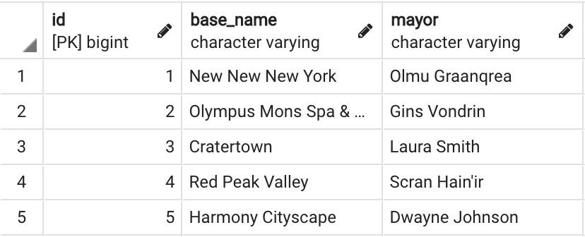
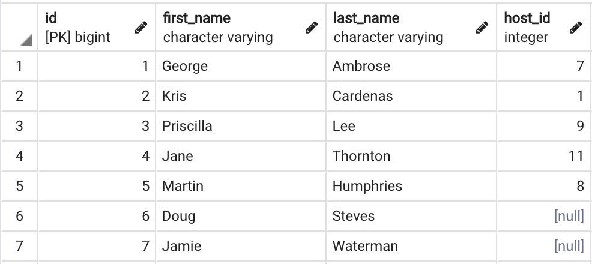
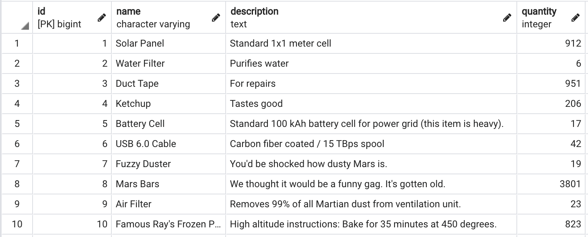
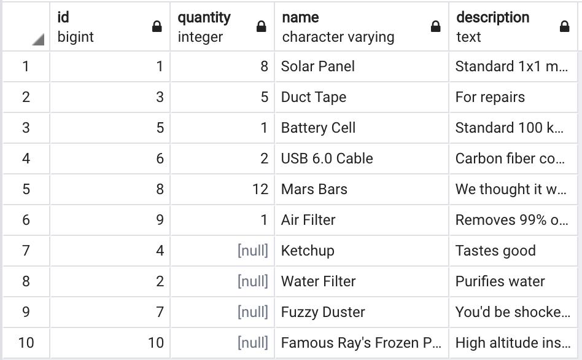
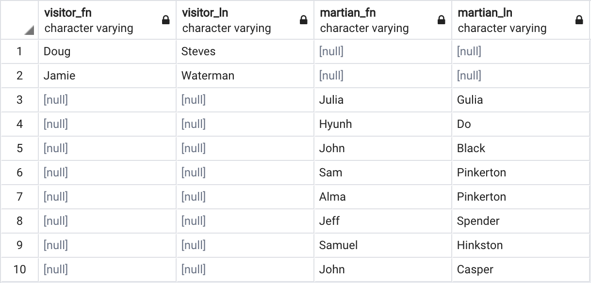

# Joins

A SQL Join statement is used to combine data or rows from two or more tables based on a common field between them.

MySQL and SQLite do not support joins. But Postgresql does!

# Martian Colony

Welcome to Mars! Here are two tables: `martians` and `bases` that make up the database of a Martian colony.

Let's assume that `martians` is the `left` table:


While `bases` is the `right` table:



We can see that martians belong to certain bases. By _joining_ the tables, we will be returning one output that combines data from both tables.

The different types of Joins are:
- INNER JOIN
  - Only returns connected rows that satisfy the `ON` criteria (there will be no `null` values in the output relating to the connection you are trying to make).
- LEFT JOIN
  - Returns every row in the left table, even if it doesn't have a match in the right table (there will be `null` values in the right side in the return)
- RIGHT JOIN
  - Returns every row in the right table, even if it doesn't have a match in the left table (there will be `null` values in the left side in the return)
- FULL JOIN
  - Returns all rows from both tables. Any unconnected pieces will have a `null` value. This is sometimes referred to as a "full outer join."

SQL Joins will follow this syntax:
- SELECT: This outlines the columns you wish to return in the output
- FROM: The left table
- ____ JOIN: The right table. Fill the blank with the type of join you'd like to use.
- ON: Where you would like the tables to connect. Tables are typically joined by an ID.

```
<!-- the columns you'd like to see in the output -->
SELECT *
<!-- first table -->
FROM martians
<!-- table you're joining with -->
INNER JOIN bases
<!-- how the two tables will connect. Tables are typically joined by an ID -->
ON martians.base_id = bases.id
<!-- since this is a SELECT clause, you could add WHERE and ORDER afterwards if you wish -->
```


There may be times where two tables have the same column name/s (ex: "name", or "id"). In order to avoid confusion in our query, it's important to specify which table you are referring to in the return. In your SELECT statement, put the name of the table ahead of the name of the column using dot notation.

```
<!-- add the table to the column using dot notation -->
SELECT martians.first_name, martians.last_name, bases.id, bases.base_name, bases.mayor
FROM martians
INNER JOIN bases
ON martians.base_id = bases.id
```

Our SELECT clause is looking a little cluttered. Let's refactor it to utilize _aliases_ to clean it up.

```
<!-- add the table alias to the column using dot notation -->
SELECT m.first_name, m.last_name, b.id, b.base_name, b.mayor
<!-- define aliases using AS -->
FROM martians AS m
INNER JOIN bases AS b
ON m.base_id = b.id
```

## Martian Colony Tables

Here is all if the data available to us in the Martian Colony.

### Martians:


### Bases:


### Visitors:


### Inventory:


### Supplies:


## Visitor Report
#### Display the name of each visitor and their host to ensure there are no unaccompanied visitors.

We need to link the host_id inside of the Visitor table to the id inside of the Martian table.

If we use an `INNER JOIN`, we will only see visitors who have a host. But we want to see all of the visitors to ensure they are being hosted appropriately. Instead, we will want to use a `LEFT JOIN`, so that every visitor will be included in the output. Remember, the left table is the table you use in the `FROM` clause.

In order to clean up our select, and ensure our output is clear, we will also assign aliases to the `SELECT` columns.

```
SELECT
	v.first_name AS visitor_fn, v.last_name AS visitor_ln,
	m.first_name AS martian_fn, m.last_name AS martian_ln
FROM visitors AS v
LEFT JOIN martians AS m
ON v.host_id = m.id
```


## Inventory Report
#### Generate an inventory report for Base #1

We will need data from the Inventory and Supply tables.

Let's look at a query of the data from Inventory that matches `base_id` of 1.

```
SELECT base_id, supply_id, quantity FROM inventories WHERE base_id = 1
```


This output isn't horrible. But it's missing some key info!
- Name of the supplies listed.
- Items that are not in stock.

To remedy this, we will create another `SELECT` that will return `FROM` the result of our first query above. This is called a "subquery."

In this example, we will use a `RIGHT JOIN` because we want to see all available supplies.

```
SELECT s.id, i.quantity, s.name, s.description
<!-- Give this an alias to refer to -->
FROM (SELECT base_id, supply_id, quantity FROM inventories WHERE base_id = 1) AS i
RIGHT JOIN supplies AS s
ON i.supply_id = s.supply_id
ORDER BY supply_id
```
To avoid duplicate, confusing columns in the output, we are careful with what we put in the `SELECT` clause. Above, we want to return the id of the supply, the quantity of that supply at the base, and the name and description of the supply.



## No Host Report
#### List visitors who do not have a host as well as Martians who are available to do the job.

We will use a `FULL JOIN` so that we can see null values on either table.

```
SELECT
	v.first_name AS visitor_fn, v.last_name AS visitor_ln,
	m.first_name AS martian_fn, m.last_name AS martian_ln
FROM visitors AS v
FULL JOIN martians AS m
ON v.host_id = m.id
WHERE m.id IS NULL OR v.id IS NULL
```


## Challenges:

<!-- IM NOT SURE -->

[Go to Ruby on Rails Introduction](../rails_model/intro.md)

[Back to Intro to Postgres](./intro_postgres.md)

[Back to Syllabus](../README.md)
