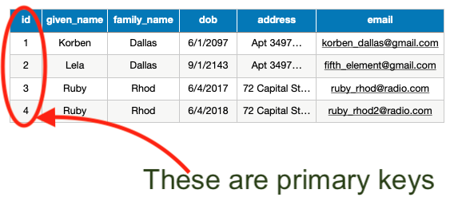

# Introduction to Databases

## Video
[](https://www.youtube.com/watch?v=H5JOXnkHfls)  
***Note: This recording contains both lectures `Intro to Databases and PostgreSQL`. The recording begins with `Intro to Databases`, and that discussion stops at 17:45 of this recording.***

## Overview
- Databases store information in an organized way.
- Relational databases store information in tables that consist of rows and columns.
- The organizational blueprint of the database is called the schema.
- Databases are an essential piece of a full-stack application.

## Learning Objectives
- Conceptualize the concept of a relational database
- Recognizing the similarity between database schemas and classes
- Recognizing the similarity between database instances and objects

## Vocabulary
- SQL
- PostgreSQL
- relational database
- rows
- columns
- database table
- schema
- primary key


### SQL and PostgreSQL
**SQL**, short for Structured Query Language, is a domain-specific language used for communicating with relational databases. **PostgreSQL**, also called **Postgres**, is one type of SQL. Postgres is an open source object-relational database management system, which means Postgres looks at databases through an object-oriented programming (OOP) lens.

### Relational Databases
A **relational database** is structured similar to an Excel spreadsheet or Google Sheets document with its information displayed in **rows** and **columns**. A **database table** is one set of rows and columns. A database can have many tables that have relationships with each other.  The description of the layout of all the tables in a database, along with the name and data type of each column within each table, is called a **schema**.

### How Programs Use Databases
How does the code we write in Rails (or any other language or framework) interact with a database? Let's explore how contact information can be stored in a relational database.

##### Example Contact Information for a Person
```
First Name:     Korben
Last Name:      Dallas
Date of Birth:  6/1/2097
Address:        Apt 3497 1 Main St, CityVille, Earth
Email:          korben_dallas@gmail.com
```

Take a look at the information above and imagine how we can write it in code.

Data like this contact information with key:value pairs is formatted like a Ruby object. We can refactor the data into a Ruby object as follows:

```ruby
person1 = {
  "fname" => "Korben",
  "lname" => "Dallas",
  "birthday" => "6/1/2097",
  "address" => "Apt 3497 1 Main St, CityVille, Earth",
  "email" => "korben_dallas@gmail.com"
}
```

That works well for storing one person's information, but what if there was more people we needed to track? We would end up with variables like `person10453` with lots of redundant code. Other challenges may include sorting the variables and accessing common information among them. So, storing the data separately is not very helpful. What is a more effective approach for managing data that tracks information about numerous individuals?

We can create a `Class`. Making a class for a generic `Person` allows us to define the common attributes for each person, and subsequently, any new individual we add will adhere to that established pattern. Refactoring the data into a Ruby class will appear as follows:

```Ruby
class Person
  def initialize(fname, lname, birthday, address, email)
    @fname = fname
    @lname = lname
    @birthday = birthday
    @address = address
    @email = email
  end
end

Person.new("Korben", "Dallas", "6/1/2097", "Apt 3497 1 Main St, CityVille, Earth", "korben_dallas@gmail.com")
```
Now we have a reproducible way to create people in our application. The next task is to store each new instance of class `Person` into a database. (Remember in Ruby, an instance of a class is an object.) How do we do that?

Imagine we are creating an Excel file to store all the objects created from class `Person`. The Excel file would probably be called `people` because it will store contact info for several people.

The properties we expect each person to have (first name, last name, birthday, etc... from the list above) would become the columns of our Excel sheet. Adding a new person is a matter of adding a row and filling out that person's information for each column.

That is essentially what will happen in our code. A class will be connected to a database table (the Excel sheet) and each instance of a person will be added to the table as a row.

### Relations or Tables
A single row entry in a database is an instance of a class within our code. A collection of instances that contain the same attributes is called a relation or a table.

**Table**


**Collection of instances of class Person**


### The Primary Key
Each row must have a unique way of identifying itself to other parts of the program.

In Rails, every row of a table has a primary key named "id", which is guaranteed to be unique. Its uniqueness prevents problems like confusing two `Person` instances due to identical names. We can always tell them apart by their primary keys.

**Primary keys with instances of class Person**


### Summary
In this lesson, we learned about organizing a program's data into a relational database structure. We were introduced to the database concept of a row, which represents an instance of a class. Rows are grouped together into tables. Relational databases define the name and data type of each column using a schema. One very important attribute of every row in every table in a Rails application is the ID. Primary keys are guaranteed to be unique and are how we identify individual rows.

Relational databases were in existence prior to the introduction of Rails and will continue to endure even as new technologies emerge. Rails, as well as other web frameworks, can be conceptualized as tools that effectively and securely connect web pages with data stored in relational databases.

---
[Back to Syllabus](../README.md#unit-five-intro-to-postgres-and-ruby-on-rails-models)
