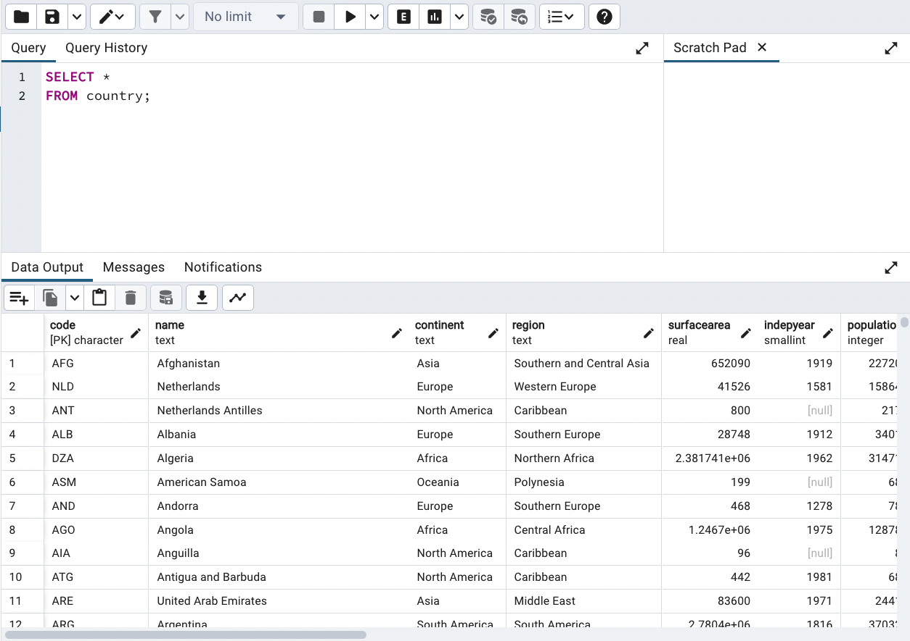
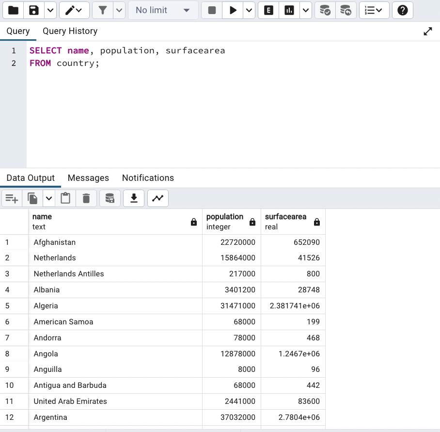
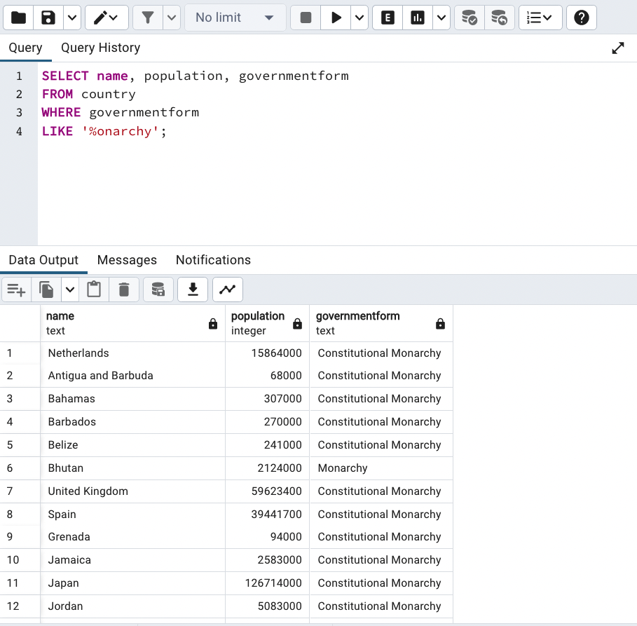
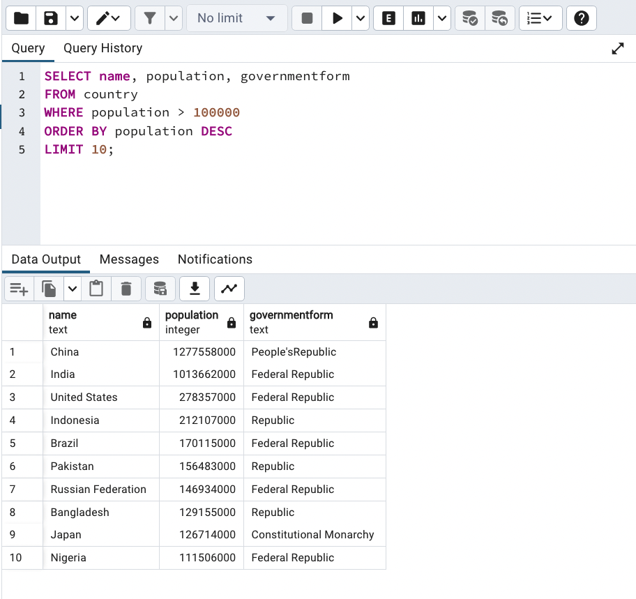
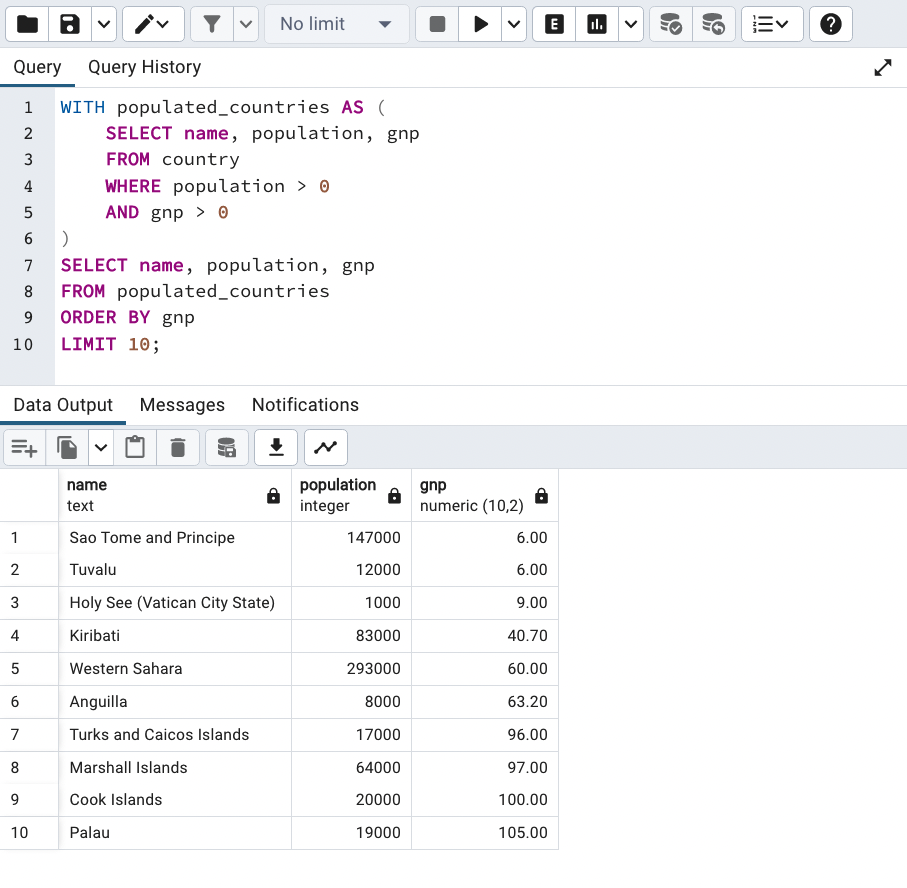

# PostgreSQL Queries

#### Overview

PostgreSQL is an object-relational database management system. To access data in the database we define a query. A query is code that requests particular information from a database. Creating efficient queries will improve the speed and performance of the application.

#### Previous Lecture (41 min)

[](https://www.youtube.com/watch?v=LAVczO2faPI)

#### Learning Objectives

- can define database
- can differentiate database rows and columns
- can define the purpose of a query
- can define primary key

#### Vocabulary

- database query
- SELECT statement
- WHERE clause
- wildcard
- subquery
- aggregate functions

#### Additional Resources

- [Country database source](http://www.stat.fi/worldinfigures)
- [PGAdmin docs](https://www.pgadmin.org/)

#### Process

- `cd` into the `database-challenges` repository
- Create a new branch: `postgresql-initials1-initials2` (ex. postgresql-aw-sp)
- `touch` a file with no spaces and `.sql` extension: `postgresql-student1-student2.sql` (ex. postgresql-austin-sarah.sql)
- Open the folder in a text editor for your notes

#### PGAdmin

PGAdmin will likely ask for a password at multiple points in the setup process. All passwords for PGAdmin are `SDlearn123`.

BEFORE completing any of the following steps, please check with your instructor.

- Open PGAdmin (command + spacebar for spotlight search)
- Object >> Register >> Server
- General tab
  - Name: `localhost`
- Connection tab
  - Host name/address: `localhost`
  - Change username from `postgres` to `learnacademy`
  - Password: `SDlearn123`
- Click save

#### Query Execution

- Select the database on the left sidebar: Servers >> localhost >> Databases >> countries
- Tools >> Query Tool
- Type the query in the Query Editor
- Click the play button to execute the query

---

### Database Queries

Data storage was one of the earliest applications of computing. This means that database languages like SQL have been around longer than most other programming languages. When we interact with a database, we do so through a query. A **database query** is an action performed on a database to retrieve data, create data, update data, and delete data. The word query means question, so essentially, we are crafting a question to the database. The trick to working with databases is asking the right questions.

### Best Practices

Queries look a bit more like regular English words than some other programming languages we've worked with. Just like every other language, PostgreSQL has keywords and best practices for crafting effective queries.

It is best practice to write the PostgreSQL keywords in uppercase, but the PostgreSQL program is not case sensitive. It is also convention to allow each section of the query its own line. Each query should end with a semicolon.

### Database Data Structure

When looking at the output of a query, the order of the items in the database may seem pretty random. Databases are not ordered by the content. They are ordered by primary key. So it is up to the developer to order the contents of the query.

### SELECT

Every query we make will start with the keyword `SELECT`. The **SELECT statement** is used to describe which columns will be included in the query.

The most basic query we can perform is to select all the information from a particular table. An asterisk `*` is a shorthand for "all items."

```sql
SELECT *       <-- means all columns
FROM country;
```



The result of the `SELECT *` will include every column and every row (or instance) in the database.

Now that we have successfully executed a query, we can start to reduce the quantity of data that gets returned. Rather than returning all the columns, we can select particular columns. To do this we will specify the columns by passing in the column names separated by commas.

```sql
SELECT name, population, surfacearea
FROM country;
```



This query will reduce the overall quantity of data being returned by reducing the number of columns. The query will still return every row (or instance) in the database.

### WHERE

Now that we have narrowed the number of columns we can begin to make decisions about which rows (or instances) we want returned. To do this, we can introduce the `WHERE` clause. The **WHERE clause** is a comparison operator that acts a lot like a conditional statement. The `WHERE` clause makes decisions using one or more of the following comparisons.

- is equal to `=`
- is not equal to `!=`
- greater than `>`
- less than `<`
- greater than or equal to `>=`
- less than or equal to `<=`
- between a certain range `BETWEEN`
- pattern matching `LIKE`
- specifies a set `IN`
- logical `AND` chains multiple conditions
- logical `OR` chains multiple conditions
- negation `NOT`

```sql
SELECT code, name, population, gnp
FROM country
WHERE gnp > 1e+6;
```


```sql
SELECT name, population, surfacearea
FROM country
WHERE surfacearea < 100000;
```

The `IN` operator refers to a set of values. This query will only return rows (or instances) where the `governmentform` values are `Republic` or `Monarchy`.

```sql
SELECT name, population, governmentform
FROM country
WHERE governmentform
IN ('Republic', 'Monarchy');
```

The `LIKE` operator uses pattern matching within the characters of a string. To broaden the scope of the pattern matching we can use a wildcard. The percent sign `%` is a **wildcard**, meaning it can stand for any number of any characters rather than pattern matching the characters exactly.

```sql
SELECT name, population, governmentform
FROM country
WHERE governmentform
LIKE '%onarchy';
```



The `NOT` operator excludes a set of values.

```sql
SELECT *
FROM country
WHERE
NOT(continent = 'North America');
```

The `OR` operator allows for values that meet either condition.

```sql
SELECT code, name, population, gnp
FROM country
WHERE population > 1e+8
OR gnp > 1e+6;
```

The `AND` operator allows for only the values that meet both conditions.

```sql
SELECT code, name, population, gnp
FROM country
WHERE population > 1e+8
AND gnp > 1e+6;

SELECT name, population, surfacearea
FROM country
WHERE surfacearea
BETWEEN 100000
AND 500000;
```

### ORDER BY

We can order the result set of a query by adding an `ORDER BY` clause after the `WHERE` clause. Since the data in the database is not in any particular order, the `ORDER BY` clause can make the data more meaningful.

```sql
SELECT name, population, governmentform
FROM country
WHERE governmentform IN ('Republic', 'Monarchy')
ORDER BY population;
```

We can append `ASC` or `DESC` to make the order ascending or descending.

```sql
SELECT name, population, governmentform
FROM country
WHERE governmentform IN ('Republic', 'Monarchy')
ORDER BY population DESC;
```

### LIMIT

A `SELECT` will always return all the items that meet a particular condition. To reduce the number of items that are returned we can pass the `LIMIT` clause after the `WHERE` clause.

The following example limits the number of rows (or instances) in the result set to ten.

```sql
SELECT name, population, governmentform
FROM country
WHERE population > 100000
LIMIT 10;
```

To make the ten items more meaningful, we can order them before applying the limit clause. This allows for a query result to the question, "What are the ten countries with the largest population?"

```sql
SELECT name, population, governmentform
FROM country
WHERE population > 100000
ORDER BY population DESC
LIMIT 10;
```



### Working with NULL

`NULL` is a special value that is used to denote "no value" similar to `nil` in Ruby.

The strange thing about `NULL` is that it is not equal to anything, _including itself_. To specify `NULL` in a `WHERE` clause we have to use `IS NULL` or `IS NOT NULL`.

### AS

The `AS` clause will create an additional column for the query. The `AS` clause requires a custom name for the alias of the column.

```sql
SELECT name, population,
gnp / population AS gnp_per_capita   <-- alias
FROM country
WHERE population > 1e+8;
```

### WITH

The `WITH` clause will create a subquery. A **subquery** is a query embedded within another query. The subquery is created by defining a `SELECT` statement with an alias. The results of a subquery are used by referencing the alias in the main query.

In this example, we create an alias called `populated_countries` for the subquery that eliminates any countries that have a population of 0 and a gnp of 0. Next, we query the alias `populated_countries` to extract 10 countries that have the lowest gnp.

```sql
WITH populated_countries AS (
	SELECT name, population, gnp
	FROM country
	WHERE population > 0
	AND gnp > 0
)
SELECT name, population, gnp
FROM populated_countries
ORDER BY gnp
LIMIT 10;
```



### Aggregate Functions

So far, we've created queries that extract lists of data. But what if we want to do more than print lists? In PostgreSQL, we can also perform calculations like addition or computing the average. **Aggregate functions** like `COUNT`, `SUM`, `AVG`, `MIN`, and `MAX` perform an action on a particular set of data and returns a calculated value.

In this example, `COUNT` allows us to see the most common form of government and how many rows meet that criteria.

```sql
SELECT governmentform, COUNT(*)
FROM country
GROUP BY governmentform
ORDER BY count DESC
LIMIT 1;
```

Using `SUM` we can return the total population for every entry in the database.

```SQL
SELECT SUM(population)
FROM country;
```

### GROUP BY

The `GROUP BY` clause is used to arrange rows with matching values in specified columns into condensed summaries.

Aggregate functions like `COUNT` or `AVG` can also be used with `GROUP BY`.

The following example uses `AVG` performs a calculation on the specified column and then returns the summarized data grouped into rows based on the region.

```sql
SELECT region, AVG(lifeexpectancy)
FROM country
GROUP BY region;
```

Here we can see how many countries are in a particular region using `COUNT` and `GROUP BY`.

```sql
SELECT region, COUNT(name)
FROM country
WHERE region='South America'
GROUP BY region;
```

---

### Challenges

Be sure to copy the queries in the file in the database repository for later reference.

- What is the population of the US? (HINT: 278357000)
- What is the area of the US? (HINT: 9.36352e+06)
- Which countries gained their independence before 1963?
- List the countries in Africa that have a population smaller than 30,000,000 and a life expectancy of more than 45? (HINT: 37 entries)
- Which countries are something _like_ a republic? (HINT: Are there 122 or 143?)
- Which countries are some kind of republic and achieved independence after 1945? (HINT: 92 entries)
- Which countries achieved independence after 1945 and are _not_ some kind of republic? (HINT: 27 entries)
- Which fifteen countries have the lowest life expectancy? (HINT: starts with Zambia, ends with Sierra Leonne)
- Which fifteen countries have the highest life expectancy? (HINT: starts with Andorra, ends with Spain)
- Which five countries have the lowest population density (density = population / surfacearea)? (HINT: starts with Greenland)
- Which countries have the highest population density?(HINT: starts with Macao)
- Which is the smallest country by area? (HINT: .4)
- Which is the smallest country by population? (HINT: 50)?
- Which is the biggest country by area? (HINT: 1.70754e+07)
- Which is the biggest country by population? (HINT: 1277558000)
- Who is the most influential head of state measured by population? (HINT: Jiang Zemin)
- Of the countries with the top 10 gnp, which has the smallest population? (HINT: Canada)
- Of the 10 least populated countries with permanent residents (a non-zero population), which has the largest surfacearea? (HINT: Svalbard and Jan Mayen)
- Which region has the highest average gnp? (HINT: North America)
- Who is the most influential head of state measured by surface area? (HINT: Elisabeth II)
- What is the average life expectancy for all continents?
- What are the most common forms of government? (HINT: use `count(*)`)
- How many countries are in North America?
- What is the total population of all continents?

### 🏔 Stretch Goals

- Which countries have the letter `"z"` in the name? How many?
- Of the smallest 10 countries by area, which has the biggest gnp? (HINT: Macao)
- Of the smallest 10 countries by population, which has the biggest per capita gnp?
- Of the biggest 10 countries by area, which has the biggest gnp?
- Of the biggest 10 countries by population, which has the biggest per capita gnp?
- What is the sum of surface area of the 10 biggest countries in the world? The 10 smallest?
- What year is this country database from? Cross reference various pieces of information to determine the age of this database.

---

[Back to Syllabus](../README.md#unit-five-intro-to-postgres-and-ruby-on-rails-models)
