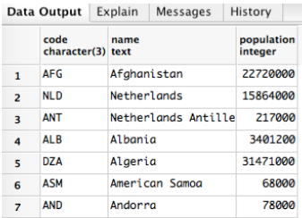

# PostgreSQL Queries

## Video
[ Database Queries ](https://player.vimeo.com/video/137862865)

## Overview
- PostgreSQL is a object-relational database management system
- A query is code that requests particular information from a database
- Creating efficient queries will improve the speed and performance of your application

## Learning Objectives
- Familiarization with the syntax of a query statement
- Exploring PGAdmin
- Analyzing a data set and extracting the necessary information through a query

## Vocabulary
- query
- subquery
- aggregate function
- database table

## Additional Resources
- [ Here ](http://www.stat.fi/worldinfigures) is the country database source
- [ PGAdmin docs ](https://www.pgadmin.org/)

## PGAdmin Setup
- Open PGAdmin (command + spacebar for spotlight search)
- Object >> Create >> Server
- General >> name: localhost
- Click on connection tab
- Host name/address: `127.0.0.1` or `localhost`
- Change username from postgres to `learnacademy`
- Password: SDlearn123
- Click save

To run a query follow these steps...
- Select the correct database:
  - On the lefthand side select: Servers >> localhost >> Databases
  - Click on countries
- Tools >> Query Tool
- Type your query in the Query Editor
- Click on play button to run query

### Database Queries
In this section you'll find a bunch of keywords and other syntax you can use to create what are generically called `database queries`. The word query just means question, so essentially, this is the syntax we will use to ask questions from the database to hopefully get the data we want.

The trick to working with databases is asking the right questions. Look through this syntax to see what kinds of questions you can ask the database.

Queries look a bit more like regular English words than some other programming languages, but it's still important to follow the specific syntax required by each keyword.

NOTE: It is best practice to write the Postgres keywords in uppercase, but the Postgres program is not case sensitive. It is also convention to allow each section of the query its own line.

### SELECT
The most basic query you can perform is to select all the information from a particular table. Every query will have a `SELECT` statement to describe which columns will be included in the query. The `*` is a shorthand for "all items."
```sql
SELECT *       <-- means all columns
FROM country;
```


To select particular columns, pass in the column name separated by commas. Any column needed in the query should be used in the select statement.
```sql
SELECT name, population, surfacearea
FROM country;
```

**What's up with that order?**
You'll notice the order of the items seems pretty random. Databases are not ordered by the content. They are ordered by primary key. So it is up to the developer to order the contents of the query.

### WHERE

A `WHERE` clause is a comparison operator and accepts the following:

`=`, `!=`, `>`, `<`, `>=`, `<=`,
`BETWEEN`, `LIKE`, and `IN`,
`NOT`, `AND`, `OR`.

````sql
SELECT code, name, population, gnp
FROM country
WHERE gnp > 1e+6
````


```sql
SELECT name, population, surfacearea
FROM country
WHERE surfacearea < 100000;
```

Use of operators can be grouped with parenthesis.

The `IN` operator refers to a set of values.
```sql
SELECT name, population, governmentform
FROM country
WHERE governmentform
IN ('Republic', 'Monarchy');
```

For the `LIKE` operator the `%` is a wildcard, meaning it can stand for any number of any characters rather than matching the characters exactly.
```sql
SELECT name, population, governmentform
FROM country
WHERE governmentform
LIKE '%onarchy';
```

The `NOT` operator excludes a set of values.
````sql
SELECT *        <-- means all columns
FROM country
WHERE
NOT(continent = 'North America');
````

The `OR` operator allows for values that meet either condition.
````sql
SELECT code, name, population, gnp
FROM country
WHERE population > 1e+8
OR gnp > 1e+6;
````

The `AND` operator allows for only the values that meet both conditions.
````sql
SELECT code, name, population, gnp
FROM country
WHERE population > 1e+8
AND gnp > 1e+6;

SELECT name, population, surfacearea
FROM country
WHERE surfacearea
BETWEEN 100000
AND 500000;
````

### ORDER BY
You can order the result set of a query by adding an `ORDER BY` clause after the `WHERE` clause.

```sql
SELECT name, population, governmentform
FROM country
WHERE governmentform IN ('Republic', 'Monarchy')
ORDER BY population;
```
You can append `ASC` or `DESC` to make the order ascending or descending.
```sql
SELECT name, population, governmentform
FROM country
WHERE governmentform IN ('Republic', 'Monarchy')
ORDER BY population DESC;
```

### LIMIT
A `SELECT` will always return all the items that meet a particular condition. To reduce the number of items that are returned you can pass the `LIMIT` clause after the `WHERE` clause.

The following examples limits the number of rows in the result set to ten:
```sql
SELECT name, population, governmentform
FROM country
WHERE population < 100000
LIMIT 10;
```

### Working with NULL
`NULL` is a special value that used to denote "no value", similar to `nil` in Ruby, and `null` or `undefined` in Javascript.

The strange thing about `NULL` is that is not equal to anything, *including itself*.
So to specify `NULL` in a `WHERE` clause we have to use `IS NULL` or `IS NOT NULL`.

- Most functions and expressions yield `NULL` if `NULL` is an argument
- You can account for `NULL` with
- `IS NULL`,
- `IS NOT NULL` or
- `COALESCE` which returns first non-`NULL` value

### AS
The `AS` clause will create an additional column for the query. The `AS` clause requires a name for the alias of the column.  

````sql
SELECT name, population,
gnp / population AS gnp_per_capita   <-- alias
FROM country
WHERE population > 1e+8;
````

### WITH
The `WITH` clause allows a developer to create subqueries. `WITH` allows us to define a `SELECT` statement and give it an alias. Then we can make a query from that alias.

Here we create a subquery called `populated_countries` that eliminates any countries that have a population of 0 and a gnp of 0. Then, we can use the alias `populated_countries` to look for the 10 countries that have the lowest gnp.
``` sql
WITH populated_countries AS (
	SELECT name, population, gnp
	FROM country
	WHERE population > 0
	AND gnp > 0
	)
SELECT name, population, gnp
FROM populated_countries
ORDER BY gnp
LIMIT 10;
```

## Aggregate Functions
So far, we've stored items into tables and selected lists of items from them. But what if we wanted to do more than print lists? In PostgreSQL, we can also perform operations on a list like addition or computing the average. Clauses like `COUNT`, `SUM`, `AVG`, `MIN`, and `MAX` perform an action on a particular set of data that is passed in.

Using `SUM` we can return the total population for every entry in the database.
```SQL
SELECT SUM(population)
FROM country;
```

Using `COUNT` we can see the most common form of government and how many rows meet that criteria.
```sql
SELECT governmentform, COUNT(*)
FROM country
GROUP BY governmentform
ORDER BY count DESC
LIMIT 1;
```

### GROUP BY
The `GROUP BY` clause is used together with the `SELECT` statement to group together rows that have the same data.

You can also use the aggregate functions like `COUNT` or `AVG` that can be used with `GROUP BY`.

`AVG` performs a calculation on the row data that is being passed then returns the data grouped by the region.
```sql
SELECT region, AVG(lifeexpectancy)
FROM country
GROUP BY region;
```

Here we can see how many countries are in a particular region using `COUNT` and `GROUP BY`.
```sql
SELECT region, COUNT(name)
FROM country
WHERE region='South America'
GROUP BY region
```

## Challenges: SQL Country Database
Save your queries in a file if you want to keep them for posterity.

#### WHERE
- What is the population of the US? (HINT: 278357000)
- What is the area of the US? (HINT: 9.36352e+06)
- Which countries gained their independence before 1963?
- List the countries in Africa that have a population smaller than 30,000,000 and a life expectancy of more than 45? (HINT: 37 entries)
- Which countries are something *like* a republic? (HINT: Are there 122 or 143?)
- Which countries are some kind of republic and achieved independence after 1945? (HINT: 92 entries)
- Which countries achieved independence after 1945 and are *not* some kind of republic? (HINT: 27 entries)

#### ORDER BY
- Which fifteen countries have the lowest life expectancy? (HINT: starts with Zambia, ends with Sierra Leonne)
- Which fifteen countries have the highest life expectancy? (HINT: starts with Andorra, ends with Spain)
- Which five countries have the lowest population density (density = population / surfacearea)? (HINT: starts with Greenland)
- Which countries have the highest population density?(HINT: starts with Macao)
- Which is the smallest country by area? (HINT: .4)
- Which is the smallest country by population? (HINT: 50)?
- Which is the biggest country by area? (HINT: 1.70754e+07)
- Which is the biggest country by population? (HINT: 1277558000)
- Who is the most influential head of state measured by population? (HINT: Jiang Zemin)

#### Subqueries: WITH
- Of the countries with the top 10 gnp, which has the smallest population? (HINT: Canada)
- Of the 10 least populated countries with permament residents (a non-zero population), which has the largest surfacearea? (HINT: Svalbard and Jan Mayen)

#### Aggregate Functions: GROUP BY
- Which region has the highest average gnp? (HINT: North America)
- Who is the most influential head of state measured by surface area? (HINT: Elisabeth II)
- What is the average life expectancy for all continents?
- What are the most common forms of government? (HINT: use `count(*)`)
- How many countries are in North America?
- What is the total population of all continents?

## Stretch Challenges
- Which countries have the letter ‘z’ in the name? How many?
- Of the smallest 10 countries by area, which has the biggest gnp? (HINT: Macao)
- Of the smallest 10 countries by population, which has the biggest per capita gnp?
- Of the biggest 10 countries by area, which has the biggest gnp?
- Of the biggest 10 countries by population, which has the biggest per capita gnp?
- What is the sum of surface area of the 10 biggest countries in the world? The 10 smallest?
- What year is this country database from? Cross reference various pieces of information to determine the age of this database.

---
[Back to Syllabus](../README.md#unit-five-intro-to-postgres-and-ruby-on-rails-models)
