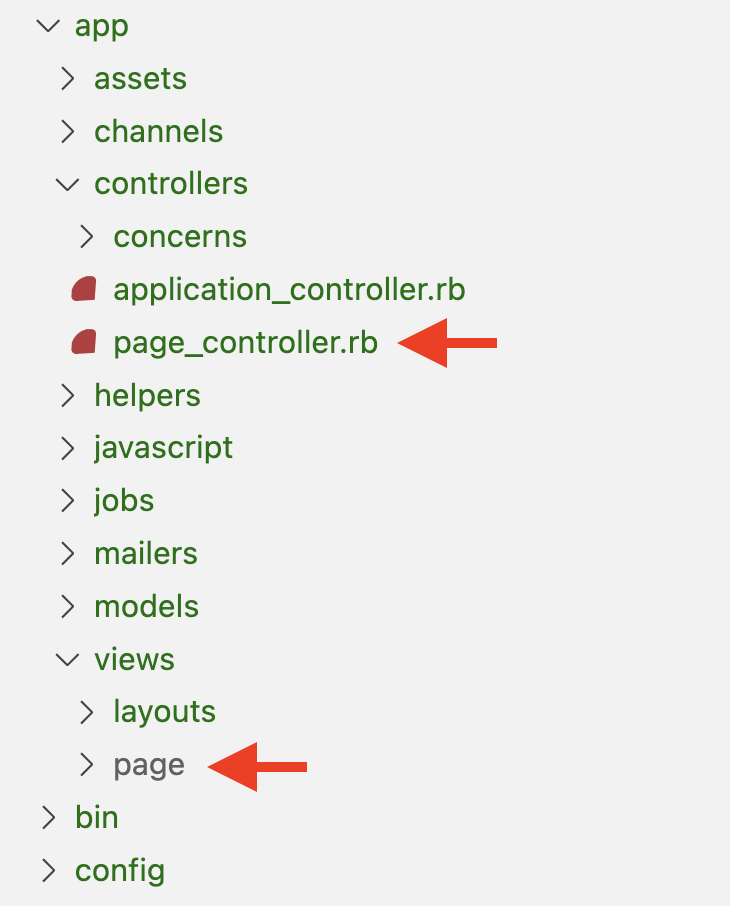
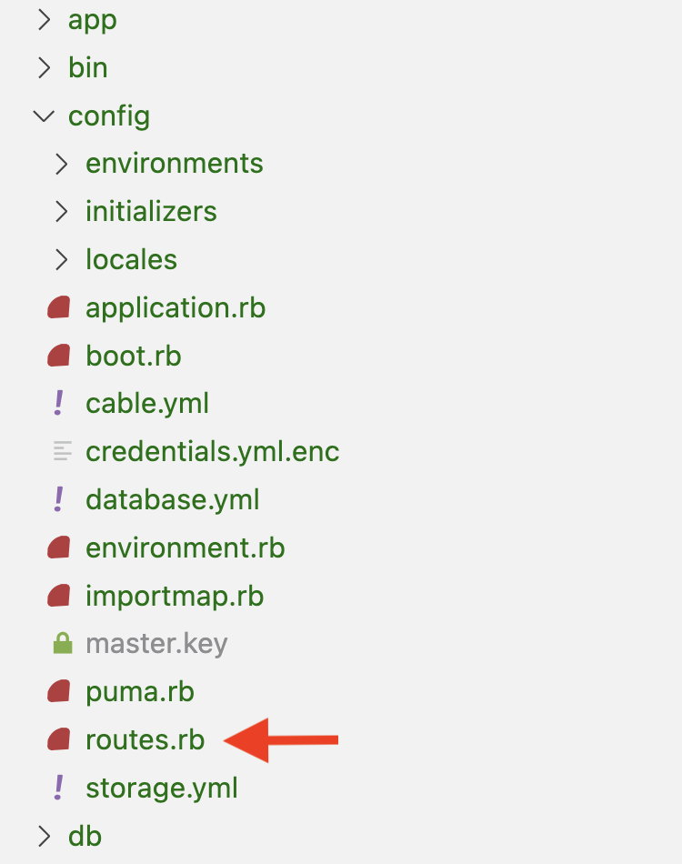

# Rails Controllers, Routes, and Views

#### Overview

Rails uses the MVC architectural pattern. MVC separates an application into the model for handling data and business logic, the controllers for handling requests and retrieving data from the model, and the views for handling graphical user interface objects and presentations. This section will take a deep dive into the controller and view aspects of MVC.

#### Previous Lecture (1hr 7min)

[](https://www.youtube.com/watch?v=dprfcJq2xX4)

#### Learning Objectives

- can conceptualize the flow of data from route to controller to view
- can describe the anatomy of a route
- can define `erb`
- can use correct Ruby syntax to create navigation

#### Vocabulary

- controller
- routes
- view
- erb
- route alias
- root

### Useful Commands

- `rails generate controller <ControllerName>`

#### Additional Resources

- [Rails Routing from the Outside In](https://guides.rubyonrails.org/routing.html)

#### Process

- Create a new Rails app on the desktop: $ `rails new rails-controllers-routes-views -d postgresql -T`
- $ `cd rails-controllers-routes-views`
- Create a database: $ `rails db:create`
- Add the git remote from GitHub Classroom
- Ensure a main branch exists
- Make an initial commit to the main branch
- Begin the rails server: $ `rails server`
- In a browser navigate to: `http://localhost:3000`

#### Troubleshooting Tips

- Did you create your database?
- Is your server running?
- Are your view files in the correct folder?
- Errors? Always look at the first error in the list.
- Blank screen? Check your terminal for errors.

---

### Requests and Responses

When a user interacts with a full-stack web application, it typically starts with a request. A request can be something like loading a page, clicking on a navigation link, or submitting a form. Every external request consists of an HTTP action and a location (URL). In a Rails application, the request is processed by the `routes.rb` file. The Rails application looks at the request and finds a route that matches. The matching route will, in turn, find the appropriate controller and invoke a method. The controller method will trigger the appropriate action to handle the response.

In short, the request hits the routes file and finds the route that matches the URL and the HTTP action. That route invokes a controller method which handles the response.

### The Controller

The **controller** is the component of the MVC architectural pattern that manages the flow of data between the model and the view based on requests made by the user. Controllers are classes that contain one or more methods. Each method will handle a particular response.

### Generating a Controller

In order to work with a controller in a Rails application, we have to run a generate command. Controllers are classes so their names will follow the PascalCase naming convention. Like all things in code, controller names should communicate intent.

For this example, we are going to create a simple website for a restaurant that will have three different pages our users can see.

1. Landing page, which is the first page the user sees when they arrive at a website
2. Menu
3. Hours

The data on each page will be the same for every user. We call these static pages. The controller will handle the routing between our static pages. Since its job will be to manage static pages we will call the controller Page.

```bash
rails generate controller Page
```

We should see a similar output in the terminal after running the generate command in the Rails application:

```bash
  create  app/controllers/page_controller.rb
  invoke  erb
  create    app/views/page
  invoke  helper
  create    app/helpers/page_helper.rb
```

The Rails generate command created three things

1. a new Ruby file in the controllers directory called `page_controller.rb`,
2. a new folder in the views directory called `page`,
3. and a new helper file called `page_helper.rb`.

We will be focusing our attention on the controller file and the view folder. We will not be using the helper file that was created. That file can be either ignored or deleted.



### Controller Methods

The controller is a class that will have one or more methods. Each method will handle a particular request (URL and HTTP action) with a response. In this example, each method will load one of the static page for the user to see. Since there are three possible pages on our restaurant website, we will eventually have three methods in our Page controller.

We will start by building the landing page. We will construct this one small step at a time so we can explore the process. To start we will create a method with the name of the action it will perform. The return of our method will render some HTML text.

**app/controllers/page_controller.rb**

```ruby
class PageController < ApplicationController
  def landing
    render html: 'Welcome to the all nachos restaurant!'
  end
end
```

### The Route

The controller method is ready to go, but we know that methods do absolutely nothing until they are invoked. Controller methods are invoked by a route. Rails **routes** provide a means to determine which controller and controller method should be invoked based on the URL and the HTTP action specified by the request.

The `routes.rb` file lives in the config directory.



A route consists of the following:

1. HTTP action
   - HTTP actions, or HTTP verbs, specify type of request.
   - The possible HTTP actions are get, post, put, patch, and delete.
   - `get`
2. URL
   - Each route will have a specific URL. In this case we will name it the same as the controller method.
   - `get '/landing'`
3. Controller
   - If the HTTP action and the URL match the route will specify what controller is handling the response.
   - `get '/landing, to: page`
4. Controller method
   - Once the controller has been specified, the route will invoke exactly one method.
   - `get '/landing, to: page#landing`

**config/routes.rb**

```ruby
Rails.application.routes.draw do
  get '/landing', to: 'page#landing'
end
```

### User Request

During development, it is common for the base URL of all Rails applications to be `localhost:3000`. If we fire up the application and navigate to `localhost:3000` in the browser we see that the boilerplate Rails landing page will display.

In order to render the HTML text for our landing page, we have to hit the appropriate route. This is done by appending `/landing` to `localhost:3000` in the URL.

When we visit `localhost:3000/landing` we should see a white page with the text `Welcome to the all nachos restaurant!`.

### The View

At this point our application is working. Our users can make a request that will trigger a route to invoke a controller method and the controller method will display text on the screen. However, we are very limited in what we can display and how it will look. Typically, header text is displayed in a large bold font like an `h1` tag. In the current version of our application there is not a way to do that.

We need to add a file that is dedicated to creating more interesting views. Rails **views** handle the presentation and formatting of HTML. If we look back at the generate command we ran in the terminal, in addition to the controller file, we got a folder inside the views directory called `page`. It was created to hold all the views that are rendered by the page controller. Right now the `page` folder is empty. We need to make a file inside the folder.

Rails is very particular about its naming conventions. The file inside the pages folder must be named exactly the same name as the controller method followed by the file extension `.html.erb`. The **erb** extension stands for embedded Ruby. Embedded Ruby or Templated Ruby is a file structure that allows us to code HTML and drop Ruby code into the view file.

Once we make a file inside the pages folder named exactly `landing.html.erb`, we can move over the text from the controller method and drop it into the HTML tag of our choosing.

**app/views/page/landing.html.erb**

```html
<h1>Welcome to the all nachos restaurant!</h1>
```

This change means the controller is no longer rendering a single line of HTML. Instead it needs to render a view file (or template). Here is where a little bit of Rails magic happens. The thing Rails does best is the MVC workflow. The pages controller and view folder have a connection because of the naming conventions. And the controller method and the view file have a connection due to the naming convention. So we can just remove everything from the controller method and allow the implicit return to find the appropriate view file. Which is the thing Rails really wants to do.

**app/controllers/page_controller.rb**

```ruby
class PageController < ApplicationController
  def landing
  end
end
```

If we refresh the page, the application still works and now our header is nice and prominent. We have successfully completed a route-controller-view workflow.

### Adding Another Page

Our landing page is working so it is time to add another page to display the menu. We will go through the same process as we did for the previous page - first adding a controller method, then a route, and then a view.

The new controller method will be called menu and that name will carry all the way through the routes and views.

**app/controllers/page_controller.rb**

```ruby
class PageController < ApplicationController
  def landing
  end

  def menu
  end
end
```

Next, add the route. Since the goal is to render text on the screen, the HTTP action is `get`. The controller also stays the same. The only differences between the two routes are the URL and the controller method name.

**config/routes.rb**

```ruby
Rails.application.routes.draw do
  get '/landing', to: 'page#landing'
  get '/menu', to: 'page#menu'
end
```

Now, we will add another file inside the page folder in the view directory. It will be called exactly `menu.html.erb`.

**app/views/page/menu.html.erb**

```html
<h2>Nacho Ordinary Menu</h2>
<ul>
  <li>Guac 'n' Roll Nachos</li>
  <li>Nachosaurus Rex</li>
  <li>Cho Cho Checking</li>
</ul>
```

With our two pages in place we can manually change the URL to see the different pages appear.

One more to go!

### Adding a Third Page

Adding the third page follows the same process as the first and second. First we will add the controller method for our hours page.

**app/controllers/page_controller.rb**

```ruby
class PageController < ApplicationController
  def landing
  end

  def menu
  end

  def hours
  end
end
```

Next, add the route.

**config/routes.rb**

```ruby
Rails.application.routes.draw do
  get '/landing', to: 'page#landing'
  get '/menu', to: 'page#menu'
  get '/hours', to: 'page#hours'
end
```

Now, we will add another file inside the page folder in the view directory. It will be called exactly `hours.html.erb`.

**app/views/page/hours.html.erb**

```html
<h2>Time for Nachos</h2>
<p>Monday: sorry no nachos today</p>
<p>Tuesday: dinner nachos</p>
<p>Wednesday: dinner nachos</p>
<p>Thursday: dinner nachos</p>
<p>Friday: all day nachos</p>
<p>Saturday: all day nachos</p>
<p>Sunday: brunch nachos</p>
```

All three pages can be displayed as long as we manually type the correct route into the browser URL.

### Navigation

Our application is working properly with three possible pages for our users. But, it is a bit awkward to manually type the URL. As users of the internet, that is not something we typically come across. Let's add some clickable links that will allow our users to navigate easily between pages.

We will add our links to the landing page that will navigate to the menu and hours pages. The links will trigger the user's request which will in turn find the right route. To follow Rails conventions we will start by adding route aliases to each route. A **route alias** is like a variable that points to a particular route.

**config/routes.rb**

```ruby
Rails.application.routes.draw do
  get '/landing', to: 'page#landing', as: 'landing'
  get '/menu', to: 'page#menu', as: 'menu'
  get '/hours', to: 'page#hours', as: 'hours'
end
```

Now that we have our aliases we can create the links in the landing page view. There is a wonderful Ruby helper method called `linked_to` that takes two arguments. The first argument is the text of the hyperlink and the second argument is the navigation. In this example, we will use a string for the text of the hyperlink. The navigation will be our route alias. In Rails, route aliases are referenced by appending `_path` to the name of the route alias. Since our route is called `menu` our navigation will be `menu_path`. The code for the link will look like this:

```ruby
link_to 'See the Menu', menu_path
```

In order to put this Ruby code into the landing page we need to escape out of the HTML. This is where `.erb` comes into play. The `.erb` file extension allows us to embed Ruby code in the HTML. This is done with the syntax `<%= %>`. Between these carrots we can write regular Ruby code.

```ruby
<%= link_to 'See the Menu', menu_path %>
```

At this point we are free to put this in the HTML as is, or, we can wrap HTML tags around the erb for some additional styling.

**app/views/page/landing.html.erb**

```html
<h1>Welcome to the all nachos restaurant!</h1>
<ul>
  <li><%= link_to 'See the Menu', menu_path %></li>
</ul>
```

We will follow this same structure to add the path to the hours page.

**app/views/page/landing.html.erb**

```html
<h1>Welcome to the all nachos restaurant!</h1>
<ul>
  <li><%= link_to 'See the Menu', menu_path %></li>
  <li><%= link_to 'See our Hours', hours_path %></li>
</ul>
```

### Root

Our application now has visible pages and much better functionality. There is one final task to improve the user experience. We created a landing page for our website but if we make a request to `localhost:3000` we still see the Rails boilerplate landing page. We can instruct our application to render our landing page at the base URL, or **root** rather than the Rails page.

This is done in the routes file using a helper method called root that takes an argument of the controller and controller method that we want to handle our landing page request. The root route can only have a `get` HTTP action.

**config/routes.rb**

```ruby
Rails.application.routes.draw do
  get '/landing', to: 'page#landing', as: 'landing'
  get '/menu', to: 'page#menu', as: 'menu'
  get '/hours', to: 'page#hours', as: 'hours'
  root 'page#landing'
end
```

---

### 💻 Challenges

As a developer, you have taken on a client who is looking to open a small business. Your client wants your advice as well as your developer skills.

- Help your client decide on what kind of small business to open.
- Create a rough draft of a website your client can use to share information about their new business.
- The website should have a landing page and at least three additional pages with useful information.
- The website should be user friendly with navigation between all appropriate pages.
- The website landing page should appear at `localhost:3000`

### 🏔 Stretch Goals

Add styling to your website using the file `app/assets/stylesheets/application.css`. There is no need to import your stylesheet, Rails handles all of that for you.

---

[Back to Syllabus](../README.md#unit-six-ruby-on-rails)
