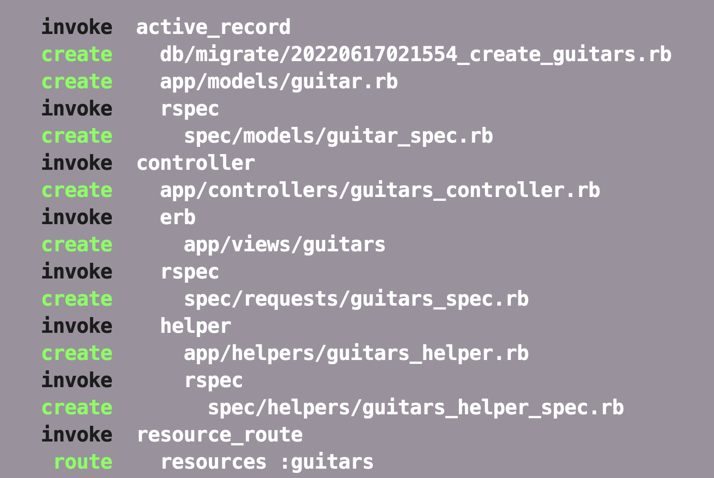
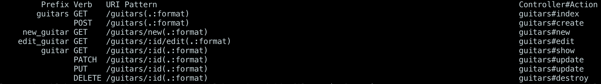
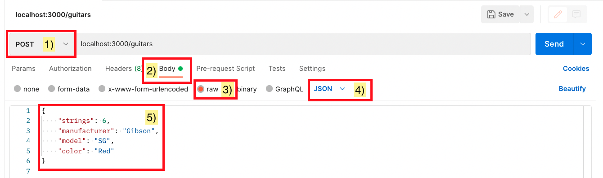
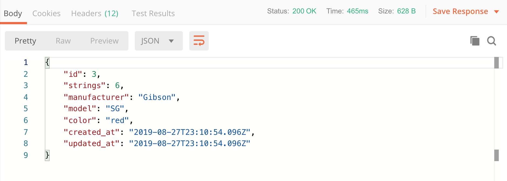
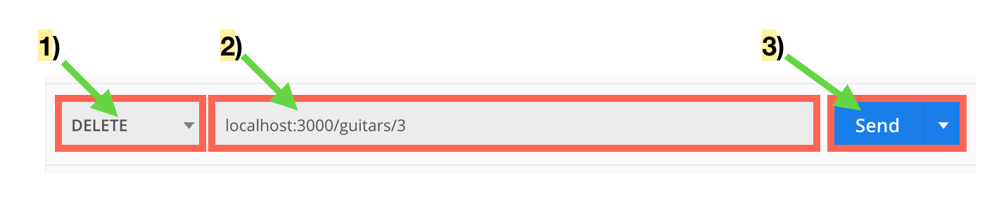
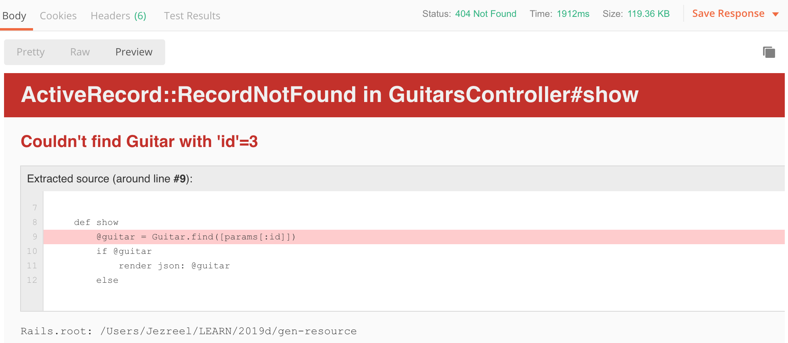

# Rails Generate Resource

## Overview
- We have covered some of the Rails generator commands. As we've seen, generators can save us a lot of time by setting up the files we need in order to say start coding up a response to a server request or to create and connect a model to a table in a database.

## Learning Objectives
- Understanding the difference between generate model, generate controller, and generate resource
- Creating CRUD functionality in an application
- Creating a JSON response for the controller methods

## Vocabulary
- resource
- CRUD
- JSON

## Useful Commands
- $ rails routes

## Additional Resources
- [ Postman ](./postman.md)

## Set Up

#### Creating a new Rails app:
```
$ rails new guitar_app -d postgresql -T
$ cd guitar_app
$ bundle add rspec-rails
$ rails generate rspec:install
$ rails db:create
$ rails server
```

In a browser navigate to:
`http://localhost:3000`


To get the application set up, we can generate a guitar resource.

```
$ rails generate resource Guitar strings:integer manufacturer:string model:string color:string
```



With that one command, Rails creates just about everything I need to start working with guitars as a data resource.

It set up both the migration and model that I need to start using guitars as an ActiveRecord class. It created a controller (and a guitar views folder) so that I can start coding up some controller actions. And finally, it plugged in resourced routes for my guitars.

At this point we ought to run our migrations to make our model official:

```
$ rails db:migrate
```

I can use this handy command to see what that `resources :guitars` line does:

```
$ rails routes
```

There's a lot that's output to the screen but lets focus on this section:



What we see is that Rails generated all the routes required for us to build out the CRUD functionality for our guitars. All we really need to do is tell our controller what we want it do for each request.

## Disable Authenticity Token
For static page Rails applications, a check is made to assure that forms submitted to the controller originate from the same website. In most single page applications that consume an API, we don't utilize this feature, and need to disable it. Add the following to the `app/controllers/application_controller.rb`

```ruby
skip_before_action :verify_authenticity_token
```

## Index

Let's tell it what we want it to do for a "`get`" to the "`/guitars`" url.

From looking at my `rails routes` output I can see that I need to create an `index` method on my guitars controller.

```ruby
class GuitarsController < ApplicationController

  def index
    guitars = Guitar.all
    render json: guitars
  end

end
```

Notice I ask it to `render json`. All this does is tell the controller to send json objects as the response.

At this point I can run the server and visit '`/guitars`'. But it's not very interesting because I don't have any data in my tables yet.

Since my guitar model is set up though, I can hop into the `rails console` and add one:

```
> Guitar.create strings: 7, manufacturer: 'Ibanez', model: 'RG Premium', color: 'Twilight Black'
```

Now when I visit I should see something like this:

```
[
  {
    "id": 1,
    "strings": 7,
    "manufacturer": "Ibanez",
    "model": "RG Premium",
    "color": "Twilight Black",
    "created_at": "2019-08-26T23:41:14.362Z",
    "updated_at": "2019-08-26T23:41:14.362Z"
  }
]
```

## Show

Let's focus on the route for retrieving selecting a single guitar object from the database.

Recalling our routes:


We see that Rails set up a route for '`/guitars/:id`' that points to a show method in the guitars controller. We'll build that out to find a guitar based on the id param passed to the controller.

We'll update our `guitars_controller.rb` to have a show method:

```ruby
class GuitarsController < ApplicationController

  #...index method...

  def show
    guitar = Guitar.find([params[:id]])
    render json: guitar
  end

end
```

Now `localhost:3000/guitars/1` returns the first guitar.

Let's hop into the rails console and add another guitar:

```
> Guitar.create strings: 6, manufacturer: 'Fender', model: 'Stratocaster', color: 'Sunburst'
```

Now `localhost:3000/guitars/2` returns the guitar we just created:

```json
{
  "id": 2,
  "strings": 6,
  "manufacturer": "Fender",
  "model": "Stratocaster",
  "color": "Sunburst",
  "created_at": "2019-08-27T17:40:34.155Z",
  "updated_at": "2019-08-27T17:40:34.155Z"
}
```

Additionally, '`/guitars`', will show all the guitars in the database.

The key here is that after generating the resource, we really only needed to define the method that a particular route requires to work.

## Create

First we'll tackle building the method to create a guitar.

We'll update `guitars_controller.rb` like so:

```ruby
class GuitarsController < ApplicationController

  #...index/show methods...

  def create
    guitar = Guitar.create(guitar_params)
    if guitar.valid?
      render json: guitar
    else
      render json: guitar.errors
    end
  end

  private
  def guitar_params
    params.require(:guitar).permit(:strings, :manufacturer, :model, :color)
  end

end
```

Now we've set up strong params for our controller and we have added a method to create a guitar or render errors.

Let's try out our new endpoint through Postman.



When we click send, given that we've formatted our request correctly, we should see a response like this:



Notice that we get the newly created guitar in the body of our response.

## Destroy

The destroy action is the conventional Rails action for implementing the Delete operation. Let's build out that action.

We'll add a destroy method to our `guitars_controller.rb`:

```ruby
def destroy
  guitar = Guitar.find(params[:id])
  if guitar.destroy
    render json: guitar
  else
    render json: guitar.errors
  end
end
```

Once that's set up, we'll recall our routes or run `rails routes` in my terminal:


We see that our delete action is mapped to `/guitars/:id` so that's what we'll attempt to reach in Postman. Let's try to delete the guitar we just created.

We'll build our request like so:



Notice that we've selected the `DELETE` verb and set up the url with the `id` of the guitar we want delete.

When we hit send, we should get back the item we just deleted:


Now if we try to show the guitar we just deleted, we should receive an error:



---
[Back to Syllabus](../README.md#unit-six-ruby-on-rails)
