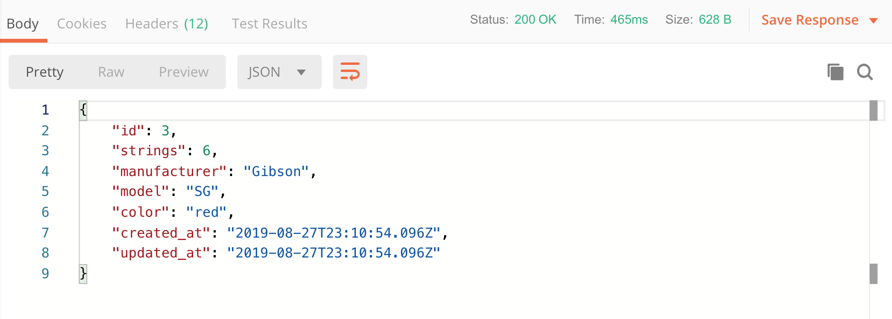

# Postman: Interacting with JSON APIs

When building a JSON API, it becomes a challenge to interact with the server when you don't yet have a view. Thankfully, there are tools that allow you to form and send http requests to your server. Postman is one of those tools.

This page provides an overview of the Postman tool and a couple of examples to help you get started.

## The Interface

The request dashboard of Postman looks something like this:


Here we've highlighted the essential sections of the Postman interface. The first 3 components (verb selector, url input, and send button) are the main components that allow you set up and make a request. The response section is where you can expect the result of a request. There are a few more important pieces to the interface but their utility is best demonstrated through example.

## A Simple GET to an `index`

This is the simplest kind of request we can make so let's start with that.

1) Select `GET` from the verb selector dropdown
2) Enter the url that points to the index method of your application.
3) Click **Send**   


That result should appear in the response section at the bottom of the page as JSON:


## A POST in Postman

POST type requests through Postman are a little more involved.

1) Select `POST` from the verb selector dropdown
2) Enter the url that points to the create method of your application.
3) Select the **Body** tab below the url input
4) Select the **raw** radio button
5) Select **JSON (application/javascript)** in the dropdown that appears to the right
6) Add the appropriate JSON
7) Click **Send**


That result should appear in the response section at the bottom of the page as JSON:




# Cloud 9 and Postman

In order to see our app in Postman, we need to expose the running Rails application to the internet by poking a hole through the AWS firewall.


### Running the Rails App
```bash
bundle exec rails s -b 0.0.0.0
```

Then Looking under the sharing options for the Cloud 9 server, and copy the IP address:


**Note:** you will use the application IP plus :8080 (ie, xx.xx.xx.xxx:8080) in the browser and in Postman

---
[Back to Syllabus](../README.md#unit-six-ruby-on-rails)
