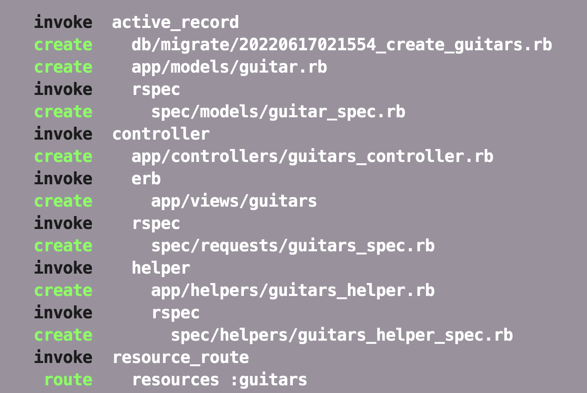
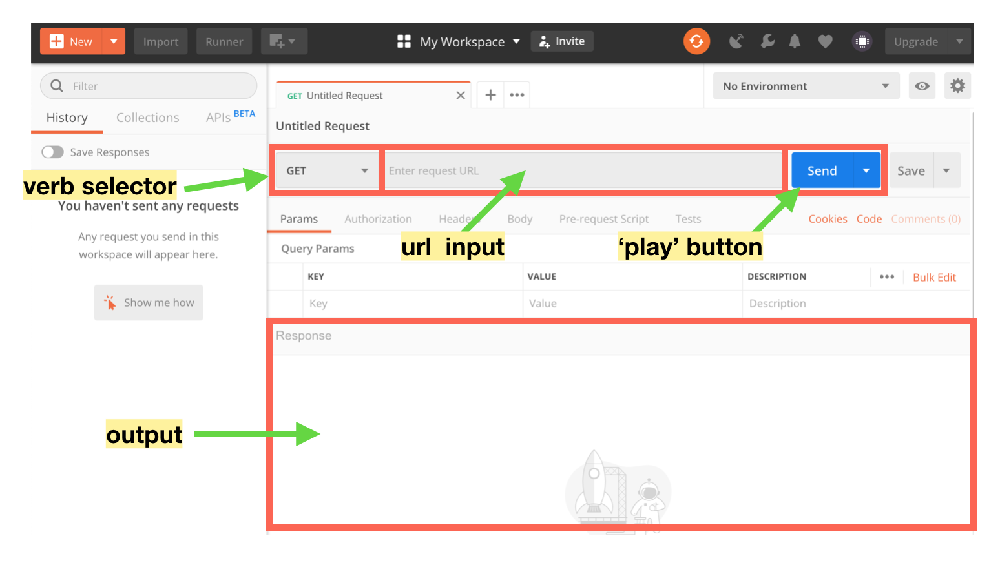
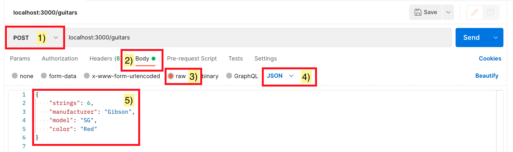
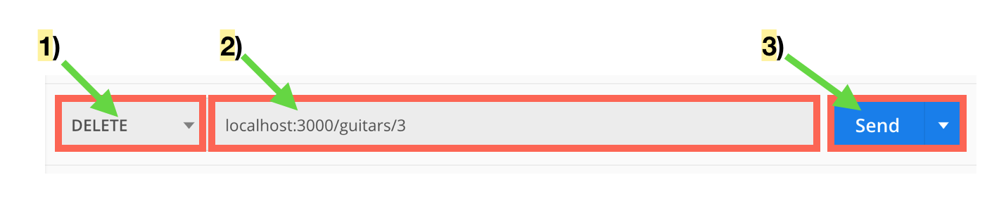

# Rails API

#### Overview
Rails is full-stack framework that handles the business logic (model) as well as the UI (views) and the controllers that get all the information to the correct place. But often full-stack applications are built with different languages, frameworks, and technologies working together. It is all about finding the right tool for the job. At LEARN, our stack is using React in the frontend handling the views and Rails handling the model and controller. When an application is only controllers and models it is called an API. In this section, we will create just the backend of an application and explore what it looks like to be a backend developer.

#### Previous Lecture (43 min)
[](https://www.youtube.com/watch?v=pzD_tTktq8Y)

#### Learning Objectives
- can discern RESTful routes associated with views
- can discern RESTful routes associated with database actions
- can discern JSON from HTML
- can match RESTful controller methods to the appropriate HTTP action
- can utilize Postman to visualize API data flow
- can implement appropriate model validations and corresponding specs

#### Vocabulary
- API
- JSON
- endpoint
- Postman
- resource

#### Additional Resources
- [What is an API?](https://www.mulesoft.com/resources/api/what-is-an-api)
- [Postman Docs](https://www.postman.com/)
- [Controller Specs](https://relishapp.com/rspec/rspec-rails/docs/controller-specs)
- [Model Specs](https://relishapp.com/rspec/rspec-rails/docs/model-specs)
- [Handling Errors in an API Application the Rails Way](https://blog.rebased.pl/2016/11/07/api-error-handling.html)

#### Useful Commands
- $ `rails routes`

#### Process
- `cd` to your Desktop
- $ `rails new rails-api -d postgresql -T`
- $ `cd rails-api`
- $ `rails db:create`
- Add the remote from GitHub
- Create the main branch
- Make an initial commit
- $ `bundle add rspec-rails`
- $ `rails generate rspec:install`
- $ `rails s`
- Open the folder in a text editor
- Code!

#### Troubleshooting Tips
- Did you create your database?
- Did you migrate?
- Is your server running?
- Are you requesting the correct route?
- Are you seeing an HTML output rather a JSON? Click the preview tab and look at the error message.

---

### API
**API** (Application Programming Interface) is an application that transmits data in the form of JSON. **JSON** (JavaScript Object Notation) is a data structure modeled after JavaScript but supported by most programming languages. Data stored in a database is retrieved, created, updated, or deleted by controller methods. The controller methods can be accessed with the correct route. Coding this communication flow to an API via route to controller method is called creating an **endpoint**. The combination of the model and the controller is and API and can serve as the backend of an application. 

### Postman
One of the challenges faced by backend developers is how to check that the work you are doing is correct without the UI. Luckily there are many tools that help create data visualization for APIs. We use a popular platform called **Postman** that allows us to design and test our API. After each step of the process, we will use Postman to ensure our code is working correctly.

### Rails Generate Resource
We have covered several Rails generator commands such as model, controller, and RSpec. Generators set up the files and folders needed to create custom functionality with correct naming conventions in a Rails application. The generate **resource** command will do the heavy lifting of creating a model with given columns and data types, a controller, view folder, and the necessary RESTful routes.

For this example, we are going to generate a resource for a Guitar model.

```
$ rails generate resource Guitar strings:integer manufacturer:string model:string color:string
```



With that one command, Rails creates just about everything needed to start working with guitars as a data resource. It set up both the migration and model needed to start using guitars as an ActiveRecord class. It created a controller (and a guitar views folder). And finally, it plugged in resourced routes for my guitars. Since we are making an API, the view folder will not be needed and can be removed.

At this point we ought to run our migrations to build the schema.

```
$ rails db:migrate
```

I can use this handy command to see what that `resources :guitars` line does:

```
$ rails routes
```

There's a lot that's output to the screen but lets focus on this section at the top of the output:


What we see is that Rails generated all the routes required for us to build out the CRUD functionality for our guitars. All we really need to do is tell our controller what we want it do for each request.

Since the guitar model is set up we can hop into the `rails console` and add a couple guitars.

```
> Guitar.create(strings: 7, manufacturer: 'Ibanez', model: 'RG Premium', color: 'Twilight Black')
> Guitar.create(strings: 6, manufacturer: 'Fender', model: 'Stratocaster', color: 'Sunburst')
```

### Disable Authenticity Token
For static page Rails applications, a check is made to assure that the data submitted to the controller originates from the same website. In most single page applications that consume an API we don't utilize this feature and need to disable it. Add the following code:

**app/controllers/application_controller.rb**
```ruby
skip_before_action :verify_authenticity_token
```

### Index
Now that the app is ready to go, we can start working through CRUD actions for the guitar data. The first step is to make a request that retrieves all the guitars. That will be a `get` request to the `/guitars` url. 

From looking at my $ `rails routes` output I can see that I need to create an `index` method on my guitars controller. Since this is an API, the controller method will not render a view. Instead it will render JSON data. 

```ruby
class GuitarsController < ApplicationController

  def index
    guitars = Guitar.all
    render json: guitars
  end

end
```

Now we need to test that the index endpoint is behaving correctly. Since we are creating an API, we need some way to visualize the data output. This is where Postman comes into play. 



We can ask Postman to make a request to our API and return the JSON. In Postman we can make a `get` request to `localhost:3000/guitars`.


In the body we will see the result of our request. It should contain an array with the guitar database instances.

```
[
  {
    "id": 1,
    "strings": 7,
    "manufacturer": "Ibanez",
    "model": "RG Premium",
    "color": "Twilight Black",
    "created_at": "2022-08-26T23:41:14.362Z",
    "updated_at": "2022-08-26T23:41:14.362Z"
  },
  {
    "id": 2,
    "strings": 6,
    "manufacturer": "Fender",
    "model": "Stratocaster",
    "color": "Sunburst",
    "created_at": "2022-08-26T23:41:15.155Z",
    "updated_at": "2022-08-26T23:41:15.155Z"
  }
]
```

Our first route is done!
### Show
Next up is the route for retrieving a single guitar object from the database. Since Rails is following the RESTful routes naming conventions, the route `/guitars/:id` will point to the show method in the guitars controller. The show method will find a guitar based on the id param passed to the controller.

**app/controllers/guitars_controller.rb**
```ruby
class GuitarsController < ApplicationController

  #...index method...

  def show
    guitar = Guitar.find(params[:id])
    render json: guitar
  end

end
```

Now `localhost:3000/guitars/1` returns the first guitar and `localhost:3000/guitars/2` returns the second.

Our second route is done. This completes the `R` in CRUD. 

### Create
Next we'll tackle building the method to create a guitar. In the create method we can ensure the newly created guitar is rendered and if something goes wrong we can render the appropriate errors. We need to set up a strong params method for our controller to protect the data coming into the app from an external request.

**app/controllers/guitars_controller.rb**
```ruby
class GuitarsController < ApplicationController

  #...index method...
  #...show method...

  def create
    guitar = Guitar.create(guitar_params)
    if guitar.valid?
      render json: guitar
    else
      render json: guitar.errors
    end
  end

  private
  def guitar_params
    params.require(:guitar).permit(:strings, :manufacturer, :model, :color)
  end

end
```

Let's try out our new endpoint through Postman. We need to provide our request with correctly formatted JSON to send to the database. To do this, there are a couple configurations.

1. The type of request is `post`.
2. Selecting the `body` tab will create a space to write out the JSON.
3. Selecting the `raw` radio button will create a text editor-like workspace.
4. Selecting `JSON` from the dropdown will instruct the workspace to expect JSON formatting.
5. The JSON must be written with correct syntax.



When we click send, given that we've formatted our request correctly, we should see a response like this:


Notice that we get the newly created guitar in the body of our response as well as a 200 response code.

Our third route is done. This completes the `CR` in CRUD. 

### Destroy
The destroy action is the conventional Rails action for removing content from the database.

**app/controllers/guitars_controller.rb**
```ruby
class GuitarsController < ApplicationController

  #...index method...
  #...show method...
  #...create method...

  def destroy
    guitar = Guitar.find(params[:id])
    if guitar.destroy
      render json: guitar
    else
      render json: guitar.errors
    end
  end

  private
  def guitar_params
    params.require(:guitar).permit(:strings, :manufacturer, :model, :color)
  end

end
```

The delete action is mapped to `/guitars/:id`. In order to delete something we have to know what we are deleting. To delete the guitar we just created, we need to select the appropriate type of request.



When we hit send, we should get back the item we just deleted:


If we try the show on the guitar we just deleted we should receive an error.

Our fourth route is done. This completes the `CRD` in CRUD. 

### Update
The update action will modify an existing item in the database. In order to update an item, we have to have the id of the item we intend to update. We also need to call the strong params method on update since this request will modify database content.

**app/controllers/guitars_controller.rb**
```ruby
class GuitarsController < ApplicationController

  #...index method...
  #...show method...
  #...create method...
  #...destroy method...

  def update
    guitar = Guitar.find(params[:id])
    guitar.update(guitar_params)
    if guitar.valid?
      render json: guitar
    else
      render json: guitar.errors
    end
  end

  private
  def guitar_params
    params.require(:guitar).permit(:strings, :manufacturer, :model, :color)
  end

end
```

The update action is mapped to `/guitars/:id`. We will select a patch request and create a JSON object with updated values the body of the request.


When we hit send, we should get back the item we just updated.

We now have full CRUD on the guitar data!

---

### Wildlife Tracker Challenge
The Forest Service is considering a proposal to place in conservancy a forest of virgin Douglas fir just outside of Portland, Oregon. Before they give the go ahead, they need to do an environmental impact study. They've asked you to build an API the rangers can use to report wildlife sightings.

**Story**  
In order to track wildlife sightings, as a user of the API, I need to manage animals.
**Branch**  
animal-crud-actions
**Acceptance Criteria**  
- Create a resource for animal with the following information: common name and scientific binomial
- Can see the data response of all the animals
- Can create a new animal in the database
- Can update an existing animal in the database
- Can remove an animal entry in the database

**Story**  
In order to track wildlife sightings, as a user of the API, I need to manage animal sightings.
**Branch**  
sighting-crud-actions
**Acceptance Criteria**  
- Create a resource for animal sightings with the following information: latitude, longitude, date
  - Hint: An animal has_many sightings (rails g resource Sighting animal_id:integer ...)
  - Hint: Date is written in Active Record as `yyyy-mm-dd` (“2022-07-28")
- Can create a new animal sighting in the database
- Can update an existing animal sighting in the database
- Can remove an animal sighting in the database

**Story**  
In order to see the wildlife sightings, as a user of the API, I need to run reports on animal sightings.
**Branch**  
animal-sightings-reports
**Acceptance Criteria**  
- Can see one animal with all its associated sightings
  - Hint: Checkout [this example](https://github.com/learn-co-students/js-rails-as-api-rendering-related-object-data-in-json-v-000#using-include) on how to include associated records
- Can see all the all sightings during a given time period
  - Hint: Your controller can use a range to look like this:
```ruby
class SightingsController < ApplicationController
  def index
    sightings = Sighting.where(date: params[:start_date]..params[:end_date])
    render json: sightings
  end
end
```

  - Hint: Be sure to add the start_date and end_date to what is permitted in your strong parameters method
  - Hint: Utilize the params section in Postman to ease the developer experience
  - Hint: [Routes with params](./controllers-routes-views.md)

### Stretch Challenges

**Story**  
In order to see the wildlife sightings contain valid data, as a user of the API, I need to include proper specs.
**Branch**  
animal-sightings-specs
**Acceptance Criteria**  
Validations will require specs in `spec/models` and the controller methods will require specs in `spec/requests`.
- Can see validation errors if an animal doesn't include a common name and scientific binomial
- Can see validation errors if a sighting doesn't include latitude, longitude, or a date
- Can see a validation error if an animal's common name exactly matches the scientific binomial
- Can see a validation error if the animal's common name and scientific binomial are not unique
- Can see a status code of 422 when a post request can not be completed because of validation errors
  - Hint: [Handling Errors in an API Application the Rails Way](https://blog.rebased.pl/2016/11/07/api-error-handling.html)

**Story**  
In order to increase efficiency, as a user of the API, I need to add an animal and a sighting at the same time.
**Branch**  
submit-animal-with-sightings
**Acceptance Criteria**  
- Can create new animal along with sighting data in a single API request
	- Hint: Look into `accepts_nested_attributes_for`

---
[Back to Syllabus](../README.md#unit-six-ruby-on-rails)
