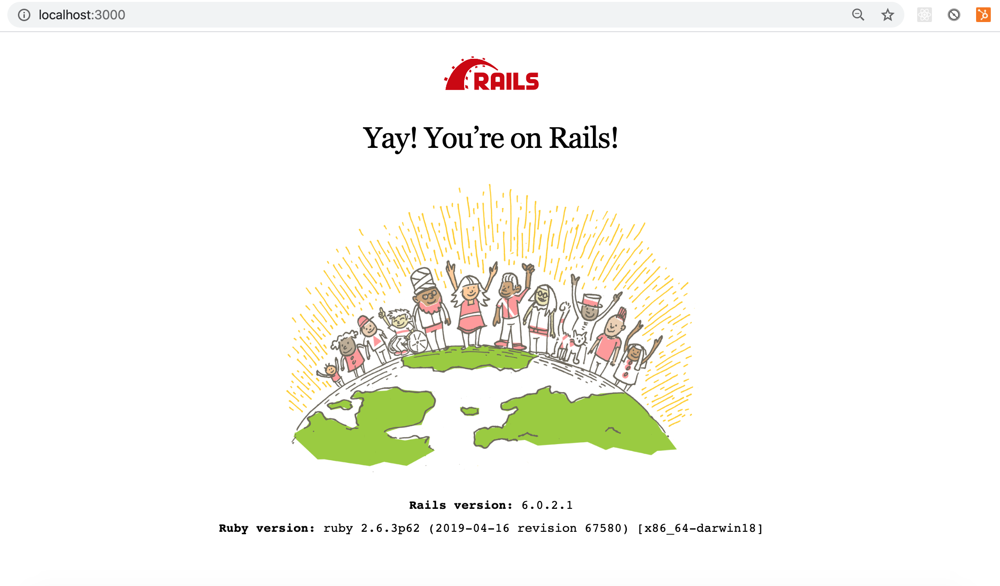

# Ruby on Rails Introduction

#### Overview
"Learning to build a modern web application is daunting. Ruby on Rails makes it much easier and more fun. It includes everything you need to build fantastic applications, and you can learn it with the support of our large, friendly community." -- Rails Docs

Ruby on Rails is a server-side web application framework written in Ruby. Rails was created by Danish programmer David Heinemeier Hansson (known as DHH). Rails was released in July 2004 as open source code. Rails is a model–view–controller (MVC) framework, providing default structures for a database, a web service, and web pages.

#### Previous Lecture (50 min)
[](https://www.youtube.com/watch?v=32GuNd2rFEk)

#### Learning Objectives
- can recall the command to create a new Rails application
- can recall the command to start the application server
- can view the Rails boilerplate page in the browser
- can navigate a Rails application to find the model, controller, views, db, gemfiles
- can recall the parts of MVC architecture
- can give examples of the technologies making up the MVC architecture

#### Vocabulary
- Ruby on Rails
- MVC

#### Additional Resources
- [Rails Docs](https://rubyonrails.org/)
- [History of Ruby on Rails](https://medium.com/@instaacarma/the-history-of-ruby-on-rails-986ead4e0e0a)

---
## Ruby on Rails Principles
- Convention over Configuration: "One of the early productivity mottos of Rails went: “You’re not a beautiful and unique snowflake”. It postulated that by giving up vain individuality, you can leapfrog the toils of mundane decisions, and make faster progress in areas that really matter."
- Programmer Happiness: "There would be no Rails without Ruby, so it's only fitting that the first doctrinal pillar is lifted straight from the core motivation for creating Ruby. Ruby’s original heresy was indeed to place the happiness of the programmer on a pedestal."

## Create a Rails App
Now that we've explored HTML, CSS, JavaScript, and Ruby, we have the complete set of tools needed to start learning **Ruby on Rails**, the framework for writing full-stack web applications in the Ruby programming language.

### MVC
Ruby on Rails follows an MVC architectural pattern. Architectural patterns are a way of dividing up responsibility within the application. **MVC** stands for model, view, and controller. Model is the database layer. The view is the part the user sees. The controller is like the switch board that collects appropriate data from the model and sends it to construct the view.

```
$ rails new app_name -d postgresql -T
$ cd app_name
$ rails db:create
$ rails server
```

- `rails new app_name`: generates a new folder with the entire Rails directory structure with all the code you need to run our simple application right out of the box
- `rails new app_app -d postgresql -T`: Rails comes with a default SQL database called SQLite, passing the flags `-d postgresql -T` will replace the default database with postgres
-  The `-T` flag tells rails to skip adding the default Minitest framework, as we're going to use Rspec instead
- `rails db:create`: sets up an empty database
- `rails server` or `rails s`: starts the Rails application by starting the server

In a browser navigate to:
`http://localhost:3000`
or
`127.0.0.1:3000`




---
[Back to Syllabus](../README.md#unit-five-intro-to-postgres-and-ruby-on-rails-models)
