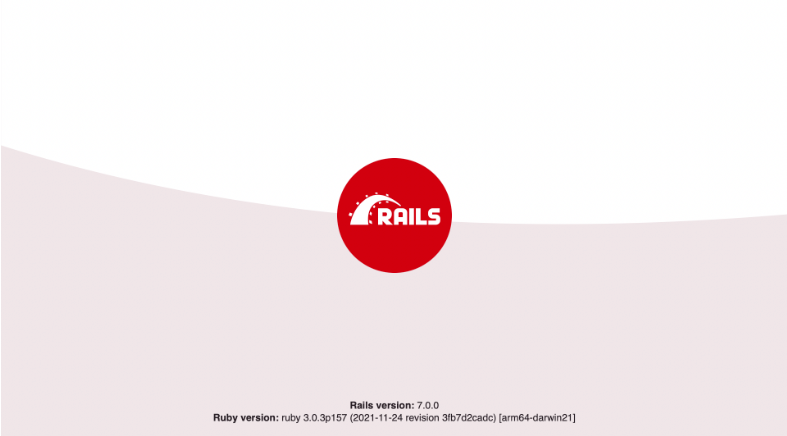

# Ruby on Rails Introduction

#### Overview
"Learning to build a modern web application is daunting. Ruby on Rails makes it much easier and more fun. It includes everything you need to build fantastic applications, and you can learn it with the support of our large, friendly community." -- Rails Docs

Ruby on Rails is a server-side web application framework written in Ruby. Rails was created by Danish programmer David Heinemeier Hansson (known as DHH). Rails was released in July 2004 as open source code. Rails is a model–view–controller (MVC) framework, providing default structures for a database, a web service, and web pages.

#### Previous Lecture (32 min)
[](https://www.youtube.com/watch?v=STtmWTWhfpk)

#### Learning Objectives
- can recall the command to create a new Rails application
- can recall the command to start the application server
- can view the Rails boilerplate page in the browser
- can navigate a Rails application to find the model, controller, views, db, gemfiles
- can recall the parts of MVC architecture
- can give examples of the technologies making up the MVC architecture

#### Vocabulary
- Ruby on Rails
- MVC

#### Additional Resources
- [Rails Docs](https://rubyonrails.org/)
- [History of Ruby on Rails](https://medium.com/@instaacarma/the-history-of-ruby-on-rails-986ead4e0e0a)

---
## Ruby on Rails Principles
"The Rails Doctrine" outlines the principles of Ruby on Rails development (Hansson, n.d.).  

- Convention over Configuration: “You’re not a beautiful and unique snowflake” is one of the earliest productivity slogans for Rails. This motto proposed that giving up vain individuality can help us to bypass the struggles of mundane decisions and to expedite progress in more significant areas. The Ruby on Rails framework provides some predetermined conventions and default settings to allow developers to spend more time coding the unique aspects of their web applications and less time setting up its configuration. 
- Programmer Happiness: "There would be no Rails without Ruby, so it's only fitting that the first doctrinal pillar is lifted straight from the core motivation for creating Ruby. Ruby’s original heresy was indeed to place the happiness of the programmer on a pedestal." This principle also known as "The Principle of the Bigger Smile" suggests that the predefined conventions and settings with the Ruby on Rails framework contribute to reduced confusion and decision fatigue among developers during the development phase. This action leads to a notable increase in satisfaction due to a smoother workflow and heightened productivity, symbolized by the metaphorical "bigger smile".

## Create a Rails App
Having explored HTML, CSS, JavaScript, and Ruby, we now possess the tools essential for learning **Ruby on Rails**, the framework for writing full-stack web applications in the Ruby programming language.

### MVC
Ruby on Rails follows an MVC architectural pattern. Architectural patterns provide a method for distributing responsibilities within an application. **MVC** stands for model, view, and controller. Model is the database layer. The view is the part the user sees. The controller is like the switch board that collects appropriate data from the model and sends it to construct the view.

### Process
```
$ rails new app_name -d postgresql -T
$ cd app_name
$ rails db:create
$ rails server
```

- `rails new app_name`: generates a new directory that includes the entire Rails directory structure with all the necessary code for running our basic application without any additional setup
- `-d postgresql`: replaces the default SQLite database with postgres
- `-T`: excludes adding the default Minitest framework because we will use Rspec
- `rails db:create`: sets up an empty database
- `rails server` or `rails s`: starts the Rails application by starting the server

In a browser navigate to:
`http://localhost:3000`
or
`127.0.0.1:3000`




---
[Back to Syllabus](../README.md#unit-five-intro-to-postgres-and-ruby-on-rails-models)
