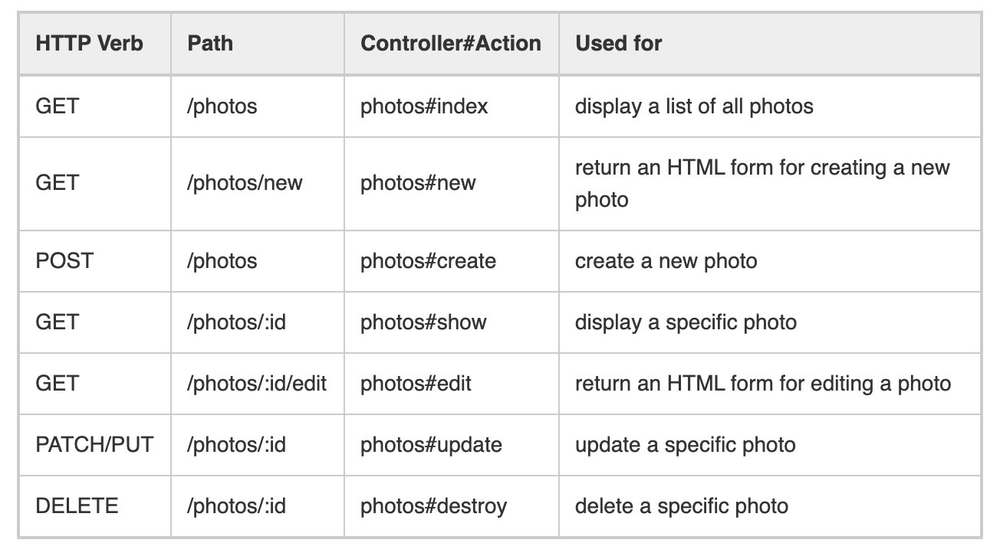

# Rails RESTful Routes and CRUD Actions

#### Overview

Rails follows a RESTful pattern for interaction between the client and the server. Rails has conventions for accessing and manipulating the information going to and coming from the database of the application.

#### Learning Objectives

- can recognize the pattern of RESTful naming conventions
- can recall the HTTP verbs
- can recall the CRUD actions
- can map each HTTP verb to the corresponding CRUD action

#### Vocabulary

- RESTful routing

#### Additional Resources

- [Rails Routing from the Outside In](https://guides.rubyonrails.org/routing.html)

---

### RESTful Routes

REST stands for Representational State Transfer which is a pattern to follow when structuring routes between the server and the client. **RESTful routes** are an attempt to bring the operations that can be applied to an object into HTTP requests. Creating, Reading, Updating, and Deleting will accomplish almost all the tasks needed to do to an object creating a standard language and structure across all of the objects in our application.

CRUD is an acronym describing the minimal actions necessary for a full stack web application. The RESTful protocol is a pattern followed by developers to implement CRUD operations. Rails _convention over configuration_ gives us strict guidelines for controller methods and routes.

Examples of routes for a model called `Photo` and a controller called `photos_controller`:


### Anatomy of a Rails Route

Rails routes follow two basic structures:

**Routes Without Params**

```ruby
get '/photos' => 'photos#index'
```

- `get` is the http verb
- `/photos` is what is appended to the base url
- `photos` is the name of the controller
- `index` is the name of the controller method

**Routes With Params**

```ruby
delete '/photos/:id' => 'photos#destroy'
```

- `delete` is the http verb
- `/photos/:id` is what is appended to the base url
- `/:id` is the params to be passed to the url
- `photos` is the name of the controller
- `destroy` is the name of the controller method

### Rails Controller Methods and RESTful Routes

#### Index

- The controller method **index** represents the **R** in CRUD and is the Rails convention for listing all the items in a particular model, or `show all`
- The HTTP verb associated with index is **get**
- The index route is: `get '/resources' => 'resources#index'`

#### Show

- The controller method **show** represents the **R** in CRUD and is the Rails convention for listing one item in a particular model, or `show one`
- The HTTP verb associated with index is **get**
- The show route is: `get '/resources/:id' => 'resources#show'`

#### New

- The controller method **new** represents a midway point between **C** and **R** in CRUD and is the Rails convention for the route that displays a form to the user
- The HTTP verb associated with new is **get**
- The new route is: `get '/resources/new' => 'resources#new'`

#### Create

- The controller method **create** represents the **C** in CRUD and is the Rails convention for adding information to the database
- The HTTP verb associated with create is **post**
- The create route is: `post '/resources' => 'resources#create'`

#### Update

- The controller method **update** represents the **U** in CRUD and is the Rails convention for modifying information in the database
- The HTTP verb associated with update is **put/patch**
- The update route is: `put/patch '/resources/:id' => 'resources#update'`

#### Delete

- The controller method **destroy** represents the **D** in CRUD and is the Rails convention for removing information from the database
- The HTTP verb associated with delete is **delete** (shocking right?)
- The delete route is: `delete '/resources/:id' => 'resources#destroy'`

---

[Back to Syllabus](../README.md#unit-six-ruby-on-rails)
