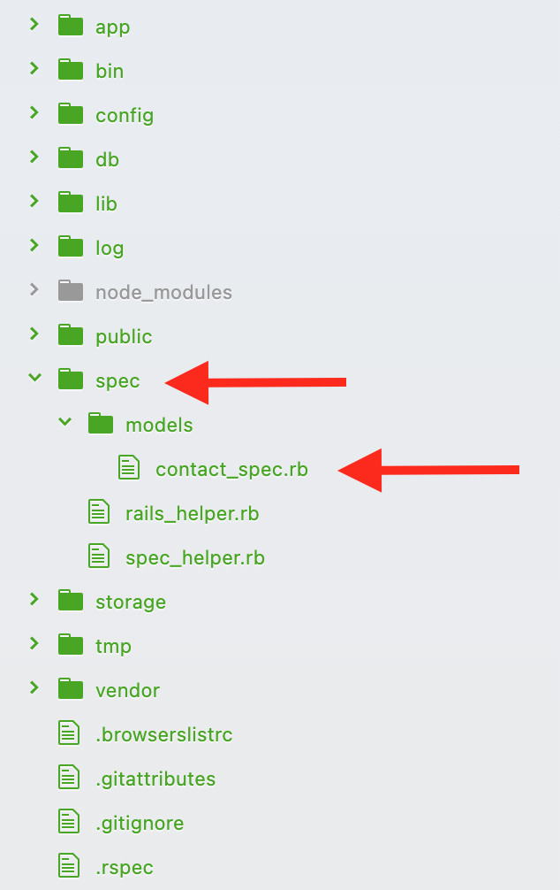

# Active Record Validations and Model Specs

#### Overview
The power of creating a full-stack application is that we can store and retrieve data from a database. But data needs to be useful and meaningful. Validations are used to ensure that only clean and valid data is saved into the database. While there are lots of ways to validate data, this section is looking at model validations. When creating model validations, we need to ensure they are working as designed. This can be done with model specs. Implementing a TDD workflow when validating a database will ensure only useful and meaningful data is stored. It also sets up a form of documentation in our app that will tell us a great deal about how the model is intended to function.

#### Previous Lecture (1hr 19min)
[](https://www.youtube.com/watch?v=Aq0vSPxvDE4)

#### Learning Objectives
- can explain the purpose of model validations
- can use correct syntax for Rails built in validations
- can use correct syntax for custom validations
- can define test-driven development
- can install RSpec into a Rails application
- can utilize test-driven development to ensure accuracy of model validations

#### Vocabulary
- validations
- specs
- test driven development (TDD)

#### Additional Resources
- [ Active Record Validations ](https://guides.rubyonrails.org/active_record_validations.html#acceptance)

#### Process
- Create a new Rails app in the appropriate folder: $ `rails new validations -d postgresql -T`
- $ `cd validations`
- Create a database: $ `rails db:create`
- Add the dependencies for RSpec:
- $ `bundle add rspec-rails`
- $ `rails generate rspec:install`
- Generate the model with appropriate columns and data types
- $ `rails db:migrate`
- Begin the rails server: `$ rails server`
- In a browser navigate to: `http://localhost:3000`

#### Troubleshooting Tips
- Did you create your database?
- Did you migrate?
- Errors? Always look at the first error in the list.

### Validations
Data is the core of any full-stack application. One of the most important things we can do to protect our data is to add Active Record validations. **Validations** are used to ensure that only clean and valid data gets saved into the database. Rails will run all model validations before content is added to the database. If these validations produce any errors the content will not be saved.

### Model Specs
The implementation of model validations is not complete without a strong suite of specs. Test specifications, or **specs** help to define what pieces of information are crucial for the functionality of the app and how the models are intended to be used in the application.

### Validation Helpers
Because validations are a common necessity there are many built in validation helper methods available.

##### Validates Presence
One of the most basic validations is ensuring the column contains data. The validation of presence tells Active Record that a new instance of the model will not be valid when empty.

##### Validates Length
The length validation can be used to create a minimum number of characters, a maximum number of characters, a range of characters, or a specific number of characters.

##### Validates Uniqueness
Often there is data in a database that should be unique. For example login information, credit card numbers, or email address. To ensure data is not duplicated a uniqueness validation can be added to the column.

### TDD and Validations
Let's look at how to implement a TDD workflow with model validations. TDD, or **test driven development**, is the process of creating a test, seeing the test fail, then implementing the code that will allow the test to pass.

For this example we will create a model called Contact that will have a column for name, email, phone_number, and a bio. All of these columns will require different types of validations.

##### Creating the Model and Spec Files
Before creating a model, we need to ensure the dependencies for RSpec are installed.

```
$ bundle add rspec-rails
$ rails generate rspec:install
```

Then we need to create the model.

```
$ rails g model Contact name:string email:string phone_number:string bio:text
$ rails db:migrate
```

Because we installed the RSpec dependencies prior to making the model, we got a directory called `spec` with a folder called `model` and files for our tests.



Inside this file is some boilerplate code.

*spec/models/contact_spec.rb*
```ruby
require 'rails_helper'

RSpec.describe Contact, type: :model do
  pending "add some examples to (or delete) #{__FILE__}"
end
```

##### Spec for Validating Presence
Now we can replace the boilerplate code with a spec that will ensure our database will not accept an entry without a name attribute.

*spec/models/contact_spec.rb*

```ruby
RSpec.describe Contact, type: :model do
  it 'is not valid without a name' do
    scully = Contact.create email: 'dscully@fbi.gov', phone_number: '(202) 123-4567', bio: 'Doctor and FBI agent.'
    expect(scully.errors[:name]).to_not be_empty
  end
end
```

If we run this file we can see that the test will fail.

```
$ rspec spec/models/contact_spec.rb
```

```bash
Failures:

  1) Contact is not valid without a name
     Failure/Error: expect(scully.errors[:name]).to_not be_empty
       expected `#<ActiveModel::DeprecationHandlingMessageArray([])>.empty?` to be falsey, got true
     # ./spec/models/contact_spec.rb:10:in `block (2 levels) in <top (required)>'

Finished in 0.04395 seconds (files took 1.76 seconds to load)
1 example, 1 failure

Failed examples:

rspec ./spec/models/contact_spec.rb:4 # Contact is not valid without a name
```

Now we can add a validation to check for the presence of the name attribute by adding code to the model class for Contact. And our test will pass.

*app/models/contact.rb*
```ruby
class Contact < ApplicationRecord
  validates :name, presence: true
end
```

We can repeat this process to ensure no fields are allowed to be empty.

*spec/models/contact_spec.rb*

```ruby
RSpec.describe Contact, type: :model do
  it 'is not valid without a name' do
    scully = Contact.create email: 'dscully@fbi.gov', phone_number: '(202) 123-4567', bio: 'Doctor and FBI agent.'
    expect(scully.errors[:name]).to_not be_empty
  end
  it 'is not valid without a email' do
    scully = Contact.create name: 'Dana Scully', phone_number: '(202) 123-4567', bio: 'Doctor and FBI agent.'
    expect(scully.errors[:email]).to_not be_empty
  end
end
```

If we run this file we can see that the second test will fail.

```
$ rspec spec/models/contact_spec.rb
```

Now we can add a validation to check for the presence of the email attribute by adding code to the model class for Contact. And our test will pass.

*app/models/contact.rb*
```ruby
class Contact < ApplicationRecord
  validates :name, :email, presence: true
end
```

##### Spec for Validating Length
Next we can create a spec that will ensure our database will not accept an entry if the email attribute is less than 10 characters.

*spec/models/contact_spec.rb*
```ruby
it 'is not valid if email is less than 10 characters' do
  scully = Contact.create name: 'Dana Scully', email: 'd@f.gov', phone_number: '(202) 123-4567', bio: 'Doctor and FBI agent.'
  expect(scully.errors[:email]).to_not be_empty
end
```

If we run this file we can see that the test will fail.

```
$ rspec spec/models/contact_spec.rb
```

Now we can add a validation to check for the length of the email attribute by adding code to the model class for Contact. And our test will pass.

*app/models/contact.rb*
```ruby
class Contact < ApplicationRecord
  validates :name, :email, presence: true
  validates :email, length: { minimum: 10 }
end
```

Here are additional options for validating a length attribute.
```
validates :name, length: { minimum: 2 }
validates :bio, length: { maximum: 500 }
validates :password, length: { in: 6..20 }
validates :phone_number, length: { is: 10 }
```

##### Spec for Validating Uniqueness
Next we can create a spec that will ensure our database will not accept an entry if the email attribute has already been entered in the database. We can create two contacts with the same information.

*spec/models/contact_spec.rb*
```ruby
it 'does not allow duplicate emails' do
  Contact.create(name: 'Dana Scully', email: 'dscully@fbi.gov', phone_number: '(202) 123-4567', bio: 'Doctor and FBI agent.')
  scully = Contact.create(name: 'Dana Scully', email: 'dscully@fbi.gov', phone_number: '(202) 123-4567', bio: 'Doctor and FBI agent.')
  expect(scully.errors[:email]).to_not be_empty
end
```

If we run this file we can see that the test will fail.

```
$ rspec spec/models/contact_spec.rb
```

Now we can add a validation to check for the uniqueness of the email attribute by adding code to the model class for Contact. And our test will pass.

*app/models/contact.rb*
```ruby
class Contact < ApplicationRecord
  validates :name, :email, presence: true
  validates :email, length: { minimum: 10 }
  validates :email, uniqueness: true
end
```

Here are additional options for validating uniqueness.
```ruby
class Contact < ApplicationRecord
  validates :name, uniqueness: true
  validates :email, uniqueness: { case_sensitive: false }
end
```

##### Validates Belong To
Rails will default adds validations to the belongs to relationship in a database. If you want an optional `belongs_to` relationship, you can set it up like this:

*app/models/phone.rb*
```ruby
class Phone < ApplicationRecord
  belongs_to :contact, optional: true
end
```

### When Validations are Called
The following Active Record query methods trigger validations, and will save the object to the database only if the object is valid.
```
create
create!
save
save!
update
update!
```

The bang versions (e.g. save!) raise an exception if the record is invalid. `save` and `update` will return `false`, `create` just returns the object the method was called on if it is invalid.

##### Valid?
To verify whether or not an object is valid, Rails uses the `.valid?` method. You can also use this method on your own. `valid?` triggers your validations and returns true if no errors were found in the object, and false otherwise.

##### To Access Errors
To verify whether or not a particular attribute of an object is valid, you can use `errors[:attribute]`. It returns an array of all the errors for `:attribute`. If there are no errors on the specified attribute, an empty array is returned.

*app/models/contact.rb*
```ruby
class Contact < ApplicationRecord
  validates :name, presence: true
end
```
```
> contact = Contact.new
> contact.valid?         # => false
> contact.errors[:name]  # => ["can't be blank"] array of error messages for name field
```

### Validations Challenges

- Create a Rails application called company_contacts. The app will have a PostgreSQL database.
- Generate a model called Account that has a username, a password, and an email.
- All stories should have accompanying model specs.

**Developer Stories**
- As a developer, I need username, password, and email to be required.
- As a developer, I need every username to be at least 5 characters long.
- As a developer, I need each username to be unique.
- As a developer, I need each password to be at least 6 characters long.
- As a developer, I need each password to be unique.
- As a developer, I want my Account model to have many associated Addresses.
- As a developer, I want Address to have street_number, street_name, city, state, and zip attributes. The street_number and zip should be integers.
- As a developer, I want to validate the presence of all fields on Address.

**Stretch Challenges**  

- As a developer, I need each Account password to have at least one number.
  - HINT: Read about [ custom validations ](https://guides.rubyonrails.org/active_record_validations.html#performing-custom-validations) in the Active Record validation docs.
- As a developer, I want to validate that Address street_number, street_name, zip are unique for within an account.
  - HINT: Read about [ :scope ](https://guides.rubyonrails.org/active_record_validations.html#uniqueness) in the Active Record validation docs.
- As a developer, I want to validate that the Address street_number and zip are numbers.
  - HINT: Read about [ numericality ](https://edgeguides.rubyonrails.org/active_record_validations.html#numericality) in the Active Record validation docs.
- As a developer, I want to see a custom error message that says "Please, input numbers only" if street_number or zip code are not numbers.
  - HINT: Read about [ message ](https://edgeguides.rubyonrails.org/active_record_validations.html#message) in the  validation docs.

---
[Back to Syllabus](../README.md#unit-five-intro-to-postgres-and-ruby-on-rails-models)
