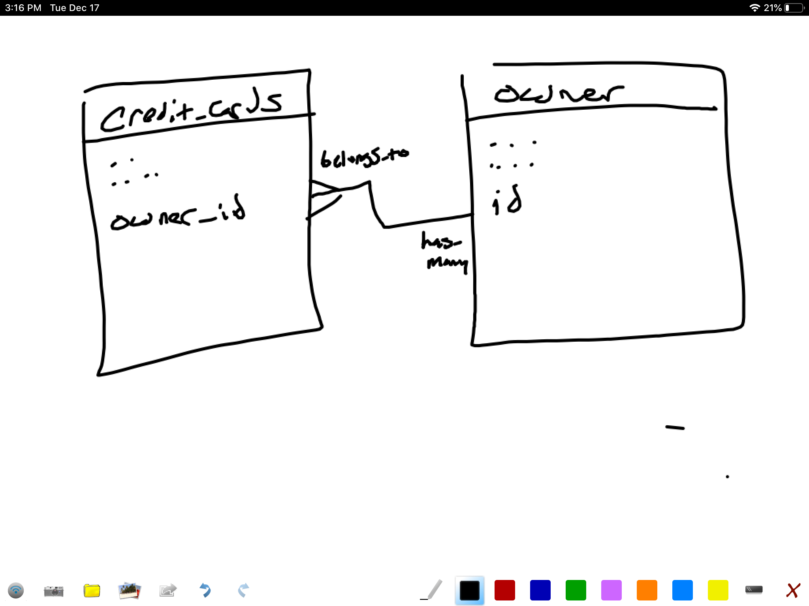

# Rails Active Record Relationships

## Video: Active Record Associations
[](https://www.youtube.com/watch?v=CM520EfUI7k)
## Video: Foreign Keys
[](https://www.youtube.com/watch?v=QpFPd4tlGoA)

## Overview

## Read the Docs
There is a lot to Active Record relationships.  Read the documentation to see all the ways that Active Record can [help you leverage the power of SQL relationships](https://guides.rubyonrails.org/association_basics.html)


From the Command line:

```bash
rails generate model CreatePhones
```


```ruby
class CreatePhones < ActiveRecord::Migration[5.2]
  def change
    create_table :phones do |t|
      t.integer :contact_id
      t.string :number
      t.string :description
      t.timestamps
    end
  end
end
```

* Note: the phone**s** table is **plural**
* Note: contact_id is the foreign key, it always goes on the 'belongs_to' side of a relationship

## Create Model

Create a file within `app/models` folder named `phone.rb` and in it create the class called Phone:
```
class Phone < ApplicationRecord
  belongs_to :contact
end
```

* Note: contact is **singular**

Change Contact to have many phones:
app/models/contact.rb
```
class Contact < ApplicationRecord
  has_many :phones  # add this line
end
```
* Note: phone**s** is **plural**

## Access Phones

In rails c, get hold of a contacts's phones:

```ruby
joe = Contact.find_by_email('joe@home.com')
joe.phones
```

Add a phone to the contacts's collection of phones:

```ruby
# Create a new phone
phone = Phone.new
phone.number = "999-8888"
phone.description = "Car Phone"
joe = Contact.find_by_email('joe@home.com')
# Make it Joe's phone
joe.phones << phone
phone.save
```

Now that a phone exists and belongs to a contact, you can access the contact it belongs to by simply:

```ruby
phone = Phone.all.first
phone.contact
```

Notice that we do not have to use any IDs, foreign keys or joins -- life is good!


Foreign Key columns are named according to the related table name in singular with `_id` appended.

For Example:

Model file will look like:
`to_do.rb`
Class name inside the `to_do.rb` file:
`class ToDo`
Table name will be snake_case plural:
`to_dos`
Foreign key column linking to the `to_dos` table:
`to_do_id`


## Challenge: Credit Cards and Owners

## Set Up
- Create a new rails application and database
- Create a model for credit card


A credit card has a number, an expiration date, and an owner. An owner has a name and address, and can have multiple credit cards.

## Manipulating Data

Using ActiveRecord in `rails console`:

* Create an owner and save them in the database
* Create a credit card in the database for that owner
* Create another owner with two other credit cards

Here is a decent schema to start out with:




### Stretch Challenge

* Add a credit limit to each card
* Find the total credit extended to the owner with two credit cards
