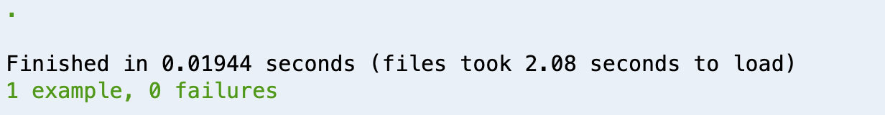

# Testing Models With RSpec

### Overview
- Validations are essential to protecting an application's data.
- Implement specs using a TDD approach to demonstrate how specs can help you define your objectives.

### Learning Objectives

### Vocabulary
- Specs
- TDD

### Set Up

#### Creating a new Rails app:
```
$ rails new contact_app -d postgresql -T
$ cd contact_app
$ rails db:create
$ bundle add rspec-rails
$ rails generate rspec:install
$ rails server
```

In a browser navigate to:
`http://localhost:3000`

### Troubleshooting Tips
- Did you create your database?
- Did you migrate?
- Errors? Always look at the first error in the list.

### Model Specs
One of the most important things we can do to protect our database is to add Active Record validations. With validations, we are building a solid foundation for the core of the application: **data**. However, the implementation of validations are not complete without a strong suite of tests.

A good test suite will tell you a great deal about how a piece of code is intended to function. Good model specs help to define what pieces of information are crucial for the functionality of the app and how the models are intended to be used in the application.

To demonstrate setting up model tests, we'll use our familiar contact model example.

Additionally, we'll implement the specs using a TDD approach to demonstrate how specs can help you define your objectives.

The install commands for RSpec will bundle `rspec-rails` in with our app and generate the files we'll need to start writing our tests.

### The Initial Requirements

We are building an application for storing the contact information of our users. That said it, is crucial for our app to have a name and email on record for each user.
- Contact cannot be created without a name
- Contact cannot be created without an email
- Entries cannot have the same email
- Emails must have an `@` symbol

The requirements may change, so we may need to add some additional tests. But this is enough to get started.

### Initial Specs

First we'll set up the model using a Rails generator command.

```bash
$ rails generate model Contact name:string email:string
```

Then we can run our migration:

```bash
$ rails db:migrate
```

Because we already installed the RSpec gem, we get a spec file created for our model.

*spec/models/contact_spec.rb*

To test out our spec setup we can run `$ rspec spec`. If it's set up correctly, we'll see pending tests for our contact model:


That pending message is set up in the generated spec file

*spec/models/contact_spec.rb*
```ruby
require 'rails_helper'

RSpec.describe Contact, type: :model do
  pending "add some examples to (or delete) #{__FILE__}"
end
```

We'll update this file to ensure our model is valid.

*spec/models/contact_spec.rb*
```ruby
RSpec.describe Contact, type: :model do
  it 'is valid with valid attributes' do
    scully = Contact.create name: 'Dana Scully', email: 'dscully@fbi.gov'
    expect(scully).to be_valid
  end
end
```

Since we have already created the model our first test should pass.

Next we will look at our user stories:

**Contact cannot be created without a name.**

*spec/models/contact_spec.rb*
```ruby
RSpec.describe Contact, type: :model do
  it 'is valid with valid attributes' do
    scully = Contact.create email: 'dscully@fbi.gov'
    expect(scully.errors[:name]).to_not be_empty
  end
end
```

Here our spec checks that there are errors for the name field if we attempt to create a contact without a name.

When we run our specs we should see it fail as expected, receiving an empty errors array for the name field.


We write just enough code for it to pass.

We'll update **contact.rb** with a presence validation:

*app/models/contact.rb*
```ruby
class Contact < ApplicationRecord
  validates :name, presence: true
end
```

When we run our specs again, we'll see it pass.



Let's go ahead and apply a presence validation to emails as well.

**Contact cannot be created without an email**

First we'll add a test case for it:

*spec/models/contact_spec.rb*
```ruby
RSpec.describe Contact, type: :model do
    scully = Contact.create name: 'Dana Scully'
    expect(scully.errors[:email]).to_not be_empty
  end
end
```

When we run `rspec spec`, that case should fail until we add an email presence validation to our model:

*app/models/contact.rb*
```ruby
class Contact < ApplicationRecord
  validates :name, :email, presence: true
end
```

Here we just added `:email` to our list of required attributes. When we run `rspec spec` again, we're passing.

We may decide that we need to protect our data from duplicate contact entries. We can start to spec this out in a test.

**Entries cannot have the same email**

*spec/models/contact_spec.rb*
```ruby
  it 'does not allow duplicate contacts' do
    Contact.create name: 'Dana Scully', email: 'dscully@fbi.gov'
    scully = Contact.create name: 'Dana Scully', email: 'dscully@fbi.gov'
    expect(scully.errors[:email]).to_not be_empty
  end
```

Here we've created a contact and then attempted to create a contact with the same email. Essentially we want to eliminate the possibility of duplicates through a validation on emails.

We'll update our contact class to add the validations.

*app/models/contact.rb*
```ruby
class Contact < ApplicationRecord
  validates :name, :email, presence: true
  validates :email, uniqueness: true # <--- new validation
end
```

If we run our tests now, we'll see that we're passing.

For the next story, we want to ensure the email has the appropriate structure.

**Emails must have an `@` symbol**

*spec/models/contact_spec.rb*
```ruby
  it 'must contain an @' do
    scully = Contact.create name: 'Dana Scully', email: 'dscully-fbi.gov'
    expect(scully.errors[:email]).to_not be_empty
  end
```

We don't have a built in validation for this type of query. But we have the knowledge of Ruby methods to create custom validations.

At its core, a validation is just running a method. We can create our own method and check for validity.

*app/models/contact.rb*
```ruby
validate :check_at_symbol
def check_at_symbol
  unless self.email.include?('@')
    errors.add(:email, "Must include @.")
  end
end
```

This is the workflow that we can use to add model tests as the required data for our application evolves. As you are writing specs, it often helps to think of other ways that bad data can break your application. When you can think about your application in this way, you can begin to see the other ways that your data ought to be tested.
