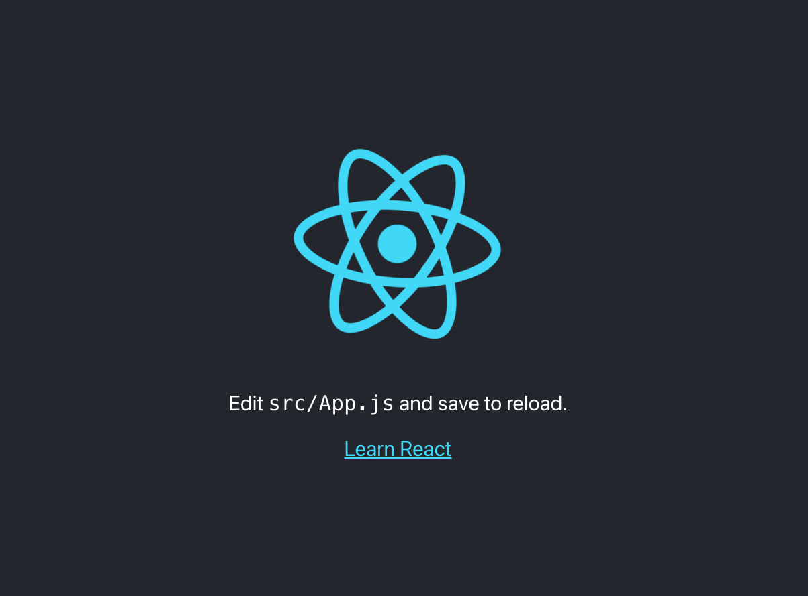

# Creating a New React Application

#### Overview

Until late 2016, the hardest part about working with React was just getting a new app set up with the appropriate dependencies. Facebook, the creators of React, recognized this problem and released some tools to help developers get started more easily using terminal commands. A command in the terminal can create the file base file structure for creating a new React application.

#### Previous Lecture (57 min)

[](https://www.youtube.com/watch?v=7QCs7nA6s7Y)

#### Learning Objectives

- can demonstrate the process of setting up a basic function-based React component
- can demonstrate the creation of multiple components
- can display multiple components inside a container component

#### Vocabulary

- node modules
- yarn
- kebob-case
- local server
- localhost:3000
- PascalCase
- export

#### Process

- `cd` into the `react-challenges` repository
- Create a new branch: `intro-initials1-initials2` (ex. intro-aw-sp)
- Create a new React application with no spaces: `yarn create react-app intro-student1-student2` (ex. yarn create react-app intro-austin-sarah)
- `cd` into the project
- Open the project in a text editor
- Create a directory in _src_ called _components_
- Code!

#### Useful Commands

- $ `yarn create react-app`
- $ `yarn start`
- control + c (stops the server)
- control + t (opens a new terminal tab)

#### Troubleshooting Tips

- Is your server running?
- Are your components imported and exported?
- What is your error message telling you?

---

### Creating a New React Application

A React application is made up of thousands of code snippet dependencies called **node modules**. To create a React application all of these node modules must be organized correctly. This would be an improbable action to do each time a new React app is needed so the responsibility of managing node modules is given over to a JavaScript package manager called **yarn**. Yarn is given a command that will create the file structure of a React app.

The command `yarn create react-app` is followed with the name of the application. The application name will be given to a directory that holds all the content of the React app. This command will only accept application names that are lower case. If a multiple word application name is desired use the kebob casing convention. The **kebob-case** naming convention is words in all lowercase letters with each work separated by a dash.

```
yarn create react-app recipe-application
```

This creates a directory called `recipe-application` and yarn creates all the files and installs all the node module dependencies to get a base application in React.

### Starting the Server

React application must be rendered in the browser. To do this, we need our computer to ask act as a local server. A **local server** is a computer used during development to process and rendering code in the browser. To start the server navigate into the new directory and use yarn to run the application.

```
cd recipe-application
yarn start
```

The command `yarn start` will automatically open a browser to the address **localhost:3000** which is the url address of your home server. The command `yarn start` will render the boilerplate React application.



After you type `yarn start` you will notice your terminal is busy running React. If you want to interact with your terminal you can open a new tab using `command + t`. To stop the React server from running use the command `control + c`

### Modifying The App Component

Inside the directory called `recipe-application` is two additional directories. One is called _public_ that contains the _index.html_ file. We will mostly be working in the directory called _src_ where there is a file called _App.js_ where we will spend most of our time.

When initially opening the file we will see the boilerplate code that creates the view in the browser. As of React version 18 this is the code that appears in the file.

**src/App.js**

```javascript
import logo from "./logo.svg"
import "./App.css"

function App() {
  return (
    <div className="App">
      <header className="App-header">
        
        <p>
          Edit <code>src/App.js</code> and save to reload.
        </p>
        <a
          className="App-link"
          href="https://reactjs.org"
          target="_blank"
          rel="noopener noreferrer"
        >
          Learn React
        </a>
      </header>
    </div>
  )
}

export default App
```

### Working in App.js

The boilerplate code is great for a quick check to make sure the app is working but not what we will ultimately use. We can start by deleting the code and replacing it with a basic functional component. Functional components in React look very similar to the functions we write in regular JavaScript. The difference is the name of the components will be in PascalCase. **PascalCase** is a naming convention for classes and components that is similar to camelCase but the first letter is uppercase.

The component has a function declaration and a return. Within the return we have some JSX. Since we will be returning more than one line of JSX we can wrap the tag in a React fragment.

Using React fragments requires an input from React dependencies at the top of the file. All components need to have an **export** to expose the component to the rest of the application.

**src/App.js**

```javascript
import React from "react"

const App = () => {
  return (
    <>
      <h1>Hello World!</h1>
    </>
  )
}

export default App
```

### Nesting Components

It is normal to have many different components working together to create a React app. To keep the components organized we will create another directory inside of _src_ called _components_.

In this example, we will create an application that has a Header component, a Recipe component, and a Footer component.

Inside the components folder, create a new file called `Header.js`. It is convention to name the file the same name as the component in that file.

**src/components/Header.js**

```javascript
import React from "react"

const Header = () => {
  return (
    <>
      <h1>Recipe Application</h1>
    </>
  )
}

export default Header
```

For each new component there are three necessary steps:

1. Create the component function expression
2. Return JSX
3. Export the component

Back in _App.js_ we will need to call the Header component. Now that all the components are in separate directories we need to tell _App.js_ where the Header component can be found.

**src/App.js**

```javascript
import React from "react"
import Header from "./component/Header"

const App = () => {
  return (
    <>
      <Header />
    </>
  )
}

export default App
```

### Adding the Recipe Component

Next we will add the Recipe component. We create the Recipe component in the `components` folder.

**src/components/Recipes.js**

```javascript
import React from "react"

const Recipe = () => {
  return (
    <>
      <h3>PB&J</h3>
      <ul>
        <li>Peanut butter</li>
        <li>Raspberry jelly</li>
        <li>Whole wheat bread</li>
      </ul>
    </>
  )
}

export default Recipe
```

Now we will import Recipe in App.js.

**src/App.js**

```javascript
import React from "react"
import Header from "./components/Header"
import Recipe from "./components/Recipe"

const App = () => {
  return (
    <>
      <Header />
      <Recipe />
    </>
  )
}

export default App
```

### Adding the Footer Component

Next we will add a footer component. We create the Footer component in the `components` folder.

**src/components/Footer.js**

```javascript
import React from "react"

const Footer = () => {
  return (
    <>
      <footer>LEARN Academy | Instruction Team &copy; 2022</footer>
    </>
  )
}

export default Footer
```

Import Footer in App.js.

**src/App.js**

```javascript
import React from "react"
import Footer from "./components/Footer"
import Header from "./components/Header"
import Recipes from "./components/Recipes"

const App = () => {
  return (
    <>
      <Header />
      <Recipe />
      <Footer />
    </>
  )
}

export default App
```

---

### ⭐️ Challenge: Favorites

As a developer, you are tasked with creating an application to share your favorite things. Decide which favorite things you would like to showcase. When creating a project it is important to think about organization of your code. It is best practice to separate and compartmentalize all the actions in your code into individual components.

### 📚 User Stories

- As a user, I can see a Header component with the title of your app.
- As a user, I can see a Profile component with information about you and your partner.
- As a user, I can see a Footer component with the name of your cohort.
- As a user, I can see a Favorites component with a list of top five favorites (i.e. top five favorite TV shows, top five favorite songs, top five favorite taco shops).

### 🏔 Stretch Goals

- As a user, I can see a browser tab with a customized name and favicon.

---

[Back to Syllabus](../README.md#unit-three-react)
