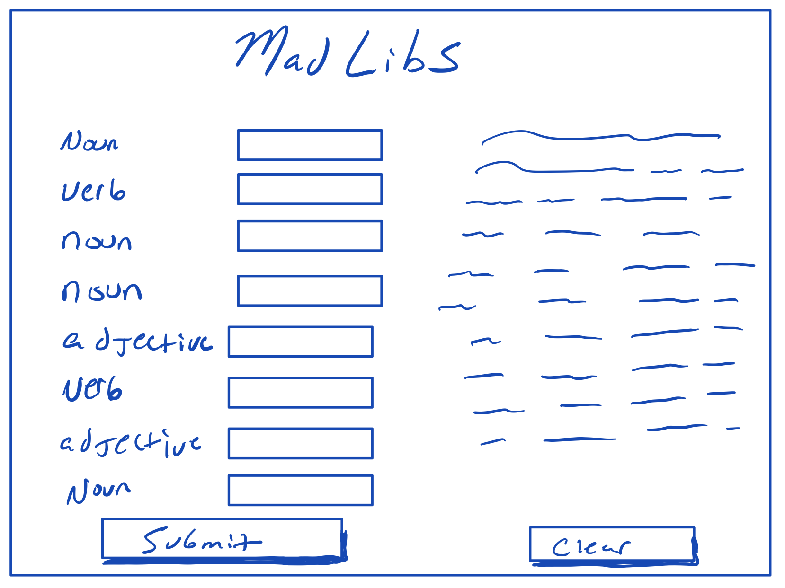

# React Forms

# Video: Forms and Functional Props
[](https://www.youtube.com/watch?v=vBpjxASFhPo)

## Overview
- In this section, we will explore how to add a form to its own component in React.
- After the user fills out the form, we will need to transfer the data from a from component to `App.js`.
- We will use conditional rendering to control the output of submitted form data.

## Learning Objectives
- Creating forms in HTML/JSX
- Creating a handler method to manage DOM event changes (what the user types)
- Creating a method to pass information from a child to a parent component


## Vocabulary
- Input tags
- Value attribute
- onChange attribute
- Name attribute
- Handler methods
- Conditional rendering
- Event, often shortened to `e`

#### Process
- `cd` into the `react-challenges` repository
- Create a new branch: `forms-initials1-initials2` (ex. forms-aw-sp)
- Create a new React application with no spaces: `yarn create react-app forms-student1-student2` (ex. yarn create react-app forms-austin-sarah)
- `cd` into the project
- Open the project in a text editor
- Create a directory in *src* called *components*
- Code!

#### Useful Commands
- $ yarn create react-app app-name
- $ yarn start
- control + c (stops the server)
- control + t (opens a new terminal tab)

#### Troubleshooting Tips
- Is your server running?
- Are your components imported and exported?
- What is your error message telling you?

---

### Forms
`<form>` is an HTML/JSX tag that wraps a collection of user inputs. Forms are a very common tool that allows developers to interact with a user. Managing form data appropriately is an important part of development.

Forms are often held in their own component but the data that is collected needs to be accessed by other parts of the application. We will explore how to manage a form and manage the data flow between components.

In this example, we will build out a form that will take user information for a pet. The form will be in the pet component and will pass the information to `App.js` after all the data has been collected.

`<form>` will be the outer most tag and will wrap a series of input tags. Another tag that will accompany each input is a label tag. `<label>` is exactly what it sounds like. It is a tag that provides context to each input.

**src/components/Pet.js**
```javascript
import React, { Component } from 'react'

class Pet extends Component{
  render(){
    return(
      <React.Fragment>
      <form>
        <label>Name of pet:</label>
        <input
          type="text"
        />
        <br />
        <label>Type of pet:</label>
        <input
          type="text"
        />
        <br />
        <label>Age of pet:</label>
        <input
          type="text"
        />
        <br />
      </form>
      </React.Fragment>
    )
  }
}
export default App
```

### Input Attributes
The next step is adding attributes to each input tag. We need to add a `value` attribute, an `onChange` attribute, and a `name` attribute. These attributes will be the first step in transferring information from the input field to our application.

**Value**  
`value` describes what is entered into the input field. It plays a role in the `handleChange` method as well as the connection to our state object.

**onChange**  
`onChange` is an event listener that gets assigned a handler method. `onChange` will automatically pass an event object to the handler method.

**Name**  
`name` also plays a role in the the `handleChange` method. It will allow this method to be dynamic. The assignment of each `name` attribute must exactly match its corresponding state key.

**src/components/Pet.js**
```javascript
import React, { Component } from 'react'

class Pet extends Component{
  render(){
    return(
      <React.Fragment>
      <form>
        <label>Name of pet:</label>
        <input
          type="text"
          name="petName"
          value={ this.state.petName }
          onChange={ this.handleChange }
        />
        <br />
        <label>Type of pet:</label>
        <input
          type="text"
          name="petType"
          value={ this.state.petType }
          onChange={ this.handleChange }
        />
        <br />
        <label>Age of pet:</label>
        <input
          type="number"
          name="petAge"
          value={ this.state.petAge }
          onChange={ this.handleChange }
        />
        <br />
      </form>
      </React.Fragment>
    )
  }
}
export default App
```

### State in the Form Component
In React applications, we typically want to keep our logic (or smart) components high up in the application tree, meaning as close to the root directory as possible. This keeps the "decision making" in the app limited and reduces conflicting or unexpected behaviors. However, there are times when having state in a component can allow us to more effectively manage data flow. This is the case with a form. We need to bundle up our form data and be able to pass it around as a single entity.

To create the single entity for our form, we can create a nested object inside a single key called form. Then when we reference `this.state.form` we get back an object containing all of our form data. Note, the keys of the form object are *exactly* the same as the `name` attribute on each input.


**src/components/Pet.js**
```
import React, { Component } from 'react'

class Pet extends Component{
  constructor(props){
    super(props)
    this.state = {
      form: {
        petName: "",
        petType: "",
        petAge: ""
      }
    }
  }
```
### onChange Handler Method
The next step is connecting the form to the state object. This is done with a handler method that is called by the `onChange` attribute.

The handler method is needs to do a lot of heavy lifting. It is going to be called on every input field and needs to update the appropriate item in state. We can do this dynamically using the name attribute.

First, we will destructure form out of state. Then we can use bracket notation to dynamically access the key of each item in the form object and assign it to the value the user is typing in that particular input field.

**src/components/Pet.js**
```javascript
handleChange = (e) => {
  const { form } = this.state
  form[e.target.name] = e.target.value
  this.setState({ form: form })
}
```

### Submit
Now that we have passed the user input into state, we need to create an action that will pass all the form data to `App.js`. We can add another input to the form that will be the type *submit*. Our input will appear to the user as a button with an `onClick` event listener that will call a handler method.

**src/components/Pet.js**
```javascript
<input
  type="submit"
  value="Submit Form"
  onClick={ this.handleSubmit }
/>
```

We can define the handler method, but before we go much further we need to switch gears and head over to `App.js`.

**src/components/Pet.js**
```javascript
handleSubmit = () => {
  // pending
}
```

### Form in App.js
In this example, `App.js` is the brains of the operation. After we collect the data from our form component we need to pass it to `App.js`. In order to get the information from a child component back to `App.js`, we need to create a method in `App.js` that can be called in the form component. This method will accept the form object from state in `Pet.js` as an argument and set it to state in `App.js`.

**src/App.js**
```
class App extends Component{
  constructor(props){
    super(props)
    this.state = {
      form: null
    }
  }

  handleFormSubmit = (newPet) => {
    this.setState({ form: newPet })
  }
```

This method will need to be passed as props to `Pet.js`.

### onClick Handler Method
Now we can circle back to our `handleSubmit` method in `Pet.js` and update the method to call the `handleFormSubmit` method and pass the the form object.

**src/components/Pet.js**
```javascript
handleSubmit = () => {
  this.props.handleFormSubmit(this.state.form)
}
```

### Conditional Rendering
Now that `App.js` has the form object in state, we can display the information to the page. We want to be in control of when the information gets displayed so we can use a technique called conditional rendering. This means we will wait until the information is in the correct place before displaying it to the user.

**src/App.js**
```javascript
<Pet handleFormSubmit={ this.handleFormSubmit } />
{ this.state.form &&
  <div>
    <p>Pet name: { this.state.form.petName }</p>
    <p>Type of pet: { this.state.form.petType}</p>
    <p>Pet age: { this.state.form.petAge }</p>
  </div>
}
```

We can use the JavaScript logical operator `&&` to set up a condition that requires both sides of a condition to be true in order for the entire statement - everything inside the curly braces - to be true. Prior to the form being submitted the value of `this.state.form` is null, a falsey value. Once the form is submitted the state object is updated to hold the form object, a truthy value. When the value in state is truthy, we see the contents of the `<div>` rendered on the page.

### Prevent Default
We may notice some strange behavior from our application, specifically that the page is refreshing after we submit the form. This is React working overtime, and we want to stop those default actions from happening. In the `handleSubmit` method, we can reference a method that belongs to the event object generated by the event listener `onClick` called prevent default.

**src/components/Pet.js**
```javascript
handleSubmit = (e) => {
  e.preventDefault()
  this.props.handleFormSubmit(this.state.form)
}
```

## Challenge: Mad Libs
As a developer, I have been tasked with recreating the children's game [ Mad Libs ](https://www.madlibs.com/) as an app. Mad Libs requires the user to supply a series of random words that match the part of speech as indicated. When all the words have been supplied, the user can see their words added to a pre-written story. Hilarity ensues.


- As a user, I can see a page with many text inputs.
- As a user, I can see labels next to the text inputs indicating what part of speech (or type of word) should be entered into each text form: nouns, pronouns, verbs, adjectives, and adjectives.
- As a user, I can fill out the inputs.
- As a user, after I have filled out the text inputs I can click a 'Submit' button.
- As a user, when I click 'Submit' I see a paragraph appear on the page that contains the words I entered in the text forms to create a funny story.

---
[Back to Syllabus](../README.md#unit-two-introduction-to-react)
