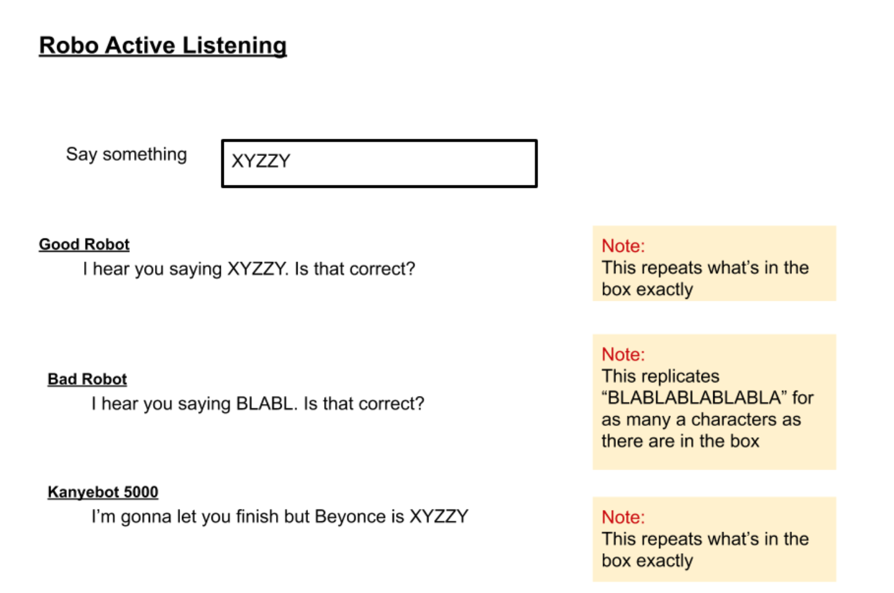

# React Inputs and Events

## Overview
- Adding a input fields to a React application
- Implementing listening events in React
- Updating state with every change to the DOM

## Learning Objectives
- Creating text input fields
- Exploring event listeners in JavaScript
- Creating a method to handle DOM event changes (what the user types)
- Creating a method to set state with the user input

## Vocabulary
- DOM event, often shortened to `e`
- Event listeners
- onChange
- HTML input tags
- Input attributes
- Handler methods

## Additional Resources
- [GeeksforGeeks](https://www.geeksforgeeks.org/javascript-events/)
- [W3Schools HTML Input](https://www.w3schools.com/tags/tag_input.asp)

#### Process
- `cd` into the `react-challenges` repository
- Create a new branch: `inputs-initials1-initials2` (ex. inputs-aw-sp)
- Create a new React application with no spaces: `yarn create react-app inputs-student1-student2` (ex. yarn create react-app inputs-austin-sarah)
- `cd` into the project
- Open the project in a text editor
- Create a directory in *src* called *components*
- Code!

#### Useful Commands
- $ yarn create react-app app-name
- $ yarn start
- control + c (stops the server)
- control + t (opens a new terminal tab)

#### Troubleshooting Tips
- Is your server running?
- Are your components imported and exported?
- What is your error message telling you?

---

## Inputs and DOM Events
Web applications are built to handle interaction with a user. These interactions can happen in a variety of ways. The user can click with their mouse, hover over elements, or use their keyboard to type. All of these interactions are considered **DOM events**. The DOM (Document Object Model) is always listening for changes. As a user moves their mouse across the screen, the DOM reacts by changing the view to represent the cursor's position. As developers, we want our web applications to recognize these interactions and respond accordingly depending on the type of event.

As developers, we can add event listeners to HTML (and JSX) tags that will wait for specific events to occur. One example is adding an `onClick` attribute to a button. The DOM is listening for a click event on that particular node and will execute the action described by the developer.

Another event listener is **onChange** which listens for any changes made to a particular node and executes a corresponding action. This type of listener is very handy when the user is typing in a text field. We can listen for the changes and capture the value of what the user is typing.

## Input Attributes
Inputs are HTML (and JSX) tags. Inputs are self closing, as they don't require inner HTML.

```javascript
<input />
```

**Type**  
Input tags provide lots of options for developers. Inputs can accept text, numbers, dates, passwords, and more. They can also look like text fields, radio buttons, or check boxes. This is determined by the "type" attribute.

```javascript
<input type="text" />
```

**Value**  
Value can be used differently for different types of input types. For buttons, a value attribute can represent the text that appears on the button. For text inputs, the value attribute can establish a default value. In React, the value attribute can directly represent the state object. Value works in conjunction with `onChange` to update state and store the user's input.

```javascript
<input
  type="text"
  value={this.state.userInput}
/>
```

**onChange**  
All inputs are listening for events. Developers can use the `onChange` method to execute logic every time there is a change on an element. In React, the onChange attribute can call a function that will update the state object and reflect back in the current value. It is customary to have an onChange listener associate with a **handler method**. Handler methods are named to associate their action with a particular event. By convention, a developer would know that a method called `handleChange` would be associated with an `onChange` event and a method called `handleClick` would be associated with an `onClick` event.

```javascript
<input
  type="text"
  value={this.state.userInput}
  onChange={this.handleChange}
/>
```

## Handle Change
In JavaScript, event listeners create a new instance of the class Event. Event has built in properties and methods that can be passed to a `handleChange` method. The convention is to shorten the name `event` to `e`.

```javascript
handleChange = (e) => {
  console.log(e)
}
```

By logging `e` we can look at the many properties and methods that are available to the class Event. To capture the characters the user is typing, we can use the property `target` which, as the name suggests, targets the input field.

```javascript
handleChange = (e) => {
  console.log(e.target)
}
```

Now that we have targeted the input, we can extract the value from the input field and set it to state.

**src/App.js**
```javascript
class App extends Component{
  constructor(props){
    super(props)
    this.state = {
      userInput: ""
    }
  }

  handleChange = (e) => {
    console.log(e.target.value)
    this.setState({userInput: e.target.value})
  }

  render(){
    return(
      <>
        <input
          type="text"
          value={this.state.userInput}
          onChange={this.handleChange}
        />
        <p>{this.state.userInput}</p>
      </>
    )
  }
}
export default App
```

## Summary
- Inputs are HTML (or JSX) tags that accept many attributes.
- Input attributes can modify the type of input, define the value, and listen for onChange events.
- onChange events call handler methods that execute JavaScript code.
- Event listeners create a new instance of the JavaScript class Event which has built in properties and methods.

## Challenge: Listening Robot

- As a user, I can see a page with a text input.
  - As a developer, I have one parent component that holds state (logic or smart component).
  - As a developer, I have an input in my parent component.
- As a user, I see titles of three robots waiting for my text.
  - As a developer, I have three child components that do not hold state (display or dumb component).
- As a user, when I enter text I see the three robots responses update in real time.
  - As a developer, I can call an onChange method on the input tag.
  - As a developer, I can pass the updated state as props to the child components.
  - As a developer, I can see the child components display the user input.
- As a user, I see my "Good Robot" repeating exactly what I type.
- As a user, I see my "Bad Robot" saying *BLABLA...*. One character for every character I type.
  - As a developer, I can create modification to the user input text by creating a method in my child component.
- As a user, I see a third robot that is the developer's choice.

---
[Back to Syllabus](../README.md#unit-two-introduction-to-react)
