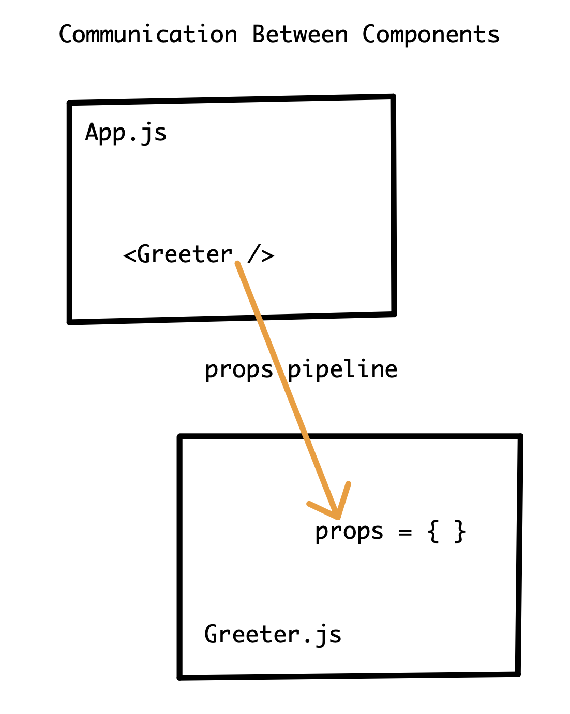

# React Props

#### Overview

Props (properties) are specialized React objects used to pass information from one component to another. Props create a unidirectional flow of data and behavior from one component down to a nested component via the component invocation. While state values are constantly updated through user interactions, props cannot be changed. They are a "read only" value.

#### Previous Lecture (1 hour 32 min)

[](https://www.youtube.com/watch?v=UtMsjt2mSOA)

#### Learning Objectives

- can define props
- can recall the syntax for passing data and behavior to a nested component
- can demonstrate how to access data and behavior in the nested component
- can describe the flow of information from a component to a nested component

#### Vocabulary

- props (properties)
- key

#### Process

- `cd` into the `react-challenges` repository
- Create a new branch: `props-initials1-initials2` (ex. props-aw-sp)
- Create a new React application with no spaces: `yarn create react-app props-student1-student2` (ex. yarn create react-app props-austin-sarah)
- `cd` into the project
- Open the project in a text editor
- Create a directory in `src` called `components`
- Code!

#### Useful Commands

- $ `yarn start`
- control + c (stops the server)
- command + t (opens a new terminal tab)

#### Troubleshooting Tips

- Is your server running?
- Are your components exported?
- Inspect the page and look for errors in the console tab.
- Always look at the first error message in the list.

---

### Communication Between Components

React gives us the ability to build modular interfaces where each component is in charge of its own functionality. Since the structure of React is component based, communication between components is very important in order to create complex applications. **Props**, short for properties, is a specialized tool in React for the communication of data and behavior between components.

Props is a pipeline where data and behavior can be passed from one component to a nested component. Props are passed to a component through the component invocation. This means that props can only travel in one direction. It is very similar to how we pass information to a function through an argument.

The data structure of the props pipeline is an object. Since an object can contain many key value pairs, the props pipeline can pass as much information as necessary between components.

### Prop Data From State

Both data and behavior can be communicated between components via props. The data typically comes from values stored in state. In a very practical sense, prop data is a snapshot of the state values that get passed down to components tasked with managing that information. State values are designed to update and change. Props don't update. Props are "read only." As the state values update and change, the new data will make its way through the props pipeline.

### Greeter Example

To explore how props work in React, we will create a greeter application. We'll start with `App.js` displaying a heading tag and a nested component called `Greeter.js` with a smaller heading tag.

**src/App.js**

```javascript
import React from "react"
import Greeter from "./components/Greeter"

const App = () => {
  return (
    <>
      <h1>Greeter Application</h1>
      <Greeter />
    </>
  )
}

export default App
```

**src/components/Greeter.js**

```javascript
import React from "react"

const Greeter = () => {
  return (
    <>
      <h3>Hello World!</h3>
    </>
  )
}

export default Greeter
```

### Passing Data as Props

The job of the Greeter component is to, well, greet! Currently we have the generic greeting "Hello World!" To improve our greeter application we can have it greet someone in particular: "Hamilton".

To make the greeting specific, `App.js` is going to provide the Greeter component with data. The Greeter component will take whatever data is passed and render it in the browser. The structure of these two components follows the principle of separation of concerns. This means `App.js` is the container component managing the "big picture" and `Greeter.js` is a display component.

`App.js` will pass data to the Greeter component through the component invocation.

**Component Invocation**

```jsx
<Greeter />
```

Within the Greeter component invocation we will create a variable called `name` and assign it the string "Hamilton".

**Component Invocation with Props**

```jsx
<Greeter name="Hamilton" />
```

**src/App.js**

```javascript
import React from "react"
import Greeter from "./components/Greeter"

const App = () => {
  return (
    <>
      <h1>Greeter Application</h1>
      <Greeter name="Hamilton" />
    </>
  )
}

export default App
```

The variable `name` is passed into the props pipeline and becomes available to the Greeter component. Since the props pipeline data structure is an object, the variable `name` becomes the key and the string "Hamilton" becomes the value.

```javascript
{name: "Hamilton"}
```

Now we need to set up the Greeter component to accept the props object. Passing information into a component is very similar to passing information into a function. We need to establish an argument in the Greeter function. Because we are using the props pipeline, the argument will be `props`.

The props pipeline data structure is an object. We can think of the argument `props` as looking like this:

```javascript
props = {name: "Hamilton"}
```

To have our application greet Hamilton, we need to use fundamental JavaScript logic and extract the value from the object. The value can be rendered in the heading tag.

**src/components/Greeter.js**

```javascript
import React from "react"

const Greeter = (props) => {
  return (
    <>
      <h3>Hello {props.name}!</h3>
    </>
  )
}

export default Greeter
```



### Passing Values From State as Props

Now that we are using props in our greeter application, we can begin to refactor. Our refactor can improve the code in our application. Rather than hardcoding the string "Hamilton" directly in the component call we can use a state value to pass props to the Greeter component. This will make our application more dynamic as state values can be updated.

**src/App.js**

```javascript
import React, { useState } from "react"
import Greeter from "./components/Greeter"

const App = () => {
  const [people, setPeople] = useState("Hamilton")

  return (
    <>
      <h1>Greeter Application</h1>
      <Greeter name={people} />
    </>
  )
}

export default App
```

The variable `name` is now assigned information from state rather than hardcoded. Since the Greeter component is a display component, no updates are needed for our refactor in `App.js`.

### Mapping a Component Call

Our greeter application is working just great. But what if we have multiple people to greet? To expand the functionality of the application we can set an array in state. Instead of a single Greeter component invocation, we will have one component per person. To manage this dynamically, we will map over the array in state and return a component invocation. No matter how many people we need to greet, our code can manage the job effectively.

React is iterating over the array in state and producing a series of component calls as a result. Each component call acts independently from the others. To keep these similar code outputs organized, React likes to have a key for each iteration. A **key** is a unique identifier that gets passed to the JSX tag returned from an iteration. A key can be any unique identifier. Since we have access to the index as the second parameter in the map method, in this example we will use the index of the array to ensure each item in the array always has a unique identifier.

As long as the `name` variable stays the same, no changes need to be made to the Greeter component.

**src/App.js**

```javascript
import React, { useState } from "react"
import Greeter from "./components/Greeter"

const App = () => {
  const [people, setPeople] = useState(["Hamilton", "Washington", "Jefferson"])

  return (
    <>
      <h1>Greeter Application</h1>
      {people.map((person, index) => {
        return <Greeter name={person} key={index} />
      })}
    </>
  )
}

export default App
```

### Passing Behavior as Props

We have explored passing data as props. We can pass behavior as well. The process is very similar to passing data as props. In this example, we will create a button that will trigger a prompt which will add new people to our array. The button will be its own component named `AddPerson`. The logic will be held in `App.js`, and the appropriate behavior can be distributed as needed.

We will add a function in `App.js` that will use the state setter method named `setPeople` to trigger a `prompt()` method. Saving the prompt to a variable captures the result of what our user types. Whatever the variable captures will be added to the array in state.

**src/App.js**

```javascript
import React, { useState } from "react"
import Greeter from "./components/Greeter"
import AddPerson from "./components/AddPerson"

const App = () => {
  const [people, setPeople] = useState(["Hamilton", "Washington", "Jefferson"])

  const addPerson = () => {
    const newPerson = prompt()
    setPeople([...people, newPerson])
  }

  return (
    <>
      <h1>Greeter Application</h1>
      {people.map((person, index) => {
        return <Greeter name={person} key={index} />
      })}
      <AddPerson addPerson={addPerson} />
    </>
  )
}

export default App
```

The function we wrote will update the array in state. There are no updates for the Greeter component as the code we wrote is dynamic. However, the function is not yet being called. We need to create a button with an `onClick` event.

The button's `onClick` will call the `addPerson` function that is being passed as props down into the component.

**src/components/AddPerson.js**

```javascript
const AddPerson = (props) => {
  return <button onClick={props.addPerson}>Add Person</button>
}

export default AddPerson
```

Now we have created a beautifully dynamic application that has great organization and proper separation of concerns.

---

### 🎲 Challenge: Dice Roller

As a developer, you are tasked with creating a dice application. The application will allow the user to role a standard six-sided dice and see the result of each roll. As the user rolls the dice, each roll gets logged which creates a list of all the previous rolls.

When creating a project it is important to think about organization of your code. It is best practice to separate and compartmentalize all the actions in your code. The dice UI will be in its own component as will the roll log UI. `App.js` controls of all the data in state, renders the other components, and passes data to the dice and roll component.


### 📚 User Stories

- As a user, I can see a square box on the screen with a black border and a white background.
- As a user, I can click on the box to roll the dice and see the result of my roll in the box.
- As a user, I can see my roll logged and see the roll log continue to grow as I roll the dice.

### 🏔 Stretch Goals

- As a user, I can see the image of a dice face when I roll the dice.
- As a user, I can click a restart button that clears my roll log.

### 🗂 Assets

- [Dice One](./assets/1-dice.png)
- [Dice Two](./assets/2-dice.png)
- [Dice Three](./assets/3-dice.png)
- [Dice Four](./assets/4-dice.png)
- [Dice Five](./assets/5-dice.png)
- [Dice Six](./assets/6-dice.png)

---

[Back to Syllabus](../README.md#unit-three-react)
