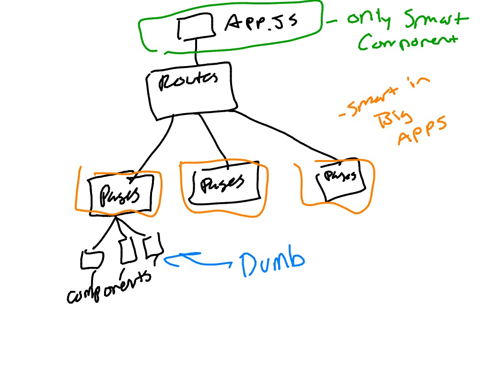

## Smart and Dumb Components

Smart components have side effects, meaning they call out to things outside of themselves.  A good example of a smart component side effect is saving data to the server from a component.  There are many other examples of side effects.  A good rule of thumb is: if you can't be 100% sure that given the same inputs the component will return the same outputs, that component has side effects and is 'Smart'.

We want as few smart components in our applications as possible.  Smart components are:

* More complicated
* Hard to test

They are also unavoidable.  Some of our components are going to be smart.  It's our job as developers to be purposeful about which ones have side effect inducing logic in them vs. all the rest that don't.

---
[Back to Syllabus](../README.md#unit-two-introduction-to-react)
