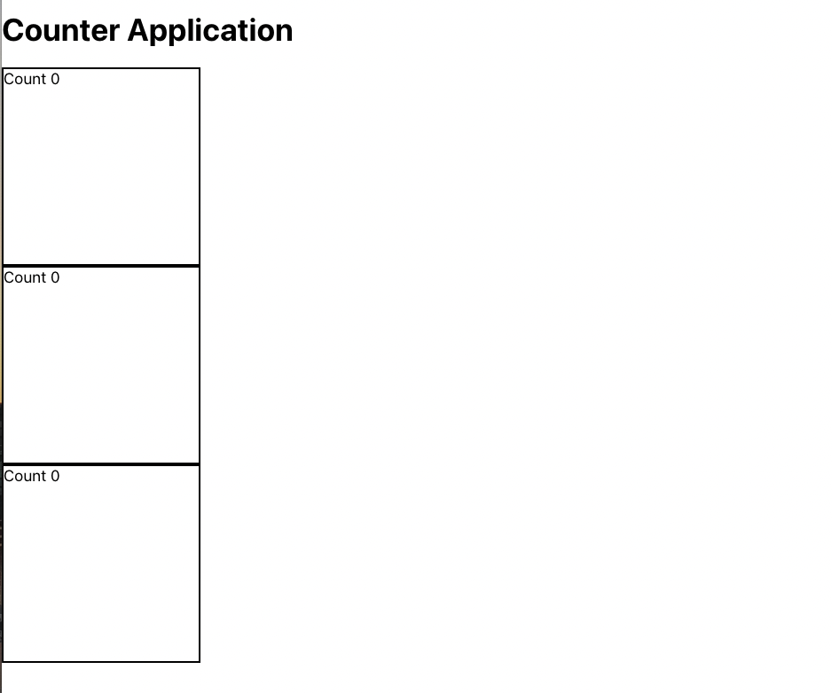
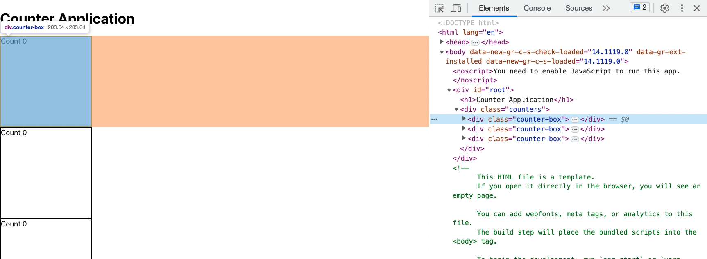

# React State

#### Overview

React components often need to store data and perform logic in order to create interactive user experiences. Data needs to be stored in a way that it can be accessed throughout the component and updated when necessary. In a React component, the data is managed by a special function called a React hook. The React hook allows developers to create a variable with an initial value and a method to update the value as needed.

#### Previous Lecture (1 hour, 12 min)

[](https://www.youtube.com/watch?v=ArJvvE576ro)

#### Learning Objectives

- can define React state
- can demonstrate JavaScript syntax in the JSX return
- can demonstrate the useState syntax to update the state values
- can create a React component with a useState hook
- can identify a component as a container component or a presentational component
- can parse out code to other components when necessary for streamlined container

#### Vocabulary

- state
- useState
- React hooks
- separation of concerns
- container component
- presentational component
- block level element

#### Additional Resources

- [React Hooks](https://react.dev/reference/react)
- [Flexbox](https://css-tricks.com/snippets/css/a-guide-to-flexbox/)

#### Process

- `cd` into the `react-challenges` repository
- Create a new branch: `state-initials1-initials2` (ex. state-aw-sp)
- Create a new React application with no spaces: `yarn create react-app state-student1-student2` (ex. yarn create react-app state-austin-sarah)
- `cd` into the project
- Open the project in a text editor
- Create a directory in `src` called `components`
- Code!

#### Useful Commands

- $ `yarn start`
- control + c (stops the server)
- command + t (opens a new terminal tab)

#### Troubleshooting Tips

- Is your server running?
- Are your components exported?
- Inspect the page and look for errors in the console tab.
- Always look at the first error message in the list.
- What is the error message telling you?

---

### React State

Components are the fundamental structure of React. A React application is made up of many components that each contribute a specific piece to the overall user experience. Components can have different kinds of functionality. All components display markup however some will only display markup while other components also need to store and manipulate data. There is a specific React data structure called **state** that is used to store data within a React component. Data stored in state is available to the entire React component.

The state data structure in React is created by a method called `useState`. **useState()** is method specific to React that defines a variable and its initial value as well as creating a method that can be called to update that value as needed.

The `useState` method is one of a collection of methods that are called React hooks. **React hooks** are a set of built-in methods for functional components allowing developers to "hook" into reusable features in React.

### Separation of Concerns

When creating React components it is important to follow the programming principle of separation of concerns. The principle of **separation of concerns** will ensure that each component in React is in charge of its own functionality. This makes a clear division of responsibility and makes fixing bugs slightly easier.

While each component is in charge of its own functionality, components still need to communicate with each other. Components communicate by passing data from one component to another. This means that some components will affect the functionality of other components. This creates two categories that a component can fall into. If a component is passing data that affects the functionality of another component it is referred to as a **container component**. Container components can also sometimes be referred to as stateful components or logic components. If a component does not affect any other components it is called a **presentational component**. It is important to make the distinction as we want to streamline the data flow in our apps, ensure a clear separation of concerns, and be able to fix any issues quickly.

### Counter Example

Here is an example that creates a counter application in React. The counter application allows the user to click on the application and increment a count. The count will start at 0 and increase one time for every click.

We'll get started in `App.js` by displaying a heading tag and a div tag designated for our counter. At this point we should spin up our app by running $ `yarn start` in the terminal and ensure our application is displaying the content as expected.

**src/App.js**

```javascript
import React from "react"

const App = () => {
  return (
    <>
      <h1>Counter Application</h1>
      <div>Count</div>
    </>
  )
}

export default App
```

### Adding State Values

Next we need to display our initial count of 0. The count will start at 0 but since the value of the count will change with each click, we must be able to update the count value. This is a very common problem to have in React so there are some tools available that handle this kind of situation. We need to make our count a state variable.

The `useState` hook method is how we create state variables. `useState` will

1. create the variable,
2. create a method that can be used to update the value,
3. and set the initial value of the variable.

We can name the state variable whatever we want as long as it communicates intent. In this case it makes sense to name the state variable `count`. Following the `count` variable is the name of the method that will be used to update `count`. It is convention to use the same name but add the prefix `set`.

Inside the parentheses of the `useState` hook method we can set the initial value of `count`. The count variable will have an initial value of 0. Our component now has data that is available to be referenced and modified as needed.

To have access to the `useState` hook method, we will import it to the component from the React dependencies.

**src/App.js**

```javascript
// modify the React import to include useState
import React, { useState } from "react"

const App = () => {

  // 1. state variable called count
  // 2. state method called setCount that can update the value of count
  // 3. inside the parentheses of useState is the initial value of count which is will be 0
  const [count, setCount] = useState(0)

  return (
    <>
      <h1>Counter Application</h1>
      <div>Count</div>
    </>
  )
}

export default App
```

### Referencing Values in State

We can reference the `count` variable by dropping it into the JSX tags to see the value of `count` render in the browser.

**src/App.js**

```javascript
import React, { useState } from "react"

const App = () => {
  const [count, setCount] = useState(0)

  return (
    <>
      <h1>Counter Application</h1>
      <div>Count {count}</div>
    </>
  )
}

export default App
```

### Updating State Values

Next we need a way to allow the user to increment the counter's value. So we will add a function to our component. The function will be called `handleClick` to reflect the type of user interaction with our application. Inside `handleClick` the `setCount` method will be called and passed the current value of `count` plus one.

The `handleClick` function is now ready to be called. We can add an `onClick` attribute to the `div` that will trigger the `handleClick` function.

Now we have a working counter application!

**src/App.js**

```javascript
import React, { useState } from "react"

const App = () => {
  const [count, setCount] = useState(0)

  // the handleClick function is invoked when the div is clicked
  const handleClick = () => {
    setCount(count + 1)
  }

  return (
    <>
      <h1>Counter Application</h1>
      <div onClick={handleClick}>Count {count}</div>
    </>
  )
}

export default App
```

### Styling in React

Now that the basic counter functionality is working we can add some styling. To define the edges of the counter we can add an outline. The first step will be to add a `className` to the counter JSX div element.

**src/App.js**

```javascript
<div onClick={handleClick} className="counter-box">
  Count {count}
</div>
```

All the stylings for our React application are going to live in the `App.css` file. If we look in the file there is already content. This is from the boilerplate code that created the React page with the black background and blue React icon. Since we deleted all that boilerplate code from `App.js` we can delete the boilerplate code from `App.css` too.

By targeting the `className` we can add a height, a width, and a border property. It is a good practice to alphabetize your CSS properties in order to keep your styles organized.

**src/App.css**

```css
.counter-box {
  border: 2px solid black;
  height: 200px;
  width: 200px;
}
```

We need to ensure the `App.css` file is imported into `App.js` so the stylesheet can be accessed.

**src/App.js**

```javascript
import React, { useState } from "react"
import "./App.css"
```

Now we should see a box on the screen that contains our counter. The box defines the edge of the counter's div and provides the user a clear area in which to click to increment the counter.

### Refactor to Advance Functionality

Our counter application is working beautifully. One of the great things about React is that components are designed to be reusable. If we wanted more than one counter in our application, right now we would be stuck duplicating code. That is a red flag! A quick refactor will allow our counter functionality to be used as many times as needed.

`App.js` is the only component that is predefined when using the command `create react-app`. It is the main component in a React application and typically is in charge of data flow, managing other components, and other tasks we will discover later in the course. Often this means `App.js` will be a container component. In this example, moving the current content of `App.js` including the state values, logic, and the JSX elements for the counter to another component will allow more functionality without code duplication.

### Counter Component

In this refactor we will add a directory inside the `src` directory named `components`. Inside the `components` directory, we will create a new file called `Counter.js` that will be a React component. `Counter.js` will become a presentational component. We can move the appropriate pieces of logic and markup from `App.js` over to the new `Counter.js` file.

**src/components/Counter.js**

```javascript
import React, { useState } from "react"

const Counter = () => {
  const [count, setCount] = useState(0)

  const handleClick = () => {
    setCount(count + 1)
  }

  return (
    <div onClick={handleClick} className="counter-box">
      Count {count}
    </div>
  )
}

export default Counter
```

### Multiple Counters

`App.js` no longer has the counter logic. Instead it will be in charge of rendering the component that now holds the counter logic. `App.js` will be a container component. It is necessary to import the counter component and invoke the component inside the return of `App.js`. This is where the power of React shines. We can invoke the counter component as many times as we please without duplicating any logic. Each counter component is a unique instance that will act independently of all other counters. Very cool!

**src/App.js**

```javascript
import React from "react"
import Counter from "./components/Counter"

const App = () => {
  return (
    <>
      <h1>Counter Application</h1>
      <Counter />
      <Counter />
      <Counter />
    </>
  )
}

export default App
```

### Styling the Set of Counters

There is one more modification to the user experience we should make. Now that we have many instances of the counter component, we can add styling to position the counters so they don't just sit on top of each other.



The individual counters already have a `className` that is providing the styling of the border. We need to style the set of counters so we need to add a div that wraps all the counter component invocations. Then we will add a `className` to the div.

**src/App.js**

```javascript
const App = () => {
  return (
    <>
      <h1>Counter Application</h1>
      <div className="counters">
        <Counter />
        <Counter />
        <Counter />
      </div>
    </>
  )
}
```

Positioning content in the browser is HARD! A good rule to follow is positioning content requires context. This means if we want to move an element we have to give it the space to move in. A div is a block level element. A **block level element** in HTML and JSX will take up the full width of the browser. We can see this by inspecting the page and seeing the space behind our counter elements.



Even though the counters appear to the user to be only 200px wide, the div element still takes up the full width of the browser. This is why the boxes sit in a vertical row. We can change the positioning of our set of counters with our friend flexbox.

By applying the CSS property `display: flex;` to the `counters` class, we immediately see a change in the positioning of the boxes. This property gives us access to the full flexbox library. Now we can add an additional flexbox property to create space on each side of the boxes.

**src/App.css**

```css
.counter-box {
  border: 2px solid black;
  height: 200px;
  width: 200px;
}

.counters {
  display: flex;
  justify-content: space-around;
}
```

Now our counter app is functional and positioned nicely on the page.

---

### 🟧 Challenge: Color Box

As a developer, you are tasked with creating a color box application. The application will allow the user to click a box and see a different color with every click.

### 📚 User Stories

- As a user, I can see a square box on the screen with a black border and a white background.
- As a user, I can see the default color name "white" inside the box.
- As a user, every time I click on the box the name of a different color appears.
  - Possible color names: red, orange, yellow, green, blue, purple, pink
- As a user, every time I click the box instead of the color name, I see the background color in the box change to represent the color.
- As a user, I can see many boxes on the page all acting independently of one another.

### 🏔 Stretch Goals

- As a user, I can start with no boxes on the screen.
- As a user, I can see a button to add a box.
- As a user, I can see a button to remove a box.
- As a user, every time I click the add button, I can add an additional box that acts independently of the other boxes.
- As a user, every time I click the remove button, I can remove the last box in the series.

---

[Back to Syllabus](../README.md#unit-three-react)
