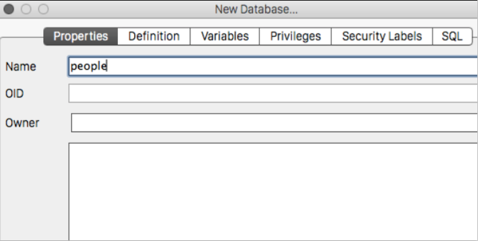
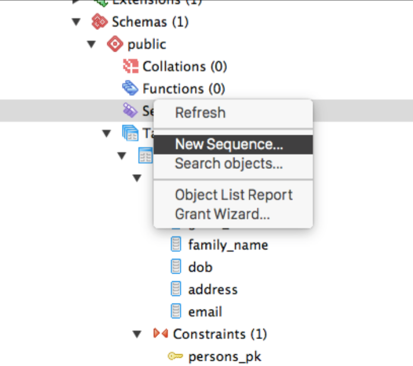
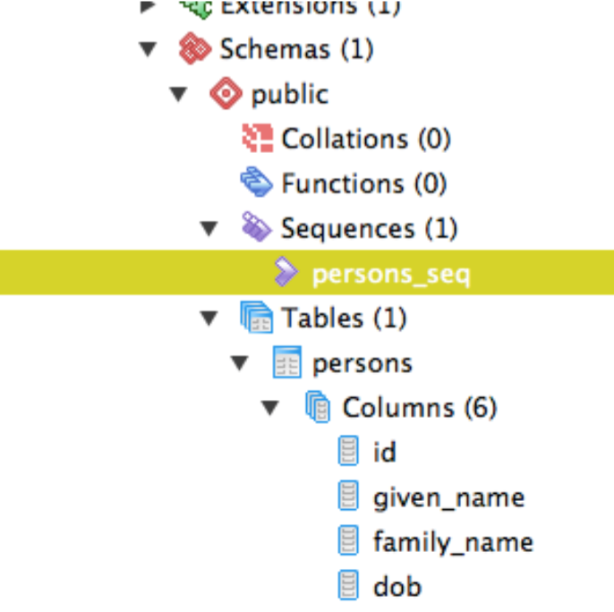
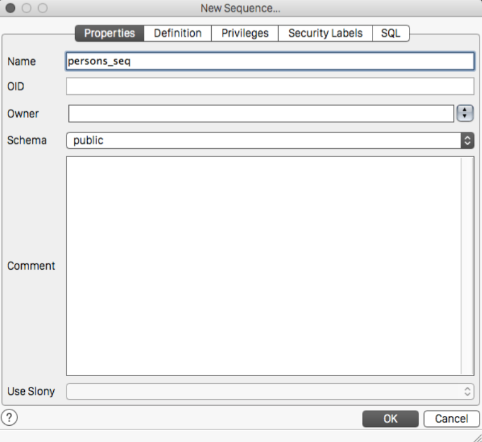
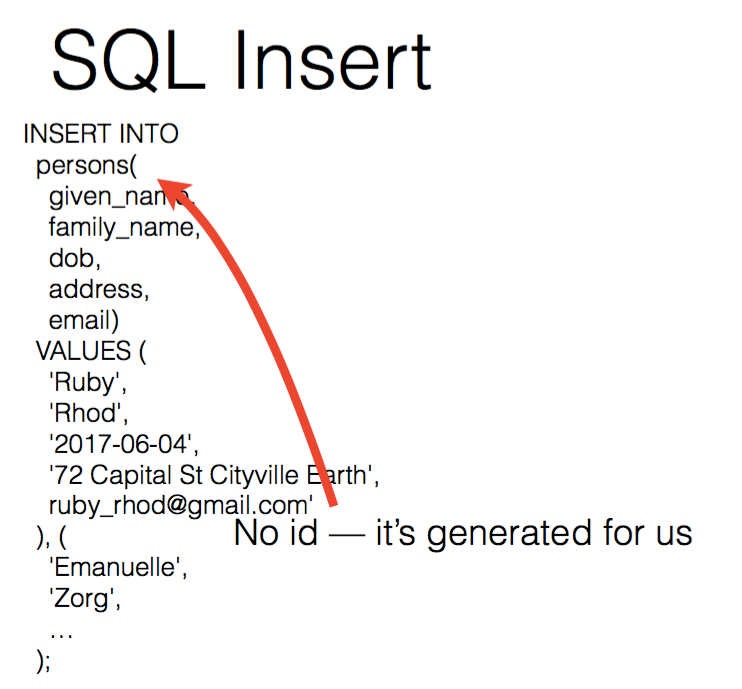
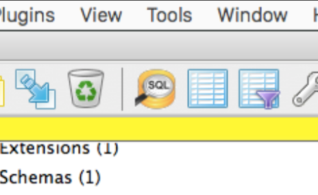

# Insert and Select

In this exercise, we are going to ....

## 1. Launch PGAdmin, and connect to Postgres

## 2. Create a new database called 'People'

## 3. Create a new table called 'persons'

##4. Add the following columns

## 5. Add a primary key for persons table

## 6. Open SQL Pane and make sure everything looks correct 

## 7. Add a new sequence to increment our primary key

## 8. Set ID column to use persons_seq

## 9. Notice that No ID column is in the SQL insert statement

## 10. Its time to insert some persons into the database

