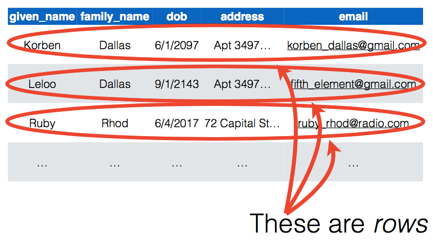
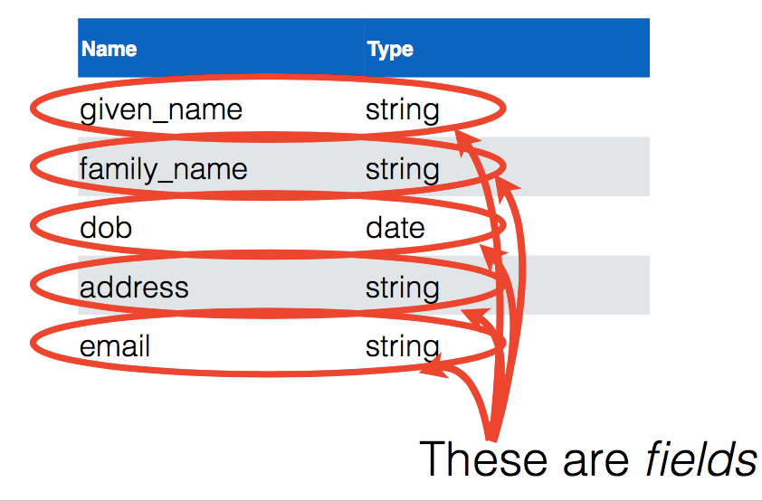
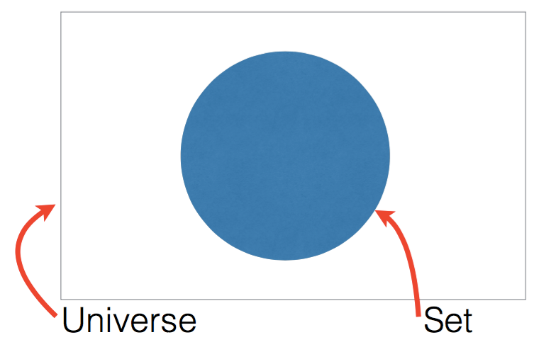
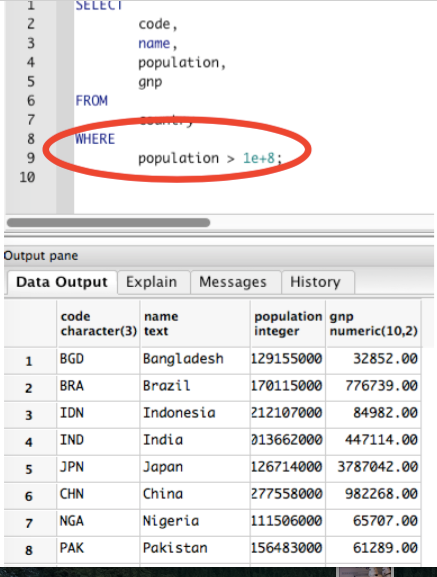
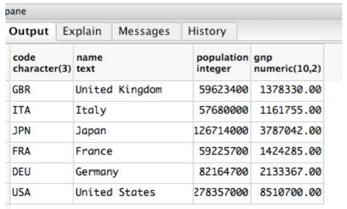
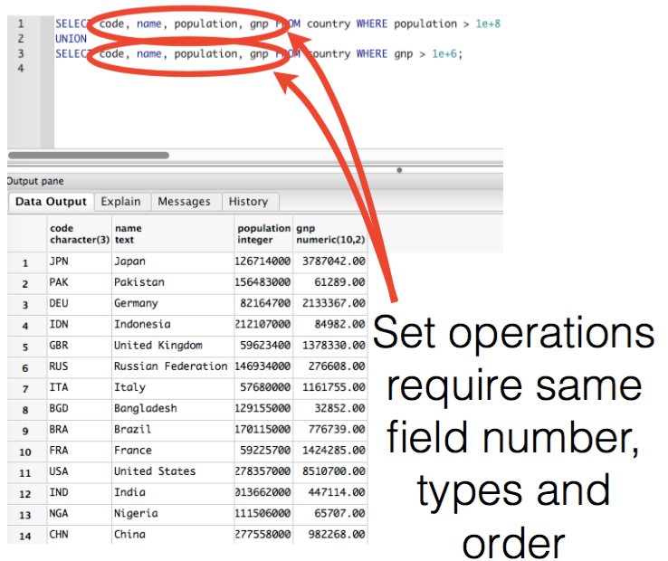

# Introduction to SQL

https://player.vimeo.com/video/137862860

### Let's get on the same page with some common terms...

**PostgresSQL or just Postgres**  - is an open source object-relational database management system

**SQL** - Structured Query Language designed for managing data held in a relational database management system

**Model** - representation of a set of data

**Instance** - A single row entry in a database

**Schema** - a description of the names and types of fields in a table

**Attributes** - the keys in a key/value pair (ex. column headers in a table)

**Relation or Table** - A collection of instances that contain the same attributes

**Primary Key** - unique identifier for each instance (automatically generated in rails)

### Model of a Person
```
Given Name: Korben
Family Name: Dallas
Date of Birth: 6/1/12097
Address: Apt 3497 1 Main St CityVille, Earth
Email: korben_dallas@gmail.com
```

In our program, a person has an email, a family_name, and several other attributes that we care about. We need a way to keep track of them and keep their information organized.

## Relations or tables

A single row entry in a database can also be called an "instance".  We need a way to keep track of all the instances of our Person model.

A collection of instances that contain the same attributes is called a relation or a table.  Tables allow us to better organize models.

A schema is a description of the names and types of fields in a table.







## One More Thing

### The Primary Key

Each row must have a unique way of identifying itself to other parts of the program.

In Rails, every row of a table has a primary key named "id", and that ID is guaranteed to be unique.  This prevents problems like two Person instances being confused for each other because they have the same name. We can always tell them apart by their ID.

### Our Model of a Person

We've added in a primary key for this instance of Person:
```
id:				1
Given Name: 	Korben
Family Name: 	Dallas
Date of Birth: 	6/1/12097
Address: 		Apt 3497 1 Main St CityVille, Earth
Email: 			korben_dallas@gmail.com
```

What primary keys - or unique identifiers - do you have?  For example, a person might have an SSN or a fingerprint.

What other primary keys - or unique identifiers - can you think of?

## Summary

In this lesson, we learned about organizing a program's data into models.  We were introduced to the database concept of a row, which represents a model instance. Rows are grouped together into tables.  Relational databases define the name, data type, and several other characteristics of the fields using a schema.  One very important attribute of every row in every table in a Rails application is the id.  Primary keys are guaranteed to be unique, and are how we identify individual rows.

Now that you are familiar with how databases organize data, you understand the foundation that the Rails apps we make class will be built on.  Relational databases were around long before Rails and will be here long after new technologies have take its place.  Rails, and all web frameworks, can be thought of as tools to efficiently and securely bridge web pages and data stored in relational databases.

## Comparisons

A `WHERE` clause accepts the following operators:

`=`, `!=`, `>`, `<`, `>=`, `<=`,
`BETWEEN`, `LIKE`, and `IN`,
`NOT`, `AND`, `OR`.

Use of operators can be grouped with parenthesis.

Here are examples of the last set of operators:

```sql
> SELECT * FROM persons WHERE age  BETWEEN 13 AND 17;
> SELECT * FROM persons WHERE name BETWEEN 'Judith' AND 'Wilma';
> SELECT * FROM persons WHERE hair IN ('red', 'brown');
> SELECT * FROM persons WHERE name LIKE 'We%';
```

The `IN` operator refers to a set of values.
For the `LIKE` operator, the `%` is a wildcard, meaning it can stand for any number of any characters.

## Ordering

You can order the result set of a query by adding an `ORDER BY` clause after the `WHERE` clause.
For instance your can sort the results by name:

```sql
> SELECT *
  FROM persons
  WHERE age BETWEEN 13 AND 17
  ORDER BY name;
```

You can append `ASC` or `DESC` to make the order ascending or descending.

## Limits

A `SELECT` can be limited to only return a maximum number of rows by adding a `LIMIT` after the `WHERE` clause.
The following examples limits the number of rows in the result set to ten:

```sql
SELECT *
FROM persons
WHERE age BETWEEN 13 AND 17
LIMIT 10;
```

## Working with NULL

`NULL` is a special value that used to denote "no value", similar to `nil` in Ruby, and `null` or `undefined` in Javascript.
The strange thing about `NULL` is that is not equal to anything, _including itself_.
So to specify `NULL` in a `WHERE` clause we have to use `IS NULL` or `IS NOT NULL`.

* Most functions and expressions yield `NULL` if `NULL` is an argument
* You can account for `NULL` with
* `IS NULL`,
* `IS NOT NULL` or
* `COALESCE` which returns first non-`NULL` value

# Database Operations

https://player.vimeo.com/video/137862865

## Open the 'Country' database that already exists on your class computer

Have a look around, and get familiar with the tables and columns

You can also do some SELECT statements to see the data

```sql
SELECT
  code,
  name,
  population
FROM
  country;
```


What's up with that order?
* Not by code
* Not by name
* Not by population

SQL is a function of sets
* A set is just a collection of things
* Not ordered by default
* No Loops
* IN SQL, think about sets, which are groups of similar records, not loops

## Try these queries on for size

#### A Set


````sql
SELECT
  code,
  name,
  population,
  gnp
FROM
  country
where
  gnp > 1e+6
````



#### Negation


````sql
SELECT
  *        <-- means all columns
FROM
  country
WHERE
  NOT(continent = 'North America')
````

#### Union




#### Intersection


````sql
SELECT code, name, population, gnp FROM country WHERE population > 1e+8
INTERSECT
SELECT code, name, population, gnp FROM country WHERE gnp > 1e+6
````


#### Difference


````sql
SELECT * FROM country WHERE NOT(continent = 'North America')
EXCEPT
SELECT * FROM country WHERE lifeexpectancy > 50
````


#### Boolean Expressions

Writing this:
````sql
SELECT
  code,
  name,
  population,
  gnp
FROM country
WHERE population > 1e+8
UNION
SELECT
  code,
  name,
  population,
  gnp
FROM country
WHERE gnp > 1e+6
````

Is the same as this:
````sql
SELECT
  code,
  name,
  population,
  gnp
FROM
  country
WHERE
  population > 1e+8
OR
  gnp > 1e+6
````

Writing this:
````sql
SELECT
  code,
  name,
  population,
  gnp
FROM country
WHERE population > 1e+8
INTERSECT
SELECT
  code,
  name,
  population,
  gnp
FROM country
WHERE gnp > 1e+6
````

Is the same as this:
````sql
SELECT
  code,
  name,
  population,
  gnp
FROM
  country
WHERE
  population > 1e+8
AND
  gnp > 1e+6;
````

#### Functions and Expressions

````sql
SELECT
  code,
  name,
  population,
  gnp,
  gnp / population
AS gnp_per_capita   #give expressions a name
FROM
  country
WHERE
  population > 1e+8
AND
  gnp > 1e+6;
````

#### ORDER BY
````sql
SELECT
  code,
  name,
  population,
  gnp
FROM
  country
where
  gnp > 1e+6
ORDER BY
  name DESC;
````

#### WITH Subqueries
``` sql
WITH
	populated_countries AS
		(SELECT
			code,
			name,
			population,
			gnp
		FROM
			country
		WHERE
			population >0
		)
SELECT
	code,
	name,
	population,
	gnp,
	gnp / population AS gnp_per_capita
FROM
	populated_countries
WHERE
	gnp / population > 0.03;
```

## Summary
In this section we've taken a look at the different types of SQL queries. You can use to create sets. We tackled WHERE clauses, Negation, Unions, Intersections, Differences, and the boolean expressions AND and OR. Then we evaluated functions and ORDER BY clauses. The SQL language is very mature, and full featured.  We've only touched the surface of what you can do with SQL.

### Resources
The country database is from http://www.stat.fi/worldinfigures

# Group by and Aggregate Functions

## Understanding Group By

So far, we've stored items into tables and selected lists of items from them. But what if we wanted to do more than print lists? In SQL, we can also perform operations on a list like addition or computing the average.

If we've created a table called "cars" that contains a make, a color, and mileage per gallon:
```
 id | make  | color  | mileage
----+-------+--------+---------
  1 | BMW   | blue   |     6
  2 | Mazda | blue   |     7
  3 | BMW   | yellow |     8
```

If we want to group by color, we can:

```sql
SELECT color
FROM cars
GROUP BY color;
```

However, the output will show us only that, the color:

```
color
-----
yellow
blue
```

Asking to print a column like `make`:
```sql
SELECT color, make
FROM cars
GROUP BY color;
```

would result in an error like this one:

`ERROR:  column "cars.make" must appear in the GROUP BY clause or be used in an aggregate function`.

What this means is that that when you group by color, each row of the `make` column would have to contain a set of values instead of one single value.
We *can* ask for the number of blue cars that exist, however -- which would be using an aggregate function, `COUNT` -- and would look like this:

```sql
SELECT color, count(cars.id) AS number_of_cars
FROM cars
GROUP BY color;
```

which returns:

```
color   | number_of_cars
--------+---------------
 yellow |     1
 blue   |     2
```

SQL has a variety of aggregate functions that can be used with `GROUP BY` in addition to `COUNT`, such as `SUM`, `AVG`, `MIN`, and `MAX`. For example, if one wanted to view the average miles per gallon of cars by color:

```sql
SELECT color, avg(cars.mileage) AS avg_mileage
FROM cars
GROUP BY color;
```

```
color   |    avg_mileage
--------+--------------------
 yellow | 8.0000000000000000
 blue   | 6.5000000000000000
```

Or, for the greatest mileage by car color:

```sql
SELECT color, max(cars.mileage) AS max_mileage
FROM cars
GROUP BY color;
```
```
 color  | max_mileage
--------+-------------
 yellow |           8
 blue   |           7
```

# Challenges: Set Up

You may need to add the Country database.  If so follow these instructions...

* open PGadmin
* click on add new server
* click on connection tab
* in hostname/address type  `127.0.0.1` or `localhost`
* change username from postgres to learn
* password = SDlearn123
* click save

To run a query follow these steps...

* click on database to query (lefthand side)
* click on tools tab at the top
* click on Query Tool
* Type your query
* Click on lightning bolt to run query


## Challenges: SQL Country Database

Save your queries in a file if you want to keep them for posterity.

#### `WHERE`

* What is the population of the US?
(HINT: starts with 2, ends with 000)
* What is the area of the US?
(starts with 9, ends with million square miles)
* List the countries in Africa that have a population smaller than 30,000,000 and a life expectancy of more than 45?
(all 37 of them)
* Which countries are something _like_ a republic?
(are there 122 or 143 countries or ?)
* Which countries are some kind of republic and achieved independence after 1945?
* Which countries achieved independence after 1945 and are _not_ some kind of republic?

#### `ORDER BY`

* Which fifteen countries have the lowest life expectancy?
* Which fifteen countries have the highest life expectancy?
* Which five countries have the lowest population density (density = population / surfacearea)?
* Which countries have the highest population density?
* Which is the smallest country, by area and population (first by area, then by population)?
* Which is the biggest country, by area and population (first by area, then by population)?

#### `GROUP BY`

* How big are the continents in terms of area and population?
* Which region has the highest average gnp?
* Who is the most influential head of state measured by population?
* Who is the most influential head of state measured by surface area?
* What are the most common forms of government?
(hint: use `count(*)`)
* What are the forms of government for the top ten countries by surface area?
* What are the forms of government for the top ten richest nations? (technically most productive)
* What are the forms of government for the top ten richest per capita nations? (technically most productive)

## Stretch Challenges

* What year is this country database from? Cross reference various pieces of information to determine the age of this database.
* How many countries are in North America?
* Which countries gained their independence before 1963?
* What is the total population of all continents?
* What is the average life expectancy for all continents?
* Which countries have the letter ‘z’ in the name? How many?

#### `WITH`

* Of the smallest 10 countries, which has the biggest gnp?
(hint: use `WITH` and `LIMIT`)
* Of the smallest 10 countries, which has the biggest per capita gnp?
* Of the biggest 10 countries, which has the biggest gnp?
* Of the biggest 10 countries, which has the biggest per capita gnp?
* What is the sum of surface area of the 10 biggest countries in the world? The 10 smallest?

[Go to next lesson: Intro to Rails](../rails_model/intro.md)

[Back to Syllabus](../README.md)
