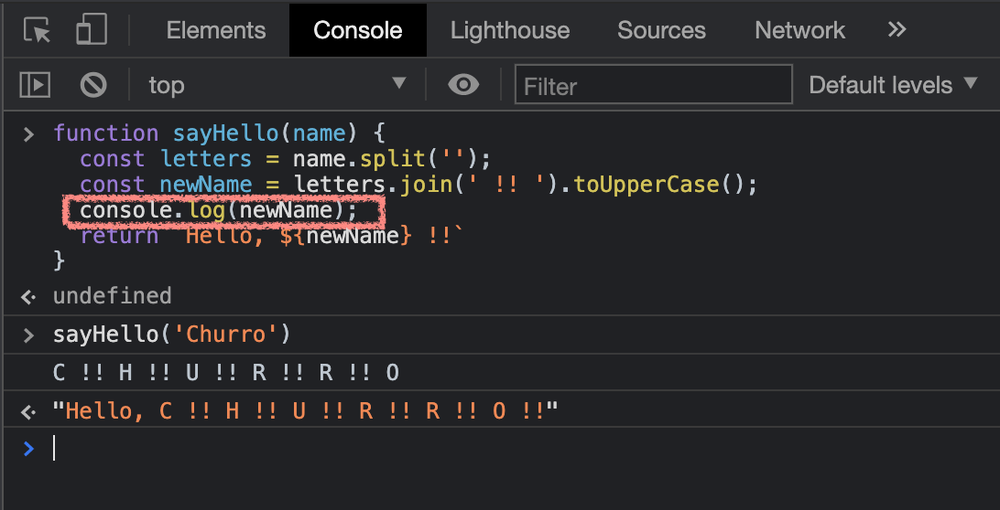
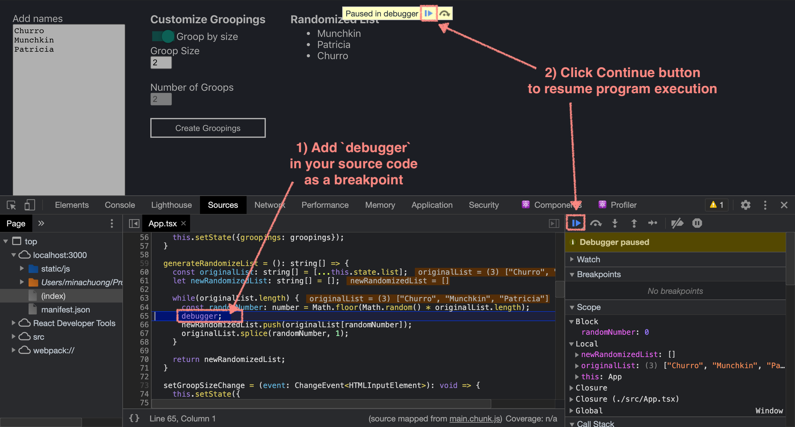
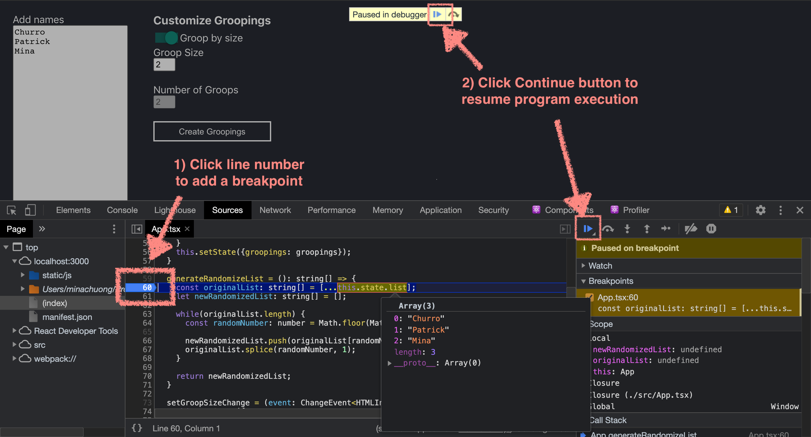
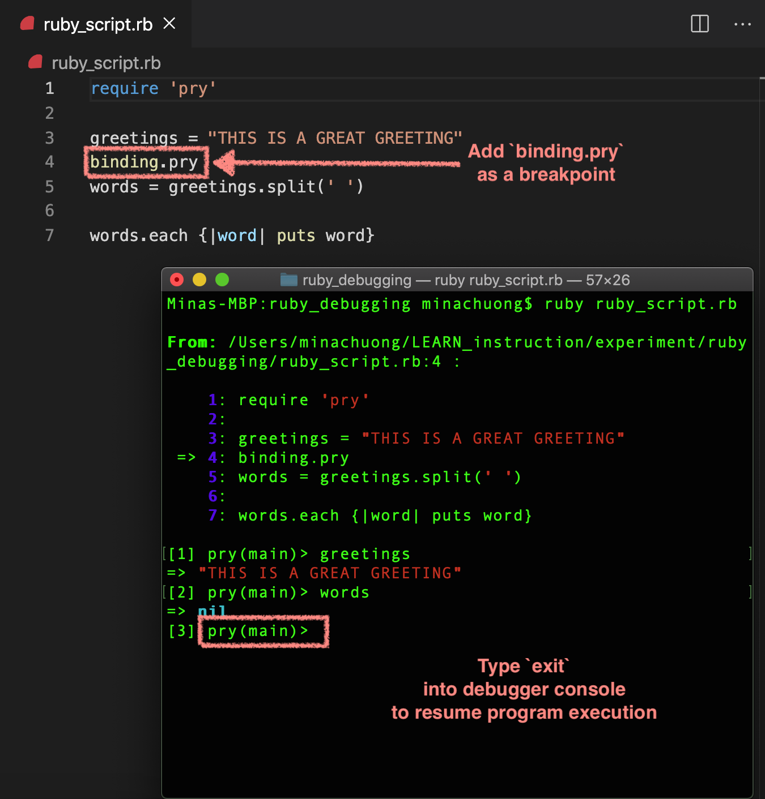

# Debugging Tools and Techniques
Debugging is both an important skill and fundamental process in software development.

## Goal of debugging:
- To identify the error and its location
- To analyze the error/its cause
- To fix erroneous behavior in code

## Tools
There are many debugging tools available for free on the internet. The following are just a few of the ones we’ll be using throughout the cohort. 

## Front-end Debugging Tools
For Javascript and React debugging, we’ll primarily use Chrome Developer Tools.
To see how to open Chrome Developer Tools: [https://developer.chrome.com/docs/devtools/open/](https://developer.chrome.com/docs/devtools/open/)

### console.log()
`console` object: Provides access to debugging console from within your code. The most common method called on console is log().
console.log() is often use to see the state of variables at the time of code execution. 
Anytime you have Javascript code that is executed by the browser, console.log() will log values into the Console tab within Chrome Dev Tools.

#### Benefit of using console:
- It is very easy to use

#### Drawbacks of using console:
- It can clutter up code and the console very easily, if console statements are not cleaned up and can be difficult to discern the different values being logged if data is not prefixed
- Limits the amount of analysis that can happen within a context 

Notes: Unless there’s a very good reason for needing to log something (e.g. rare error scenarios), console.log statement generally should not be committed into source code. Also, if you’re really into logging to the Console, check this article out: [https://thenewstack.io/tutorial-getting-creative-with-console-statements/](https://thenewstack.io/tutorial-getting-creative-with-console-statements/)

Source: [https://developer.chrome.com/docs/devtools/console/](https://developer.chrome.com/docs/devtools/console/)

### debugger;
`debugger` is a reserve word that allows the program execution to pause at the location where debugger is placed. It acts as a “break point”. 

The benefits of using `debugger` is so that you have full access to the context where the program is paused. Often, with `debugger`, you can access all variables within the scope through a debugger panel (in Chrome Developer Tools).

#### Benefits:
- There is the ability to do a fuller analysis on context
- A developer can deeply interact with data within the context

#### Drawbacks:
- Requires more explicit and careful management because it will pause program execution
- Requires learning how to use debugging interface

Source: [https://developer.chrome.com/docs/devtools/javascript/breakpoints/](https://developer.chrome.com/docs/devtools/javascript/breakpoints/)

### Break Points in Chrome Dev Tools:
Break points work similar to debugger but they are applied through a UI. In this case, through Chrome Dev Tools, you can apply a break point by clicking the line number of code you’d like the program execution to pause at. You can access the loaded source code in the Sources tab and should see a marker indicated on the line upon click. To remove break points, click the marker again.

#### Benefits:
- No code change is necessary to use this debugging feature.
- Full debugging functionality is available to you

#### Drawbacks:
- There is a minor learning curve to getting use to debugging UI

Source: [https://developer.chrome.com/docs/devtools/javascript/breakpoints/](https://developer.chrome.com/docs/devtools/javascript/breakpoints/)

## Back-end Tool

### puts, p, pp, print
Good ole logging. [This article](https://dev.to/lofiandcode/ruby-puts-vs-print-vs-p-vs-pp-vs-awesome-5akl) does a fantastic job at showing the differences between each option for logging.

### pry
For Ruby code (both inside of and outside of a Rails app), you can use a gem called `pry`. 
You will need to install in locally to your machine, `gem install pry` in order to use it for Ruby code outside of a project that uses Bundler. You will also need to `require 'pry'` at the top of your Ruby script to 

Place `binding.pry` anywhere in your code to pause execution at that point. This functions a lot like `debugger` however the debugger interface is in your terminal because that's likely where your Ruby code is getting run. 

The terminal provides a debugging prompt (`pry(main) >`) so that you can access context. Notice that you will retrieve a value for variables above `binding.pry` but no values for variables declared after it. 

As with most interactive Ruby interfaces, typing `exit` and `enter` will allow you to exit the debugging terminal.

### byebug
For Rails apps (versions 4.2 and newer), `byebug` is bundled with the app by default so there is no need to install it manually.

Place `byebug` anywhere in your code to pause execution at that point. This functions a lot like `debugger` and `binding.pry`, however the debugger interface is in your terminal because that's likely where your Ruby code is getting run. 

The terminal provides a debugging prompt (`(byebug)`) so that you can access context. Notice that you will retrieve a value for variables above `byebug` but no values for variables declared after it. 

Sources: For byebug documentation: [https://github.com/deivid-rodriguez/byebug](https://github.com/deivid-rodriguez/byebug)

## General Techniques

- Brute force logging: Log output at various points through your app (generally where you expect relevant data to flow) and verify expected behavior within the logs so that you can eliminate areas where the defect is not located
- Backtracking: Start at the point where the program provides incorrect outcomes, then follow where the data came from to determine when the data first yielded an unexpected value.
- Testing: Tests are a great way to simulate or attempt to reproduce the defect. By writing test(s) and using mock data associated with the defect, you may be able to uncover the defect and document the fix/bug all-in-one!
