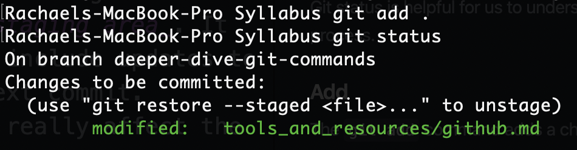
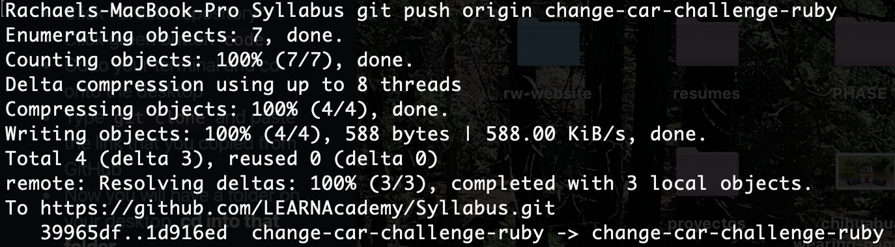

# GitHub Resources

[ Presentation ](https://github.com/LEARNAcademy/git-intro/blob/master/GitAndGithub.pdf)

Git is a free, open-sourced version control system widely used in the programming world. It is a very powerful tool used for sharing and working on code and allows for many people to contribute to the same code base. Git was created in 2005 by Linus Torvalds, the creator of Linux, to track changes in source code. Git is accessed primarily through the command line.

History of the name git according to Linus is quite funny. 'Git' is British slang for pig headed or argumentative. This will feel very appropriate at moments when interacting with git. Torvolds says, while 'git' was a random three-letter combination that is pronounceable, and not actually used by any common UNIX command, it can change meaning, depending on your mood:  

Global Information Tracker: if you're in a good mood, and it actually works for you. Angels sing and light suddenly fills the room  
Goddamn Idiotic Truckload of sh*t: when it breaks

## Setting up Git

Instructions for Mac OSX (initial configuration required for interacting with GitHub over HTTPS via command line):
- Install Git: `$ brew install git`
- Verify Git version using: `$ git --version`
  - Version 2.31.1 is required for using Personal Access Tokens for GitHub Authentication
  - For more information about GitHub's Authentication migration from password credentials to tokens, visit [Token Authentication Requirements](https://github.blog/2020-12-15-token-authentication-requirements-for-git-operations/)
  - If Git version is older than 2.31.1, update Git using: `$ brew upgrade git`
- Once we have an appropriate Git version, we can configure Git username (**which is not the same as GitHub username**), in Terminal:
  - Configure Git global username which is used to display your name on **all** repos using: `$ git config --global user.name "Mona Lisa"`
  - For more info: [Setting your username in Git](https://docs.github.com/en/github/getting-started-with-github/setting-your-username-in-git)
- Configure global commit email address, (GitHub uses this email address to display the author of the commit)
  - Set up and verify your commit email address on GitHub by following these steps: [Setting Your Commit Email Address](https://docs.github.com/en/github/setting-up-and-managing-your-github-user-account/setting-your-commit-email-address)
  - Configure Git email address using: `$ git config --global user.email "email@example.com"`
- Because Git was installed using Homebrew, the OSX Keychain helper should already be installed
  - Configure the credential helper using: `$ git config --global credential.helper osxkeychain`
- Verify all recent Git configurations are correct:
  - Using `$ git config -l`, you should see a list of items  similar the following:
  ```
  credential.helper=osxkeychain
  user.name=Mona Lisa
  user.email=email@example.com
  ```
- Create a Personal Access Token (PAT)
  - **This token needs to be treated like a password (do not share it with anyone and do not save it in any place where it may be publicly accessible). **
  - Please read through steps before performing the steps for creating a PAT here and reference the following suggestions: [Creating a GitHub Personal Access Token](https://docs.github.com/en/github/authenticating-to-github/creating-a-personal-access-token)
  - For Step 6: You can name this whatever you like, something generic like `LEARN GitHub` would suffice
  - For Step 7: Select the following scopes: `repo`, `admin:org`, `notifications`, `user`
  - For Step 9:
    - **DO NOT NAVIGATE AWAY FROM PAGE UNTIL YOU HAVE COPIED THE TOKEN AND PASTED IT SOMEWHERE IN A SAFE PLACE**
    - If you have a password manager, there may be a place to store your token there.
    - If you do not have a password or token manager, paste the token in a txt file and once it is stored in Keychain Access, the file may be deleted.
- Ways to prompt GitHub Authentication:
  - Clone an existing repo using HTTPS
  - If cloning doesn't prompt authentication (because you've likely used password authentication before), attempting to push a commit to an existing repo should prompt authentication. However if that doesn't work, you'll need to remove the credentials cached in Keychain Access. Visit [Updating Credentials](https://docs.github.com/en/github/getting-started-with-github/updating-credentials-from-the-macos-keychain) for more info.
- When authentication is prompted:
  - Use your token like a password
  ```
    $ git clone https://github.com/username/repo.git
    Username: your_username
    Password: your_token
  ```
 - Verify that the token was stored in Keychain so that you aren't constantly prompted with authentication
  - Follow only Steps 1 through 3 on this page: [Updating Credentials](https://docs.github.com/en/github/getting-started-with-github/updating-credentials-from-the-macos-keychain)

Instructions for windows: <br />
https://git-scm.com/download/win

## Git Workflow

### How to start a project in GitHub
**Follow these steps if you have NO existing code and want to start a new project**
- Sign into GitHub and click on + sign (upper right hand corner)
- Click on “New Repository” and name your repository
- Click on “initialize a README”
- Click “Create repository”
- Click green button `code`
- Copy HTTPS repo url.
- Go to your terminal and cd onto the desktop
- Type `git clone` and paste the link that you copied from GitHub
- Now you will have a folder on your desktop.  **cd into that folder**
- Type `atom .`  You are now in an atom file that is connected to your terminal and your GitHub repo!
- Create a new file in atom
- Begin your project!

### Git Commands

#### Status

The `git status` command displays the state of the working directory and the staging area. It lets you see which changes have been staged, which haven't, and which files aren't being tracked by Git. Status output does not show you any information regarding the committed project history.


Above, we can see from running `git status` that there has been a change made to the `github.md` file inside the `tools_and_resources` folder. It also tells us that those changes have not been added to be committed.

Git status is helpful for us to understand where our code is at in the git process.

#### Add

The `git add` command adds a change in the working directory to the _staging area_. It tells Git that you want to include updates to a particular file in the next commit. However, `git add` doesn't really affect the repository in any significant way. Changes are not actually recorded until you run `git commit`.

`git add` requires an argument of which file/s you want to add the the staging area. By running `git add .` you are asking to add _all_ modifications. If you have altered multiple files but don't want to add all of them, list the files you _do_ want to stage in place of the period. Ex: `git add <filename>`.

After you have added to your staging area, if you run `git status` again, you will see that those files are now ready to be committed.



If you forget to add a file and you haven't committed yet, no worries! Just add the file in a separate command and re-run `git status` to double check that it's been staged.

#### Commit

The `git commit` command captures a snapshot of the project's currently staged changes. Commits are the core building block units of a Git project timeline.

Commits can be thought of as snapshots or milestones along the timeline of a Git project. Commits are created with the `git commit` command to capture the state of a project at that point in time. Commit snapshots will always happen in the local repository. With this snapshot, we will eventually update the existing snapshot that exists on GitHub.


Let's break down the command above:
1. `git commit`: Commit the staged snapshot. This alone will launch a text editor prompting you for a commit message.
2. `-m`: Passing the `-m` option will forgo the text editor prompt in favor of an inline message.
3. `"add explanation..."`: This is the commit message. This is a brief breakdown of what is achieved with this snapshot of code. It should be written in current-tense (think of this command _telling_ your computer what to do). The commit message will always be in a string.

#### Push

The `git push` command is used to upload local repository content to a remote repository (for us, this is GitHub). Pushing is how you transfer commits from your local repository to a remote repo.



As developers we rarely push our code directly to the 'main' branch of a repository. This is to keep our "production" code safe from any accidental bugs we may introduce if we aren't careful. To avoid pushing directly to `main`, we work on individual features of our code inside of _branches_.

Because of that, in the command above we can see that `git push` is followed by `origin` and then the name of the branch we are _pushing to_. It is good practice to always dictate _where_ you'd like to push your code.

### Saving your existing code in GitHub

**Follow these steps if you have code saved to your local drive and want to add that project to your GitHub**

- Sign into GitHub and click on `+` sign (upper right hand corner)
- Click on `New Repository` and name your repository. TIP: name your GitHub repo the same name as your project folder, DO NOT click on “initialize a README”
- Click `Create Repository`
- Go to your terminal and cd into your project
- In terminal, run the commands:
  - `$ git init`
  - `$ git add .`
  - `$ git commit -m “initial commit”`
- Follow second set of instruction on GitHub repo page (it will looking something like this)...
```
$ git remote add origin https://github.com/username/example.git
$ git push -u origin master
```


## As you work on your project
**Repeat these steps often!**
In terminal:
- `$ git add .`
- `$ git commit -m "message about current work"`
- `$ git push origin <branch-name>`


[ Back to Syllabus ](../README.md#programming-tools)
