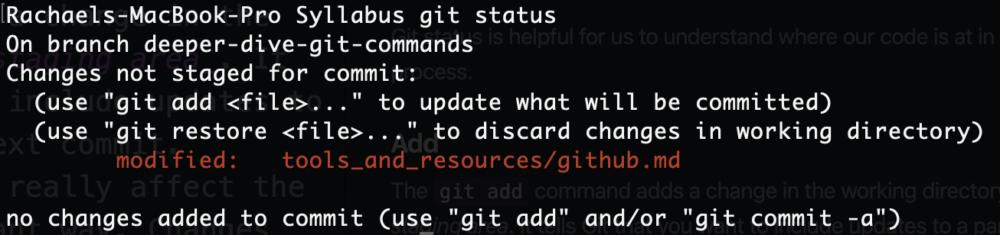

# GitHub Resources

[ Presentation ](https://github.com/LEARNAcademy/git-intro/blob/master/GitAndGithub.pdf)

Git is a free, open-sourced version control system widely used in the programming world. It is a very powerful tool used for sharing and working on code and allows for many people to contribute to the same code base. Git was created in 2005 by Linus Torvalds, the creator of Linux, to track changes in source code. Git is accessed primarily through the command line.

History of the name git according to Linus is quite funny. 'Git' is British slang for pig headed or argumentative. This will feel very appropriate at moments when interacting with git. Torvolds says, while 'git' was a random three-letter combination that is pronounceable, and not actually used by any common UNIX command, it can change meaning, depending on your mood: <br />

Global Information Tracker: if you're in a good mood, and it actually works for you. Angels sing and light suddenly fills the room <br />
Goddamn Idiotic Truckload of sh*t: when it breaks

## Setting up Git

Instructions for mac: $ brew install git

Instructions for windows: <br />
https://git-scm.com/download/win

## Git Workflow

### How to start a project in GitHub
**Follow these steps if you have NO existing code and want to start a new project**
- Sign into GitHub and click on + sign (upper right hand corner)
- Click on “New Repository” and name your repository
- Click on “initialize a README”
- Click “Create repository”
- Click green button `code`
- Go to your terminal and cd onto the desktop
- Type `git clone` and paste the link that you copied from GitHub
- Now you will have a folder on your desktop.  **cd into that folder**
- Type `atom .`  You are now in an atom file that is connected to your terminal and your GitHub repo!
- Create a new file in atom
- Begin your project!

### Git Commands

#### Status

The `git status` command displays the state of the working directory and the staging area. It lets you see which changes have been staged, which haven't, and which files aren't being tracked by Git. Status output does not show you any information regarding the committed project history.



Above, we can see from running `git status` that there has been a change made to the `inheritance.md` file inside the `ruby` folder. It also tells us that those changes have not been added to be committed.

Git status is helpful for us to understand where our code is at in the git process.

#### Add

The `git add` command adds a change in the working directory to the _staging area_. It tells Git that you want to include updates to a particular file in the next commit. However, `git add` doesn't really affect the repository in any significant way. Changes are not actually recorded until you run `git commit`.


### How to save your existing code in GitHub

**Follow these steps if you have code saved to your local drive and want to add that project to your GitHub**

- Sign into GitHub and click on `+` sign (upper right hand corner)
- Click on `New Repository` and name your repository. TIP: name your GitHub repo the same name as your project folder, DO NOT click on “initialize a README”
- Click `Create Repository`
- Go to your terminal and cd into your project
- In terminal, type:
  - `$ git init`
  - `$ git add .`
  - `$ git commit -m “initial commit”`
- Follow second set of instruction on GitHub repo page (it will looking something like this)...
```
$ git remote add origin https://github.com/username/example.git
$ git push -u origin master
```


## As you work on your project
**Repeat these steps often!**
In terminal:
- `$ git add .`
- `$ git commit -m "message about current work"`
- `$ git push origin master`


[ Back to Syllabus ](../README.md#programming-tools)
